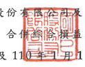

國巨股份:
及其子公司

表 1日至3月31日 民國 111年及 110
(僅經核閱,未依一般公認審計準則查核)
單位:新台幣仟元,惟 每股盈餘為元

|                          | 110年1月1日至3月31日    |              |           |              |     |    |          |    |    |
|--------------------------|-------------------------|--------------|-----------|--------------|-----|----|----------|----|----|
| 111年1月1日 至3月31日    | (重編後並經核閱)        |              |           |              |     |    |          |    |    |
|                          | 金                      | 額           |           |              |     |    |          |    |    |
| 代 碼                    | 金                      | 額           | %         | %            |     |    |          |    |    |
| 營業收入(附註三二)       |                         |              |           |              |     |    |          |    |    |
| 4100                     | 銷貨收入一淨額          | $ 30,134,218 | 100       | $ 28,025,982 | 100 |    |          |    |    |
| 5000                     | 營業成本(附註十二、二四 |              |           |              |     |    |          |    |    |
| 及三二)                  | 62                      |              |           |              |     |    |          |    |    |
| 18,648,750               | 17,506,511              | 63           |           |              |     |    |          |    |    |
| 5900                     | 營業毛利                | 11,485,468   | 38        | 10,519,471   | 37  |    |          |    |    |
| 營業費用(附註二四及三二) |                         |              |           |              |     |    |          |    |    |
| 6100                     | 行銷費用                | 1,568,200    | 5         | 1,477,283    | 5   |    |          |    |    |
| 6200                     | 管理费用                | 1,735,235    | 6         | 1,741,110    | 6   |    |          |    |    |
| 6300                     | 研究發展費用            | 700,957      | 2         | 749,758      | 3   |    |          |    |    |
| 預期信用減損迴轉利益     |                         |              |           |              |     |    |          |    |    |
| 6450                     | (附註十一)              | 6,334)       |           |              |     |    |          |    |    |
| 5,561)                   | =                       | =            |           |              |     |    |          |    |    |
| 6000                     | 營業費用合計            | 3,998,831    | 13        | 3,961,817    | । ক |    |          |    |    |
| 6900                     | 營業淨利                | 7,486,637    | 25        | 6,557,654    | 23  |    |          |    |    |
| 營業外收入及支出         |                         |              |           |              |     |    |          |    |    |
| 7050                     | 財務成本(附註二四)      | (            | 235,121 ) | (            | 1)  | (  | 299,835) | (  | 1) |
| 7060                     | 採用權益法之關聯企業    |              |           |              |     |    |          |    |    |
| 及合資損益份額           | 48,644                  | -            | 25,888    | -            |     |    |          |    |    |
| 7100                     | 利息收入                | 268,717      | 1         | 232,499      | 1   |    |          |    |    |
| 7110                     | 租金收入(附註三二)      | 9,469        | ।         | 11,290       | ﺎ   |    |          |    |    |
| 7235                     | 透過損益按公允價值衡    |              |           |              |     |    |          |    |    |
| 量之金融商品净利益       |                         |              |           |              |     |    |          |    |    |
| (損失)                   | 437,590                 | ଠା            | (         | 108,435 )    | -   |    |          |    |    |
| 7020                     | 其他利益及損失(附註     |              |           |              |     |    |          |    |    |
| 二四)                    | 39,596                  | -------      | 634,082   | 2            |     |    |          |    |    |
| 7000                     | 签紫外收入及支出        |              |           |              |     |    |          |    |    |
| 合計                     | 568,895                 | 2            | 495,489   | 2            |     |    |          |    |    |
| (接次頁)                 |                         |              |           |              |     |    |          |    |    |

|                      | 110年1月1日至3月31日     |              |             |             |          |    |
|----------------------|--------------------------|--------------|-------------|-------------|----------|----|
| 111年1月1日至3月31日 | (重編後並經核閱)         |              |             |             |          |    |
| 金                   | 額                       | %            | 金          | 領          | %        |    |
| 代 碼                |                          |              |             |             |          |    |
| 7900                 | 税前净利                 | $ 8,055,532  | 27          | $ 7,053,143 | 25       |    |
| 7950                 | 所得稅費用(附註四及二五) | 1,785,546    | 6           | 1,567,242   | _ 6      |    |
| 8200                 | 本期淨利                 | 6,269,986    | _21         | 5,485,901   | _ 19     |    |
| 其他綜合損益         |                          |              |             |             |          |    |
| 8310                 | 不重分類至損益之項       |              |             |             |          |    |
| 目:                  |                          |              |             |             |          |    |
| 8316                 | 透過其他綜合損益         |              |             |             |          |    |
| 按公允價值街量       |                          |              |             |             |          |    |
| 之權益工具投資       |                          |              |             |             |          |    |
| 未實現評價損益       |                          |              |             |             |          |    |
| (附註二三)           | 8,713)                   | 6,848        |             |             |          |    |
| (                    | -                        | 1            |             |             |          |    |
| 8320                 | 採用權益法之關聯         |              |             |             |          |    |
| 企業及合資其他       |                          |              |             |             |          |    |
| 綜合損益份額         | 7,584)                   | .            |             |             |          |    |
|                      | 16,297)                  | --           | 6,848       | ----        |          |    |
| 8360                 | 後續可能重分類至損益     |              |             |             |          |    |
| 之項目:              |                          |              |             |             |          |    |
| 8361                 | 國外營運機構財務         |              |             |             |          |    |
| 報表換算之兌換       |                          |              |             |             |          |    |
| 差額(附註二三)       | 5,334,215                | 18           | 702,841 )   |             |          |    |
|                      | (                        | (            | 2)          |             |          |    |
| 8368                 | 避險工具之損益           | 306,511      | 1           | (           | 55,543 ) | -  |
| 8370                 | 採用權益法之關聯         |              |             |             |          |    |
| 企業及合資之其       |                          |              |             |             |          |    |
| 他綜合損益份額       |                          |              |             |             |          |    |
| (附註二三)           | 34,754                   | -            | (           | 14,807)     | -        |    |
| 8399                 | 與可能重分類之項         |              |             |             |          |    |
| 目相關之所得稅       |                          |              |             |             |          |    |
| (附註四及二          |                          |              |             |             |          |    |
| 五)                  | 1,079,712)               | (_ 4)        | 130,786     |             |          |    |
| 4,595,768            | 15                       | 642,405 )    | 2)          |             |          |    |
| 8300                 | 本期其他綜合損益         |              |             |             |          |    |
| (稅後淨額)           | 4,579,471                | 15           | 635,557)    | (____)      |          |    |
| 8500                 | 本期綜合損益總額         | $ 10,849,457 | $ 4,850,344 | _17         |          |    |
|                      | _36                      |              |             |             |          |    |
| (接次頁)             |                          |              |             |             |          |    |

|                       | 110年1月1日至3月31日   |              |             |             |             |       |
|-----------------------|------------------------|--------------|-------------|-------------|-------------|-------|
| 111年1月1日 至3月31日 | (重編後並經核閱)       |              |             |             |             |       |
| 代 碼                 | 会                     | 額           | %           | 金          | 額          | %     |
| 淨利歸屬於:           |                        |              |             |             |             |       |
| 8610                  | 本公司業主             | ക            | 6,242,293   | 21          | $ 5,005,033 | 18    |
| 8615                  | 共同控制下前手權益     | 1,245        | "           | 20,087      | ı           |       |
| 8620                  | 非控制權益             | 26,448       | -           | 460,781     | _2          |       |
| 8600                  | $ 6,269,986            | 21           | $ 5,485,901 | 20          |             |       |
| 綜合損益總額歸屬於:   |                        |              |             |             |             |       |
| 8710                  | 本公司業主             | $ 10,814,862 | 36          | $ 4,464,143 | 16          |       |
| 8715                  | 共同控制下前手權益     | 1,245        | -           | 17,126      | -           |       |
| 8720                  | 非控制權益             | 33,350       | -           | 369,075     | 1           |       |
| 8700                  | $ 10,849,457           | _36          | $ 4,850,344 | _17         |             |       |
| 每股盈餘(附註二六)    |                        |              |             |             |             |       |
| 9750                  | 基                     | 本           | ക           | 11.59       | ക്ക          | 10.13 |
| 9850                  | 稀                     | 釋           | ക്ക          | 11.29       | $           | 9.90  |

後附之附註係本合併財務報告之一部分。

(請參閱勤業眾信聯合會計師事務所民國 111年 4月 26 日核閱報告 )
.

董事長:陳泰銘

經理人:王淡如

會計主管:楊文翔

