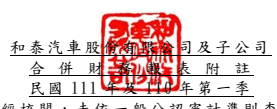

(僅經核閱 ,未依 一般公 認審計 準則查 核 )
單位:新 台幣仟 元 (除特別註 明者外 )

## 一、 公司沿革

和泰汽車 股份有 限公司 (以下簡 稱「 本公 司」)於中華 民國設 立,本公司 及子公 司 (以下統稱「 本集團 」)主 要經營 業務包 括各種車 輛及其 零件之 進口、買賣 及銷 售 維修服務,各種車輛 之 分 期 買 賣 及 租 賃 、 中 古 車 買 賣 交 易 與 各 項 產 物 保 險 業 務 等。

二、 通過財務 報告之 日期及 程序 本合併財 務報告 已於民國 111 年 5 月 11 日提報董 事會後 發布。

三、 新發布及 修訂準 則及解 釋之適 用
(一)已採用金 融監督 管理委 員會 (以 下簡稱「 金管會 」)認 可之新 發布、修正 後國 際財務報 導準則 之影響 下表彙列 金管會 認可之 民國 111 年適用 之國際財 務報導 準則之 新發布 、修 正及修訂 之準則 及解釋 :

|                             | 國際會計準則理事會            |                 |                 |
|-----------------------------|-------------------------------|-----------------|-----------------|
|                             | 新發布/修正/修訂準則及解釋    | 發布之生效日    |                 |
| 國際財務報導準則第3號之修正 | 「對觀念架構之索引」          |                 | 民國111年1月1日 |
| 國際會計準則第16號之修正    | 「不動產、廠房及設備          | :達到預定      |                 |
| 使用狀態前之價款」          |                               | 民國111年1月1日 |                 |
| 國際會計準則第37號之修正    | 「虧損性合約─履行合約之成本」 |                 | 民國111年1月1日 |
| 2018-2020週期之年度改善     | 民國111年1月1日               |                 |                 |

本 集 團 經 評 估 上 述 準 則 及 解 釋 對 本 集 團 財 務 狀 況 與 財 務 績 效 並 無 重 大 影 響。

(二)尚未採用 金管會 認可之 新發布 、修正 後 國際財務 報導準 則之影 響 無。

(三)國際會計準則理事會已發布但尚未經金管會認可之國際財務報導準則之影響 下 表 彙 列 國 際 會 計 準 則 理 事 會 已 發 布 但 尚 未 納 入 金 管 會 認 可 之 國 際 財 務 報 導準則之 新發布 、修正 及修訂 之準則 及 解釋: