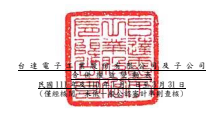
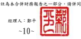

單位:新台幣仟元

|                                            | 歸                                                               | 屬                                                                        | 於           | 母           | 公               | 司                 | 業             | 主        | 之         | 權          | 益            |              |             |             |
|--------------------------------------------|------------------------------------------------------------------|---------------------------------------------------------------------------|--------------|--------------|------------------|--------------------|----------------|-----------|------------|-------------|---------------|--------------|-------------|-------------|
|                                            | 保                                                               | 留                                                                        | 盈           | 餘 其        | 他               | 權                 | 益             |           |            |             |               |              |             |             |
|                                            |                                                                  | 透過其他綜合 損益按公允價                                                 |              |              |                  |                    |                |           |            |             |               |              |             |             |
|                                            | 國外營運機構 值衡量之金融 財務報表換算 資產未實現 避 險 工 具 之 |                                                                           |              |              |                  |                    |                |           |            |             |               |              |             |             |
|                                            | 附                                                               | 註 普通股股本 資本公積 法定盈餘公積 特別盈餘公積 未分配盈餘 之兌換差額 損 | 益 損        | 益 總        | 計 非控制權益 權 | 益                 | 總             | 額        |            |             |               |              |             |             |
| 110 年  110 年 1 月 1 日餘額               | $ 25,975,433                                                     | $ 49,202,505                                                              | $ 27,342,534 | $ 7,622,034  | $ 48,300,040     | ($ 12,319,980 ) ($ | 353,844 )      | $ 130,616 | $          | 145,899,338 | $ 32,690,303  | $            | 178,589,641 |             |
|                                            | 本期合併總損益                                                   | -                                                                         | -            | -            | -                | 6,580,300          | -              | -         | -          | 6,580,300   | 462,995       | 7,043,295    |             |             |
|                                            | 本期其他綜合損益                                                 | -                                                                         | -            | -            | -                | 49,292             | 1,397,556      | 33,365    | (          | 33 )        | 1,480,180     | 141,579      | 1,621,759   |             |
| 本期綜合損益總額                           | -                                                                | -                                                                         | -            | -            | 6,629,592        | 1,397,556          | 33,365         | (         | 33 )       | 8,060,480   | 604,574       | 8,665,054    |             |             |
| 對子公司所有權權益變動                     | -                                                                | (                                                                         | 155,731 )    | -            | -                | -                  | -              | -         | -          | (           | 155,731 )     | -            | (           | 155,731 )   |
| 非控制權益增減                             | -                                                                | -                                                                         | -            | -            | -                | -                  | -              | -         | -          | (           | 1,364,066 ) ( | 1,364,066 )  |             |             |
| 110 年 3 月 31 日餘額                      | $ 25,975,433                                                     | $ 49,046,774                                                              | $ 27,342,534 | $ 7,622,034  | $ 54,929,632     | ($ 10,922,424 ) ($ | 320,479 )      | $ 130,583 | $          | 153,804,087 | $ 31,930,811  | $            | 185,734,898 |             |
| 111 年  111 年 1 月 1 日餘額               | $ 25,975,433                                                     | $ 49,114,151                                                              | $ 29,697,752 | $ 12,543,208 | $ 53,622,701     | ($ 15,520,287 ) ($ | 776,353 )      | $ 129,917 | $          | 154,786,522 | $ 31,338,136  | $            | 186,124,658 |             |
|                                            | 本期合併總損益                                                   | -                                                                         | -            | -            | -                | 6,058,622          | -              | -         | -          | 6,058,622   | 772,168       | 6,830,790    |             |             |
|                                            | 本期其他綜合損益                                                 | -                                                                         | -            | -            | -                | 128,613            | 5,767,906      | 33,959    | -          | 5,930,478   | 1,175,330     | 7,105,808    |             |             |
| 本期綜合損益總額                           | -                                                                | -                                                                         | -            | -            | 6,187,235        | 5,767,906          | 33,959         | -         | 11,989,100 | 1,947,498   | 13,936,598    |              |             |             |
| 對子公司所有權權益變動                     | -                                                                | (                                                                         | 171,583 )    | -            | -                | -                  | -              | -         | -          | (           | 171,583 )     | -            | (           | 171,583 )   |
| 實際取得或處分子公司股權價格與帳面價值差異 | 六(三十一)                                                       | -                                                                         | 2,393        | -            | -                | -                  | -              | -         | -          | 2,393       | (             | 38,862 ) (   | 36,469 )    |             |
| 111 年 3 月 31 日餘額                      | $ 25,975,433                                                     | $ 48,944,961                                                              | $ 29,697,752 | $ 12,543,208 | $ 59,809,936     | ($                 | 9,752,381 ) ($ | 742,394 ) | $ 129,917  | $           | 166,606,432   | $ 33,246,772 | $           | 199,853,204 |

後附合併財務報表附註為本合併財務報告之一部分,請併同參閱。

董事長:海英俊 經理人:鄭平 會計主管:余博文

