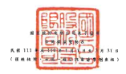
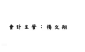

联会:副台督导电

|  실                                  | N                                                               | A                    | 1                            | 1                     |                   |              |               |                             |                 |                  |                   |             |                 |               |                 |               |              |           |              |
|--------------------------------------|-----------------------------------------------------------------|----------------------|------------------------------|-----------------------|-------------------|--------------|---------------|-----------------------------|-----------------|------------------|-------------------|-------------|-----------------|---------------|-----------------|---------------|--------------|-----------|--------------|
|                                      | 选场关闭出台                                                    |                      |                              |                       |                   |              |               |                             |                 |                  |                   |             |                 |               |                 |               |              |           |              |
|                                      | 国互符合允                                                      |                      |                              |                       |                   |              |               |                             |                 |                  |                   |             |                 |               |                 |               |              |           |              |
|                                      | 盟不管理被骗                                                    | 盟 但 所 受 <        |                              |                       |                   |              |               |                             |                 |                  |                   |             |                 |               |                 |               |              |           |              |
| থ                                    | tr                                                              | 】 ★ ★ ☆ 日 時 無    | 对自然良相采 合 肚 黄 人     | 高同在制下 印度付出点 |                   |              |               |                             |                 |                  |                   |             |                 |               |                 |               |              |           |              |
| 出 本 通 股                          | ( 网 址 二 飞 正 无 发 金 公 网 外 时 直 给 公 网 点 8 欧 黑 欧 | 用于理员 【附近二区  |                              |                       |                   |              |               |                             |                 |                  |                   |             |                 |               |                 |               |              |           |              |
| 14                                   | 图 时 注 有                                                     | R 4                  | �                            | 라                    | · 二七八二九)     | tê           |               |                             |                 |                  |                   |             |                 |               |                 |               |              |           |              |
| র্ড |
</2                                      | . . .                                                           | 一线周上             | ( 制 註二五) ( 開 年二五) 金 | 么 发布时间 新闻 本来说 推进 发布时 上一篇 上一篇 上一篇:
《 射盘 二三 》 【 图 型 三 三 】 【 用 出 三 江 】 | 小图 北 三 天 】 电 】
《 射 型 二 三 》 【 图 型 三 三 ) 【 目 机 三 二 】 | 小图 北 三 天 】 | 香 | 88,485,833                       | (制位四) 表二之 ) |              |               |                             |                 |                  |                   |             |                 |               |                 |               |              |           |              |
| 110年1月1日新疆                      | $ 2.569.433                                                     | 408                  | 5 4,950,84 ]                 | 3 23,099,157          | $ 2,945,827       | $ 30,725,189 | 5 47/012-412  | ( 3 4,665,523 )             | 5               | 5                | 74,474            | 载 上海电脑 | 图
【ST63.411.00             |                 |               |                 |               |              |           |              |
| A4                                   | 追,用调整补同战制了组成重处                                     | 1                    | 177 141                      | 20,000,265            | _20,631,205       |              |               |                             |                 |                  |                   |             |                 |               |                 |               |              |           |              |
| A5                                   | 110 4-1 月 1 出 查典禮服領                                      | 4.969.841            |                              |                       |                   |              |               |                             |                 |                  |                   |             |                 |               |                 |               |              |           |              |
| 4,649,423                            | માર                                                              | _25/2015             | - 7,131 1,394                | -- 2.947,827          | 36,725,189        | - 27,002 417 | ( 4.665.528 ) | 21,221                      | 150, NO         | ( ___ 2421.552 ) | - 53, 425, 923    | 99.243      | -20,870,714     | -- 84,375,910 |                 |               |              |           |              |
| 109年度显位款超星分配。              |                                                                 |                      |                              |                       |                   |              |               |                             |                 |                  |                   |             |                 |               |                 |               |              |           |              |
| HS                                   | 子会同组织现金融时                                              |                      | 2                            | のこと                | 17                | *            | 1             | 5                           | でこ            | 23,405 ] {       | 442,700 ] (       | 466,105 }   |                 |               |                 |               |              |           |              |
|                                      | .                                                               |                      |                              |                       |                   |              |               |                             |                 |                  |                   |             |                 |               |                 |               |              |           |              |
| (7                                   | 风明福益处招列无臂哪个家具合管工智能制                          | '                    | .                            | 1 1                   | 1,700 ]           | િ             | 8.224         | 8,224                       | .               | .                | -                 | .           | 5,527           | 64,327        | 697,582         | 771,422       |              |           |              |
| DI                                   | 110年1月1日更3月32日神到                                        | =                    | .                            | .                     | 5,005,000         | 5,0023,000   | 1             | .                           |                 | 5,005,033        | 20,087            | 460,781     | 5,485,900       |               |                 |               |              |           |              |
| 175                                  |                                                                 |                      |                              |                       |                   |              |               |                             |                 |                  |                   |             |                 |               |                 |               |              |           |              |
| 210年1月1日至3月32日规模式比如今展览 | -                                                               | ್ಸ                    | -                            | 490,057 >             | 4,730             | (            | 55,543 J      | .                           | 540,800 )       | 2,564 ] (        | 9L.716 )          | 636,587 ]   |                 |               |                 |               |              |           |              |
| וא                                   | 残险為環給十一周二胡眼禮                                        | ----                 | 18,560                       | __                    | --                | 1            | ﺋﺴ            | -----------                 | 73,913          | 23,902           |                   |             |                 |               |                 |               |              |           |              |
| ZI                                   | 110年3月 31 日版版                                              | 2 125811             | 2 18,200                     | 2 ... 3 8 5 4 8 8 4 8 | 5 23.551.321      | 2-2331-336   | 3-2945,827    | $ 41.738,440                | 5 . 22.011.669  | ( 5 . 5.255.520) | $ 26.00 76.521    | 5-194261    |                 |               |                 |               |              |           |              |
| 2                                    | -                                                               | ( S ... 2 421 .352 ) | 5-72.949.502                 | 161.281               | $ 21,004,000      | 2 84.402.422 |               |                             |                 |                  |                   |             |                 |               |                 |               |              |           |              |
| A1                                   | 111年1月1日給頭                                                 | 5 4,559,189          | 5                            | 5                     | 5 4.959.189       | $ 22.048,917 | $ 3,621,366   | $ 4,504,931                 | $ 50,545,451    | $ 63,767,748     | ( 5 9,733,873 )   | 5           | 80,021          | 5 158,811     | ( $ 1,879,155 ) | 5 79,416,558  | ﻬ            | 5 354,177 | 5 79.770.695 |
| んよ                                 | 益流试垫系列控制下班费查知                                      | 1                    | 223,991                      | 19,431,164            |                   |              |               |                             |                 |                  |                   |             |                 |               |                 |               |              |           |              |
| -                                    | -19.653.133                                                     |                      |                              |                       |                   |              |               |                             |                 |                  |                   |             |                 |               |                 |               |              |           |              |
| AS                                   | 111年1月7日更巡肢鼓躍                                           | - 152212             | -                            | 4,829,149             | - 22.043.932      | - 8,621,366  | --            | ... 50,545,431              | 6129479         | ( ...            | 100 Tel           | 196.811     | ( __ 1,829,855) | .. 79,416,514 | 225651          | -- 19,295,301 | -- 924222221 |           |              |
| 332年度量热指标及企配:               |                                                                 |                      |                              |                       |                   |              |               |                             |                 |                  |                   |             |                 |               |                 |               |              |           |              |
| 85                                   | 本公司股票现金网到                                              | ៉                     | ્ર                            | .                     | .                 | .            | ..            | ( Dostoon's 1 ( Destron's ) | .               |                  |                   |             |                 |               |                 |               |              |           |              |
| .                                    | { 5,400,560 }                                                   | 5,400,540 ]          |                              |                       |                   |              |               |                             |                 |                  |                   |             |                 |               |                 |               |              |           |              |
| 子会习授意现金级利                   |                                                                 | =                    | .                            | .                     | .                 | ー           | ಹ             | .                           | ా                | (                | ( 30,273 )        | No.273 ]    |                 |               |                 |               |              |           |              |
| <7                                   | 技同程及让当列之巅明全高及合委之受到数                          | :                    | .                            |                       | .                 | ై             | 0             | .                           | .               | יי               | ా                  | .           | .               | ব             | 4               |               |              |           |              |
| 171                                  | 111 年 1 月 1 日 2 月 31 日 1 時 1 日 1 時 1 1                  | ి                     | ं ब                           | r                     | r                 | i !          | 6,242,293     | 6,242,293                   | : "             | ાં જિલ્લામ            | ି                  | .           | 6,242,297.      | 1,245         | 26,443          | 6,269,986     |              |           |              |
| DV                                   | 211年1月日日在2月23日印度男比哈会超级                           | 送                   |                              | 送                    | .                 | .            | I             |                             | 4,282,355       | 1                | 306.511           |             |                 |               |                 |               |              |           |              |
|                                      | 16.297 ]                                                        | 4,572,569            | 6,912                        | 4,579,477             |                   |              |               |                             |                 |                  |                   |             |                 |               |                 |               |              |           |              |
|                                      | 短线空股                                                        | 477,793              | .                            | ·                     | -77,793           | 20,681,277   | 5             | 场                          | H               | 国               | 【                | ( 952,675   | 1,090           | 57,110 )      | 19,687,278      |               |              |           |              |
|                                      | =)                                                              | -                    | 225,236 ) ( ( 19:454,042 )   |                       |                   |              |               |                             |                 |                  |                   |             |                 |               |                 |               |              |           |              |
| ារ                                    | 可與航公司值解破為登場經                                        | ਾ                     | 3,578                        | ੰ                      | 3,578             | 151,371      | -             | .                           | .               |                  | ਲ                 | =           | .               | 154,949       |                 | 114.949       |              |           |              |
| N1                                   | 假给基礎知分一員工因酸殖                                        | .                    | 40                           | ಪ                     | 808               | .            | י             | .                           | .               | R41              | י                 |             |                 |               |                 |               |              |           |              |
| (1)                                  | 非拉制推应                                                      | .                    | স                            | B                     | ﺎﻣﻤﺎ              | 1            | -             | ---                         | ( ---           | 3,000            | ... 1211          |             |                 |               |                 |               |              |           |              |
| ZI                                   | 111 年3月 31 日 8 8000                                          | 5-5.436.592          | 1                            | 8                     | 5-240200          | 3 42.892.719 | 2 4.621-200   | 2 4.59,831                  | 5 .. 51,387,184 | 2 61623421       | ( 5 - 6 122 233 ) | S __ 66.217 | 5 -- 505-522    | ( 5 2416 345) | $104.008.257    | 223.263       | 210182124    |           |              |

我射之射但城血合得即將每年上一部分。

〔持命周到重尽信群合宜好邮事面延良爱 112年 4月 26 出版图核合 >

- 9 -