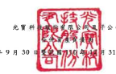

公司 风圆 111 年 9 月 30
31 日及 9 月 30 8 單但:新台餐杯元

| 111年9月30日(经植园)                               | 110年12月31日(經查檢)                              | 110年9月30日(经核园)   |               |               |               |               |              |               |     |     |    |
|----------------------------------------------------|----------------------------------------------------|------------------------|---------------|---------------|---------------|---------------|--------------|---------------|-----|-----|----|
| મ                                                  | 黄                                                 | ম্য                     | 全            | 镇            | તેર            | 金            | | |          | જે             | 会  | lar | વેર |
| 流動管產                                           |                                                    |                        |               |               |               |               |              |               |     |     |    |
| 1100                                               | 现金及的需現金(肘往六)                             | S                      | 70,506,662    | રૂક            | $ 68,275,835  | 37            | $ 69,459,307 | 38            |     |     |    |
| 1110                                               | 选過損益按公允價值御量之盒融資產(附註七)           | 16,131,758             | 8             | 775,988       | -             | 592,323       | -            |               |     |     |    |
| 1136                                               | 按操编侵成本到量之全融管虚(附往九及三二)           | 3,042                  | '             | 3,209         | 20,670        |               |              |               |     |     |    |
| 1140                                               | 合约货產(附註二四)                                 | 594,295                | ·             | 654,423       | .             | 1,390,799     | 1            |               |     |     |    |
| 1150                                               | 施收票據一净額(肘往十一)                           | 547,941                | 458,316       | 185,724       |               |               |              |               |     |     |    |
| 1170                                               | 應收張款一淨額《附在十一)                          | 44,518,919             | 22            | 41,245,921    | 38,737,263    |               |              |               |     |     |    |
|                                                    | 22                                                 | 21                     |               |               |               |               |              |               |     |     |    |
| 1180                                               | 應收帳數一副係人《附註三一)                        | 14,726                 | 12,139        | .             | 13,580        | .             |              |               |     |     |    |
| 1200                                               | 其他應收款(同位十一)                               | .                      |               |               |               |               |              |               |     |     |    |
| 923,318                                            | 817,564                                            | .                      | 584,379       | .             |               |               |              |               |     |     |    |
| 1210                                               | 其他應收數一間係人(附註三一)                       | .                      | 3,265         | 3.757         |               |               |              |               |     |     |    |
| 130X                                               | 存食一净额(附註十二)                               | 31,448,701             | 15            | 32,299,343    | 18            | 30,791,062    | 17           |               |     |     |    |
| 1470                                               | 其他演始贡画(册红十九)                             | 2,966,646              | 2,564,888     | 1             | 2,734,488     | _2            |              |               |     |     |    |
| 11XX                                               | 流野贸產的計                                       | 167,656,008            | 83            | 147,110,891   | 80            | 144,513,352   | 80           |               |     |     |    |
| 非波妙黃產                                         |                                                    |                        |               |               |               |               |              |               |     |     |    |
| 1510                                               | 造過損益投公允價值到量之金融資產(附款七)           | 1,607,817              | 1             | 2,090,852     | 1             | 2,394,459     | 1            |               |     |     |    |
| 1517                                               | 透過其他综合攝益按公允價值街量之会融資產〔附註八〕 | 1,970,070              | ﻨﺴﺮ           | 2,013,586     | 1             | 1,592,053     | ﻟﺴﻮ          |               |     |     |    |
| 1535                                               | 按排绑役成本附量之金融资產(附註九及三二)           | 312,308                | 289,411       | 291,647       | i             |               |              |               |     |     |    |
| 1550                                               | 埃用握益法之投资(附班十四)                         | 1,838,178              | 1             | 1,847,579     | 1             | 1,689,288     |              |               |     |     |    |
| 1600                                               | 不動產、廠房及效備一净額(附註十三及三一)           | 19,370,631             | 10            | 18,889,587    | 10            | 18,832,103    | 10           |               |     |     |    |
| 1755                                               | 使用裸资產一净額(附註十六)                         | 1,766,602              | l             | 1,717,650     | 1             | 1,637,058     | 1            |               |     |     |    |
| 1760                                               | 授贤达不舒虚一净额(阴红十七)                       | 1.261.787              | 1             | 1.246.465     | 1             | 1,244,619     | l            |               |     |     |    |
| 1780                                               | 無彩寶產一淨額(附註十八)                           | 3,687,631              | 2             | 3,675,676     | 2             | 4,626,527     | 3            |               |     |     |    |
| 1840                                               | 遞延所得觀資產                                     | 2,911,002              | 1             | 4,244,276     | 2             | 4,121,824     | 2            |               |     |     |    |
| 1920                                               | 存出保证金                                         | 358,854                | 278,995       |               |               |               |              |               |     |     |    |
| .                                                  | 20                                                 | 289,029                |               |               |               |               |              |               |     |     |    |
| 1975                                               | 净確定福利資產(附誌二二)                           | 46,309                 | 37,932        | .             |               |               |              |               |     |     |    |
| .                                                  | . 3                                                | 15,032                 |               |               |               |               |              |               |     |     |    |
| 1995                                               | 其他非波動資產《附註于允〕                         | 109,910                | 100,519       | 118,198       | 118           |               |              |               |     |     |    |
| 15XX                                               | 非油對實產結計                                     | 35,241,099             | 17            | 36 A32,528    | 20            | 36.851.837    |              |               |     |     |    |
| 賞                                                 |                                                    |                        |               |               |               |               |              |               |     |     |    |
| 1XXX                                               | 產                                                 | 总                     | 时            | $ 202,897,107 | 100           | $ 183,543,419 | 100          | $ 181,365,189 | 102 |     |    |
| 代                                                 | ହି                                                  | 演                     | જ             | 想            | র             |               |              |               |     |     |    |
| 波動負債                                           |                                                    |                        |               |               |               |               |              |               |     |     |    |
| 2100                                               | 短期借款(附該二十)                                 | $ 33,900,130           | 17            | 5 28.385.043  | 15            | $ 31,349,466  | 17           |               |     |     |    |
| 2120                                               | 造過損益按公允價值到量之金融資價(附註七)           | 857,799                | 373,960       | 142,318       |               |               |              |               |     |     |    |
| . .                                                | .                                                  | .                      |               |               |               |               |              |               |     |     |    |
| 2130                                               | 合约负债(附拉二四)                                 | 2,731                  | 98            | .             |               |               |              |               |     |     |    |
| 2150                                               | 施付界线                                           | 63                     | 44            | 8,773         |               |               |              |               |     |     |    |
| 2170                                               | 應付張數                                           | 48,095,811             | 24            | 46,659,415    | 25            | 44,975,705    | 25           |               |     |     |    |
| 2180                                               | 應付張數一副他人(附註三一)                         | 30,243                 | 38,342        | 120.254       |               |               |              |               |     |     |    |
| 2219                                               | 其他應付款                                         | 21,410,620             | 11            | 20,683,867    | 11            |               |              |               |     |     |    |
|                                                    | 11                                                 | 20,616,200             |               |               |               |               |              |               |     |     |    |
| 2220                                               | 其他應付數一關係人(附註三一)                       | 1,705                  |               |               |               |               |              |               |     |     |    |
| 634                                                | 3                                                  | 2,146                  | .             |               |               |               |              |               |     |     |    |
| 2230                                               | 本期所得视負債                                     | 6,606,865              | 7.263.027     | 4             | 6,957,755     | 4             |              |               |     |     |    |
| 2250                                               | 负债率省(附纹二一)                                 | 1,124,499              | 1,152,812     | 1             | 1,183,456     | 1             |              |               |     |     |    |
| 2280                                               | 粗質負債(附該十六)                                 | . -                    |               |               |               |               |              |               |     |     |    |
| 372,902                                            | 400,877                                            | .                      | 321,504       | -             |               |               |              |               |     |     |    |
| 2310                                               | 預收款項                                           | 4,582,766              | 2,955,935     | 3.101.642     | 2             |               |              |               |     |     |    |
| 21XX                                               | 液野角债购计                                       | 116,985,063            | 58            | 107,915,125   | 59            | 108,779,317   | প            |               |     |     |    |
| 非波動員債                                         |                                                    |                        |               |               |               |               |              |               |     |     |    |
| 2540                                               | 長期借款(附註二十)                                 | 3,000,000              | l             |               |               |               |              |               |     |     |    |
| 2570                                               | 遞起所得親負債                                     | 2477 349               | 1             | 1,878,663     | 1             | 1,654,461     | l            |               |     |     |    |
| 2580                                               | 社贸负债(附拉十六)                                 | 771,720                | -             | 743,516       | -             | 732,984       | -            |               |     |     |    |
| 2645                                               | 存入保證金                                         | 149,834                | 132,588       | 100,333       |               |               |              |               |     |     |    |
| 25XX                                               | 非通野負債總計                                     | 6,398,903              | 1             | 2.754.767     | .2            | 2,487,778     | | T          |               |     |     |    |
| 2XXX                                               | 員優總計                                           | _123.383.966           | ् श            | 110/669,892   | 60            | 111,267,095   | 61           |               |     |     |    |
| 歸屬於珍公司景主權益                               |                                                    |                        |               |               |               |               |              |               |     |     |    |
| 股                                                 | 本                                                 |                        |               |               |               |               |              |               |     |     |    |
| 3110                                               | 曾通股股本                                         | 23,508,670             | 12            | 23.508.670    | 13            | 23,508,670    | 13           |               |     |     |    |
| 3200                                               | 資本公積                                           | 22.811.662             | F             | 21,836,342    | 12            | 21,745,221    | _12          |               |     |     |    |
| 保留登錄                                           |                                                    |                        |               |               |               |               |              |               |     |     |    |
| 3310                                               | 法定量做公積                                       | 16,780,649             | 8             | 15,613,679    | 9             | 15,613,679    | 9            |               |     |     |    |
| 3320                                               | 特別盈泰公積                                       | 3,214,551              | 2             | 5,940,218     | .3            | 5,940,218     | 3            |               |     |     |    |
| 3350                                               | 来分配量结                                         | 17,820,595             | q             | 15,199,955    | 12,673,573    |               |              |               |     |     |    |
| 3300                                               | 保留互给烤料                                       | 37,815,795             | 19            | 36,753,852    | 20            | 34.227 A70    | 19           |               |     |     |    |
| 其他推旋                                           |                                                    |                        |               |               |               |               |              |               |     |     |    |
| 3410                                               | 國外營運機構財務模表換算之兒換差額                 | 678,399 )              | 5,820,080 )   | 5,969,762 )   |               |               |              |               |     |     |    |
|                                                    | (                                                  | 3 )                    | (             | 3 )           |               |               |              |               |     |     |    |
| 3420                                               | .                                                  |                        |               |               |               |               |              |               |     |     |    |
| 逃過其他総合損益按公允價值街量之会融資產未實現損失 | 361,016 )                                          | 236,908 )              | .             | 247,872 )     | -             |               |              |               |     |     |    |
| 3491                                               | 員工夫滕得到勞                                     | 732,514 )              |               |               |               |               |              |               |     |     |    |
| 3400                                               | 具化模经總計                                       | 1,77,922)              | 1)            | 6.056,988 )   | _3)           | 6,217,634 )   | 3)           |               |     |     |    |
| 3500                                               | 庫減股票                                           | 3,468,412 )            | 2)            | 3,700,808 )   | 2)            | 3,700,808 )   | 2)           |               |     |     |    |
| 31XX                                               | 硬公司意卫星益施計                                 | 78,895,786             | 39            | 72,341,068    | 39            | 69,562,919    | 38           |               |     |     |    |
| 36XX                                               | 非控制模型                                         | 617,355                | .             | 532,459       | -             | 535,175       | -            |               |     |     |    |
| 3XXX                                               | 程益地计                                           | 79.513.141             | 39            | 72,873,527    | - 20          | 70,098,094    | প            |               |     |     |    |
| 負債 與 權 益 總 計                                | $ 202.897.107                                      | 100                    | $ 183,543,419 | _100          | $ 181,365,189 | 100           |              |               |     |     |    |
| 缓附之附让供本合併财務報告之一部分 =               |                                                    |                        |               |               |               |               |              |               |     |     |    |

缓附之附让供本合併财務報告之一部分 =
(增多周到塞尔伯爵合會计師事務所民國 111年10月28日核閱领合)
董事長:宋明峰

绞理人:印象彬 音計 在管: 周 琛

- 5

