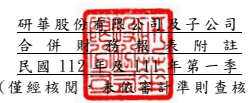

單位:新 台幣仟 元 (除特別註 明者外 )

## 一、 公司沿革

(一)研華 股份有 限公司 (以下簡 稱「 本公 司」)於 民國 70 年 9 月成立,營 運總部 設於台灣 台北內 湖科學 園區。主 要從事 嵌入式板 卡、工業 控制產 品、應 用電 腦及工業 用電腦 之研發 、設計 、製造 與 行銷等業 務。

(二)本公 司股票 自民國 88 年 12 月起 在 台灣證券 交易所 上市交 易 。 (三)研華 為物聯 網智能 系統與 嵌入式 平 台產業之 全球領 導廠商,並以「永 續地球 的智能推 手」作為企 業品牌 願景,依 據 客戶需求 區分成 工業物 聯網事 業群、 嵌入式物 聯網平 台事業 群、服務物 聯網 事業群三 大事業 群。為迎接 物聯網、 大 數 據 與 人 工 智 慧 之 大 趨 勢 , 研 華 提 出 以 工 業 物 聯 網 雲 平 台 為 核 心 之 物 聯 網軟、硬 體解決 方案, 以協助 夥伴客 戶 串接產業 鏈。

## 二、 通過財務 報告之 日期及 程序

本合併財 務報告 已於民國 112 年 4 月 28 日經董事 會通過 後發布 。

三、 新發布及 修訂準 則及解 釋之適 用

(一)已採用金融監督管理委員會 (以 下 簡 稱 「 金 管 會 」 )認 可 並 發 布 生 效 之 新 發

布、修正 後國際 財務報 導準則 之影響

下表彙列 金管會 認可之 民國 112 年適用 之國際財 務報導 準則之 新發布 、修 正及修訂 之準則 及解釋 :

|                          | 國際會計準則理事會             |                 |                 |
|--------------------------|--------------------------------|-----------------|-----------------|
|                          | 新發布/修正/修訂準則及解釋     | 發布之生效日    |                 |
| 國際會計準則第1號之修正  | 「會計政策之揭露」             |                 | 民國112年1月1日 |
| 國際會計準則第8號之修正  | 「會計估計之定義」             |                 | 民國112年1月1日 |
| 國際會計準則第12號之修正 | 「與單一交易所產生之資產及負債 | 民國112年1月1日 |                 |
| 有關之遞延所得稅」       |                                |                 |                 |

本 集 團 經 評 估 上 述 準 則 及 解 釋 對 本 集 團 財 務 狀 況 與 財 務 績 效 並 無 重 大 影 響。

(二)尚未採用 金管會 認可之 新發布 、修正 後 國際財務 報導準 則之影 響 無。