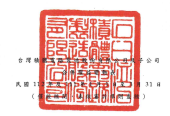
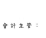

渠在;新台梦济元 N

|                                                  | 理 2017年 10:50 10:      |                                                                                                                |                                     |                                               |              |               |                                              |                              |                |                         |                  |             |              |                 |           |                 |
|--------------------------------------------------|--------------------------|----------------------------------------------------------------------------------------------------------------|-------------------------------------|-----------------------------------------------|--------------|---------------|----------------------------------------------|------------------------------|----------------|-------------------------|------------------|-------------|--------------|-----------------|-----------|-----------------|
|                                                  | 棋是按公无惧保           |                                                                                                                |                                     |                                               |              |               |                                              |                              |                |                         |                  |             |              |                 |           |                 |
| 愁                                               | 母会司 第 女             |                                                                                                                |                                     |                                               |              |               |                                              |                              |                |                         |                  |             |              |                 |           |                 |
| 殷赵(任殷)                                       | 线对监检会持             | 本 分 配 直 标 你留意综合計 或品牌之比较后版 本實現特價提款 迪拉工具領品 員工衣服得到香                        | 六十四月                            | 然后合于 叶 昨 四 时 福 石                    |              |               |                                              |                              |                |                         |                  |             |              |                 |           |                 |
| 11] 年1月】日给级                                | 25,930,380               | $ 59,304,212 $1,536,378,590                                                                                    | 016,429,661 ($ (56,303,61) $ 57,000 | 5                                             | 120,536      | ર             | ($ 62,608,515)                               | $ 2,168,286,553              | ર              | 2,446,652               | $ 2,170,733,205  |             |              |                 |           |                 |
| 虽终分配                                         |                          |                                                                                                                |                                     |                                               |              |               |                                              |                              |                |                         |                  |             |              |                 |           |                 |
| 界别量给众程                                     | 3,304,303                | 3,304,313)                                                                                                     |                                     |                                               |              |               |                                              |                              |                |                         |                  |             |              |                 |           |                 |
| 现金股利                                         | 71,326,540)              | 71,308,546)                                                                                                    | 21,308,546)                         | 71,308,542)                                   |              |               |                                              |                              |                |                         |                  |             |              |                 |           |                 |
| 虽除分配合叶                                     | 3,304,303                | ( 74/12/8-2)                                                                                                   | 71,308,546)                         | 71,308,546)                                   | 71,308,546)  |               |                                              |                              |                |                         |                  |             |              |                 |           |                 |
| 本题评利                                         | 202,732,975              | 202,732,975                                                                                                    | 202,873,374                         |                                               |              |               |                                              |                              |                |                         |                  |             |              |                 |           |                 |
|                                                  | 200,732,975              | 1-40,399                                                                                                       |                                     |                                               |              |               |                                              |                              |                |                         |                  |             |              |                 |           |                 |
| 本期视夜其他综合提拔                             | 19,649,475               | 4,278,602)                                                                                                     | 679,806                             | 15,550,679                                    | 15,550,679   | 139,362)      | 15,411,212                                   |                              |                |                         |                  |             |              |                 |           |                 |
| 本期综合新品绝额                                 | 202, 232, 975            | 202,732,975                                                                                                    | 19,649,475                          | 4,778/602)                                    | 679,806      | 15,550,679    | 211,283,654                                  | 937                          | __ 218,284,591 |                         |                  |             |              |                 |           |                 |
| 股份基礎的好交通                                 | 1,247                    | טיק 1,870                                                                                                      | 438,029                             | .                                             | -) (         | 425,224) (    | 425,224)                                     | 26,675                       | 26,675         |                         |                  |             |              |                 |           |                 |
| 师藏姓果育团                                     | .                        | ー                                                                                                             | -                                   | '                                             | · (          | 871,566) (    | 871,566)                                     | · (                          | K71,566)       |                         |                  |             |              |                 |           |                 |
| 威分透過其他綜合播品按公允價值刷量之租品工具投買 | .                        | -                                                                                                              | .                                   | 1 =                                           | 7,447        | 7,447         | - (                                          | 7,447)                       | 】【一0        | - (                     | 2,447)           | j=          | .            | -               |           |                 |
| 现陆工具销点基礎调整                             | .                        | - 1                                                                                                            | 2,178)                              | . . .                                         | 2,178)       | - (           | 2,178]                                       | - (                          | · 2,178]       |                         |                  |             |              |                 |           |                 |
| .                                                |                          |                                                                                                                |                                     |                                               |              |               |                                              |                              |                |                         |                  |             |              |                 |           |                 |
| 採用模基法紹則之期哪全買股權净值之變動數         | 30                       | 20                                                                                                             | 30                                  |                                               |              |               |                                              |                              |                |                         |                  |             |              |                 |           |                 |
| .                                                | =                        | .                                                                                                              | .                                   | .                                             | .            |               |                                              |                              |                |                         |                  |             |              |                 |           |                 |
| 铝到鲜子企用所有租租品赞助新                     | 15,474                   | 15,474                                                                                                         | 4,587,383                           | 4,602,655                                     |              |               |                                              |                              |                |                         |                  |             |              |                 |           |                 |
| 异控制度益增加                                   | 3.648                    | 3.688                                                                                                          |                                     |                                               |              |               |                                              |                              |                |                         |                  |             |              |                 |           |                 |
| 111 年3月 31 日参議                              | 25,931,767               | $ 229,317 675                                                                                                  | $ 65,215,135                        | $ 311.145.822                                 | 3 62108.515  | 21/61 306 121 | $ 2,008.261.537                              | (5 43,653,886) (5 4,211,739) | 735.164        | 425.224]                | (S = (2,492,685) | (≤          | 121.566)     | $ 2,314,430,006 | 7.038.658 | $ 2.321.468.754 |
| 112年1月1日於領                                  | 25,930,380 $ 259,303,805 | $ 69,190,38 $ (158,596,000 $) (000,047,11,22,222,423,52,62,534,224,224,224,752,52,52 $ 69,460,111,6 $ 60,330,0 | 185,153} ($ 20,505,626) $           | $ 2,945,653,195 $ 14,635,672 52,960,000,000,0 |              |               |                                              |                              |                |                         |                  |             |              |                 |           |                 |
| 监会免                                           |                          |                                                                                                                |                                     |                                               |              |               |                                              |                              |                |                         |                  |             |              |                 |           |                 |
| 特别监会公报                                     | 17,166,163               | 17,166,163)                                                                                                    |                                     |                                               |              |               |                                              |                              |                |                         |                  |             |              |                 |           |                 |
| 观众股利                                         | 71,308,546)              | 71,308,546)                                                                                                    | 21,48540                            | 21, 418, 546)                                 |              |               |                                              |                              |                |                         |                  |             |              |                 |           |                 |
| 监给分配合讨                                     | 17,166,363               | [ 图 474,709)                                                                                                  | 71,308,546)                         | 71,408,546)                                   | 71, 908,546) |               |                                              |                              |                |                         |                  |             |              |                 |           |                 |
| 本期净利                                         | 206,966,561              | 206,986,561                                                                                                    | 206,986,561                         | 37,525)                                       | 206,949,006  |               |                                              |                              |                |                         |                  |             |              |                 |           |                 |
| 本期现换男死综合报道                             | 5.081,462)               | 1,215,977                                                                                                      | 12,655                              | 3,151,844)                                    | (Fre (STY    | 143,929)      | 1,295,773)                                   |                              |                |                         |                  |             |              |                 |           |                 |
| 本期综合攝益應額                                 | 206,966,561              | 2016.986.561                                                                                                   | 203 653,263                         |                                               |              |               |                                              |                              |                |                         |                  |             |              |                 |           |                 |
| 5.000,460                                        | ाशाहल्य                     | 1265                                                                                                           | उप्रश्ना                               | 203,834,212                                   | ाधनला          |               |                                              |                              |                |                         |                  |             |              |                 |           |                 |
| 限制員工程利新設持边纳                           | 419) {                   | 4,195)                                                                                                         | 4,195                               | 4,614                                         | 4,614        | 4,614         | 4,614                                        |                              |                |                         |                  |             |              |                 |           |                 |
| 股份基礎检讨交易                                 | 21,100                   | 564,868                                                                                                        |                                     |                                               |              |               |                                              |                              |                |                         |                  |             |              |                 |           |                 |
| 2,110                                            | '                        | .                                                                                                              | .                                   | '                                             | · (          | 490,165) (    | 490,185)                                     | 95,783                       | 95,783         |                         |                  |             |              |                 |           |                 |
| 属分透過異化綜合損盜按合免費值班受之後五工具設資 | «                        | .                                                                                                              | 80,753                              | 80,753                                        | - 1          | 80,753)       | '                                            | · (                          | B0,753)        | .                       | .                | .           | -            |                 |           |                 |
| 通股工具提出展域調整                             | .                        | .                                                                                                              | .                                   | -                                             | -            | - (           | 41,165)                                      | - (                          | 40,855)        | - 【                    | 40,855)          | - (         | 40,855)      |                 |           |                 |
| 标用假互法巧列之間哪全意股权净值之受购款         | 109                      | .                                                                                                              | .                                   | 109                                           | .            | 109           |                                              |                              |                |                         |                  |             |              |                 |           |                 |
| 20列野于公司所有强强互受到新                     | .                        | · (                                                                                                            | 5,069)                              | .                                             | -            | -             | .                                            | .                            | -              | - (                     | 5,059)           | 5,059       | '            |                 |           |                 |
| 非法制机互培加                                   | 4,363                    | 4.362                                                                                                          |                                     |                                               |              |               |                                              |                              |                |                         |                  |             |              |                 |           |                 |
| 112年3月31日始頭                                 | 25,932 (71               | $ 259,320,710                                                                                                  | 5 6989 421                          | $ 311,146,899                                 | 5 20.330.423 | $2.41.820.68  | $ 2,773,288,000 ($ 16,623,767) ($ 8,221,199) | 5 1551 (0)                   | ાર              | 675,338) [5 24,269,263) | S 3 106 211 255  | $ 14,46,640 | SUN 2012 201 |                 |           |                 |

- 8 -

