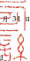
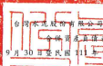
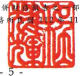

| 8                                                | 單位:新台醫仔元                                      |               |             |               |               |               |               |      |               |     |
|--------------------------------------------------|------------------------------------------------------|---------------|-------------|---------------|---------------|---------------|---------------|------|---------------|-----|
| 12 4 9 8 30 3                                    | 111年12月31日                                        | 111年9月30日  |             |               |               |               |               |      |               |     |
| 200                                              |                                                      |               |             |               |               |               |               |      |               |     |
| દ                                                | ਨਾਂ                                                    | 章            | 125         | হার্            | శి             | হ             | 8页           | - 96 |               |     |
| 波動資產                                         |                                                      |               |             |               |               |               |               |      |               |     |
| 1100                                             | 观金及约當观全(附註六)                               | S ... 77      | 510,081     | 88,842,494    | 19            | $ 95,367,543  | 21            |      |               |     |
| 1110                                             | 选過損益按公允價值街量之会融資產(附抹                | 20            | 668,831     | 611,802       | -             | 859,007       | .             |      |               |     |
| 1120                                             | 选過其他綜合損益按公允價值街量之全融資               | F             |             |               |               |               |               |      |               |     |
| 二及三四)                                        | 6,826,023                                            | 5,934,753     | 1           | 5,789,040     | 1             |               |               |      |               |     |
| 1136                                             | 4                                                    |               |             |               |               |               |               |      |               |     |
| 按操錆後成本街量之全融資產〔附註六及三           | 29,982,272                                           | 20,954,299    | 5           | 17,917,938    |               |               |               |      |               |     |
| 13                                               |                                                      |               |             |               |               |               |               |      |               |     |
| 1150                                             | 應收票據《附註丸及二三》                             | T5 423 145    | 19.450.723  | 4             | 19,550,756    | 4             |               |      |               |     |
| 應收帳款(附註九、十及二三)                       |                                                      |               |             |               |               |               |               |      |               |     |
| 1170                                             | 13.605 976                                           | -3            | 15,148,760  | 3             | 13,244,040    | 3             |               |      |               |     |
| 1180                                             | 應收票據及帳款一國德人(附註三三)                     | 1483543       | 513,975     | 423,374       |               |               |               |      |               |     |
| 1200                                             | 其他應收款                                           | 2.591 541     | 2,309,268   | 1             | 1,654,875     | 1             |               |      |               |     |
| 1210                                             | 其他應收款一間係人(附註三三)                         | 20,638        | 415,606     | 314,894       |               |               |               |      |               |     |
|                                                  | .                                                    |               |             |               |               |               |               |      |               |     |
| 130X                                             | 存貨(附註十一)                                       | 443,179       | -3          | 16,089,980    | 4             | 17,682,787    | 4             |      |               |     |
| 1410                                             | 预付款項(別誌三三)                                   | 6.725.817     | 4,268,024   | 1             | 4,705,273     | 1             |               |      |               |     |
| 1479                                             | 其他流野黄産(附註二三)                               | 1.035.981     | 1,084,374   | 1,087,386     |               |               |               |      |               |     |
| 24.77                                            |                                                      |               |             |               |               |               |               |      |               |     |
| 11XX                                             | 流野黄産總計                                         | 163.318.027   | 35          | 175/624,058   | 38            | 178,596,913   | 39            |      |               |     |
| 1.65 15                                          |                                                      |               |             |               |               |               |               |      |               |     |
| 11 3 11                                          | 1                                                    |               |             |               |               |               |               |      |               |     |
| 非流動資産                                       |                                                      |               |             |               |               |               |               |      |               |     |
| 1510                                             | 這過頻益按公允價值炮量之全融資產(附註七·三三及三四十 | 201759        | 1           | 284,876       | -             |               |               |      |               |     |
|                                                  | -                                                    | -             |             |               |               |               |               |      |               |     |
| 1517                                             | 透過其他綜合頻益按公允價值約量之金融資產〔附註八、三 | 20,906,490    | 5           | 5             |               |               |               |      |               |     |
| 二及三四)                                        | 4                                                    | 22,751,646    | 22,180,763  |               |               |               |               |      |               |     |
| 1535                                             | 按弹销技成本街量之全融贸產(所放六及三四)             | 18,829,366    | 4           | 9,577,103     | 2             | 11,646,126    | N             |      |               |     |
| 1550                                             | 採用權益法之投資(附註十三及三四)                     | 57,333,453    | 12          | 53,586,673    | 12            | 48,944,177    | 11            |      |               |     |
| 1600                                             | 不動産、販房及設績(附註十四、二四、三三及三四)       | 127,763,598   | 27          | 114.739.983   | 25            | 112,934,189   | 25            |      |               |     |
| 1755                                             | 使用機資產(附註十五、二四及三四)                     | 15,634,113    | 3           | 15,503,775    | 3             | 15,697,201    | 3             |      |               |     |
| 1760                                             | 投資任不動產(附該十六、二四及三四)                   | 7,949,939     | 2           | 5,323,016     | 1             | 5,410,610     | 1             |      |               |     |
| 1780                                             | 無形質産〔附註十七、二四反二八〕                     | 28,680,821    | 6           | 27,880,416    | 6             | 27,997,866    | б             |      |               |     |
| 1915                                             | 預付双備款(附进十四)                                 | 8,712,928     | 2           | 9,658,047     | 2             | 8,435,855     | 2             |      |               |     |
| 194D                                             | 應收融資租賃款(附註十)                               | 19,049,991    | 4           | 21,372,402    | 5             | 22,101,820    | 5             |      |               |     |
| 1975                                             | 淨確定福利資産(附誌四)                               | 1,583,640     | .           | 1,567,531     | .             | 1,856,632     | .             |      |               |     |
| 1995                                             | 其他非波動質產(附抹四及三四)                         | 2,857,337     | 1           | 2,939,435     | 2,931,447     |               |               |      |               |     |
| 15XX                                             | 非波動貨產總計                                       | 309,599,435   | 65          | 285,184,903   | 62            | 280,136,686   |               |      |               |     |
| 1XXX                                             | 省                                                   | 麦            | 总          | 叶            | $ 472,917,462 | 100           | $ 460,808,961 | 100  | $ 458,733,599 | 100 |
| 代                                               | 码                                                   | R             | 債          | 陵            | 科            | হ্ৰ            |               |      |               |     |
| 波動負債                                         |                                                      |               |             |               |               |               |               |      |               |     |
| 2100                                             | 短期借款(附註十八·三十及三四)                        | $ 20,099,911  | 4           | $ 22,416,812  | 5             | 5 44,217,526  | 10            |      |               |     |
| 2110                                             | 應付組期票券(附註十八)                               | 3,640,126     | I           | 3,065,961     | l             | 4,108,056     | 1             |      |               |     |
| 2120                                             | 透過損益按公允慣值附量之金融資績(附註七及三二)       | 603,782       | 641,522     | 703,682       |               |               |               |      |               |     |
| 2130                                             | 合约負債(附註二三)                                   | 4,372,004     | 1           | 1,774,714     | 2,507,559     | 1             |               |      |               |     |
| 2170                                             | 應付票據及帳款(附註三三)                             | 11,238,347    | 2           | 13,691,411    | 3             | 13,906,734    | 3             |      |               |     |
| 2219                                             | 其他應付款(附註十四、二十及二八)                     | 13,303,326    | 3           | 9,771,591     | 2             | 8,675,845     | 2             |      |               |     |
| 2220                                             | 其他患传散一周像人(附註三三)                         | 1,080,014     | .           | 750,236       | .             | 454,103       | .             |      |               |     |
| 2230                                             | 本期所得稅負債(所註四)                               | 2,401,752     | 1           | 1,063,356     | 875,099       | .             |               |      |               |     |
|                                                  | !                                                    |               |             |               |               |               |               |      |               |     |
| 2280                                             | 租賃負債(附註十五及三三)                             | 466,737       | 400,136     | 396,335       | .             |               |               |      |               |     |
| 2320                                             | 432.766                                              | .             |             |               |               |               |               |      |               |     |
| 一年内对期之長期負債(附註十八、十九、三十及三四) | 36,635,653                                           | 8             | 21,511,839  | 5             |               |               |               |      |               |     |
| 2399                                             | 其他流動員債                                         | 496,902       | 121,833     | 204,126       |               |               |               |      |               |     |
| 21XX                                             | 流動負債總計                                         | 94,338,554    | 20          | 75,209,411    | _ 16          | 76,481,831    | 17            |      |               |     |
| 乖液的負債                                       |                                                      |               |             |               |               |               |               |      |               |     |
| 2530                                             | 應付公司績(用註十九)                                 | 68,840,993    | 14          | 72,136,574    | 16            | 89,535,110    | 20            |      |               |     |
| 2540                                             | 7                                                    | 9             | 39,019,996  |               |               |               |               |      |               |     |
| 長期借款(附註十八·三十及三四)                    | 31,737,240                                           | 42,864,736    | 8           |               |               |               |               |      |               |     |
| 2580                                             | 租賃貸債(附該十五及三三)                             | 3.735.814     | 1           | 3.550.048     | 1             | 3.359.660     | 1             |      |               |     |
| 2570                                             | 遮延所得我負債(附註四)                               | 12.714.330    | 3           | 12.359.419    | 3             | 12,209,194    | 3             |      |               |     |
| 2610                                             | 長期應付景據(附註十八)                               | 15,064,836    | 3           | 14,990,589    | 3             | 15,063,137    | 3             |      |               |     |
| 2640                                             | 净硫灰操利負債(附註四)                               | 63,349        | -           | 119,623       | -             | 79,610        | .             |      |               |     |
| 2670                                             | 其他非流動負債(附註十三及十四)                       | 1,695,855     | 1,302,781   | 1,314,615     |               |               |               |      |               |     |
| 25XX                                             | 非液结具值绝計                                       | 133,852,417   | 28          | 147,323,770   | 32            | 160,581,322   | 35            |      |               |     |
| 2XXX                                             | 52                                                   |               |             |               |               |               |               |      |               |     |
| 負債總計                                         | 228,190,971                                          | 48            | 222,533,181 | 48            | 237,063,153   |               |               |      |               |     |
| 本公司需主催品總計(附註二二)                     |                                                      |               |             |               |               |               |               |      |               |     |
| 3110                                             | 量通股股本                                           | 71,561,817    | 15          | 71,561,817    | 16            | 67,361,817    | 15            |      |               |     |
| 3120                                             | 特别股股本                                           | 2,000,000     | 2,000,000   | 2,000,000     | 1             |               |               |      |               |     |
| 3200                                             | 资本公绩                                             | 65,939,406    | 14          | 65,985,865    | 14            | 56,817,103    | 12            |      |               |     |
| 3300                                             | 保留盈结                                             | 68,806,743    | 15          | 66,527,594    | 14            | 64,275,022    | 14            |      |               |     |
| 3400                                             | 其他模型                                             | 3             |             |               |               |               |               |      |               |     |
| 14,822,862                                       | 3                                                    | 11,991,090    | 11,131,654  | 2             |               |               |               |      |               |     |
| 3500                                             | 庫藏股票                                             | 732,459 )     | 171,600 )   | 171,600 )     | 44            |               |               |      |               |     |
| 31XX                                             | 本公司震主催品绝計                                   | 222,398,369   | 47          | 217,894,766   | 47            | 201,413,996   |               |      |               |     |
| 36XX                                             | 非控制模益(附註二二)                                 | 22,328,122    | ﯽ           | 20,381,014    | ﯿﮟ            | 20,256,450    | 4             |      |               |     |
| 3XXX                                             | 程益總計                                             | 244,726,491   | 52          | 238,275,780   | 52            | 221,670,446   | 48            |      |               |     |
| 员                                               | 債 與 權 益 總 計                                    | $ 472,917,462 | _100        | $ 460,808,961 | _100          | $ 458,733,599 | _100          |      |               |     |
| 搜附之附近多本合併                               | · 分                                                 |               |             |               |               |               |               |      |               |     |

(靖参图致富品信群合合計師事務

A 30 B

民國

1月10日被闘報令)

短理人:程媒解 合计生管:素國家

董事長:張安平