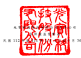
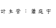

|            | , 係 新 台 幣 仟 元                          |                      |                                                                                   |                                                                              |                                                 |              |                |                |                |              |                               |               |                             |               |                 |                                          |                  |                     |              |             |
|------------|-----------------------------------------------|----------------------|-----------------------------------------------------------------------------------|------------------------------------------------------------------------------|-------------------------------------------------|--------------|----------------|----------------|----------------|--------------|-------------------------------|---------------|-----------------------------|---------------|-----------------|------------------------------------------|------------------|---------------------|--------------|-------------|
| 歸         | 屬                                            | 於                   | 母                                                                                | 公                                                                           | 司                                              | 業           | 主             | 之             | 權             | 益           |                               |               |                             |               |                 |                                          |                  |                     |              |             |
|            | 其                                            | 他                   | 權                                                                                | 益                                                                           | 項                                              | 目           | (             | 附             | 註             | 二 四 及     | 二 九 )                      |               |                             |               |                 |                                          |                  |                     |              |             |
|            | 透 過 其 他 綜 合                             |                      |                                                                                   |                                                                              |                                                 |              |                |                |                |              |                               |               |                             |               |                 |                                          |                  |                     |              |             |
|            | 國 外 營 運 機 構 損 益 按 公允 價 值         |                      |                                                                                   |                                                                              |                                                 |              |                |                |                |              |                               |               |                             |               |                 |                                          |                  |                     |              |             |
| 股         | 本                                            | (                   | 附                                                                                | 註                                                                           | 二                                              | 四           | ) 資本公積 保 | 留             | 盈             | 餘           | (                            | 附            | 註                          | 二            | 四              | ) 財 務 報 表 換 算 衡 量 之 金融 資 產 | 與待出售處分群組 | 庫藏股票 非控制權益 |              |             |
| 代         | 碼                                            | 股 數 ( 仟 股 ) 金 | 額 待註銷股本 ( 附 註 二 四 ) 法 定 盈 餘 公 積 特 別 盈 餘 公 積 未分配盈餘 合 | 計 之兌換差額 未 實 現 (損 ) 益 員 工 未 賺得 酬 勞 直 接 相 關之 權 益 合 | 計 ( 附 註 二 四 ) ( 附 註 二 四 ) 權益總額 |              |                |                |                |              |                               |               |                             |               |                 |                                          |                  |                     |              |             |
| A1         | 111 年 1 月 1 日餘額                          | 2,350,867            | $ 23,508,670                                                                      | $                                                                            | -                                               | $ 21,836,342 | $ 15,613,679   | $ 5,940,218    | $ 15,199,955   | $ 36,753,852 | ( $ 5,820,080 ) ( $ 236,908 ) | $             | -                           | $             | -               | ( $ 6,056,988 )                          | ( $ 3,700,808 )  | $ 532,459           | $ 72,873,527 |             |
| 盈餘分配: |                                               |                      |                                                                                   |                                                                              |                                                 |              |                |                |                |              |                               |               |                             |               |                 |                                          |                  |                     |              |             |
| B1         | 提列法定盈餘公積                              | -                    | -                                                                                 | -                                                                            | -                                               | 1,166,970    | -              | (              | 1,166,970 )    | -            | -                             | -             | -                           | -             | -               | -                                        | -                | -                   |              |             |
| B17        | 特別盈餘公積迴轉                              | -                    | -                                                                                 | -                                                                            | -                                               | -            | (              | 2,725,667 )    | 2,725,667      | -            | -                             | -             | -                           | -             | -               | -                                        | -                | -                   |              |             |
| B5         | 現金股利                                      | -                    | -                                                                                 | -                                                                            | -                                               | -            | -              | (              | 9,241,621 )    | (            | 9,241,621 )                   | -             | -                           | -             | -               | -                                        | -                | -                   | (            | 9,241,621 ) |
| O1         | 非控制權益變動                                | -                    | -                                                                                 | -                                                                            | -                                               | -            | -              | -              | -              | -            | -                             | -             | -                           | -             | -               | 7,419                                    | 7,419            |                     |              |             |
| M5         | 實際處分子公司股權價格與帳面價值差額          | -                    | -                                                                                 | -                                                                            | 30,549                                          | -            | -              | -              | -              | -            | -                             | -             | -                           | -             | -               | -                                        | 30,549           |                     |              |             |
| N1         | 股份基礎給付交易                              | -                    | -                                                                                 | -                                                                            | 744,607                                         | -            | -              | -              | -              | -            | -                             | (             | 732,514 )                   | -             | (               | 732,514 )                                | -                | -                   | 12,093       |             |
| L7         | 處分庫藏股交易                                | -                    | -                                                                                 | -                                                                            | 88,015                                          | -            | -              | -              | -              | -            | -                             | -             | -                           | -             | 232,396         | -                                        | 320,411          |                     |              |             |
| M7         | 對子公司所有權權益變動                        | -                    | -                                                                                 | -                                                                            | 37,793                                          | -            | -              | -              | -              | -            | -                             | -             | -                           | -             | -               | -                                        | 37,793           |                     |              |             |
| H3         | 組織重組                                      | -                    | -                                                                                 | -                                                                            | (                                               | 29,824 )     | -              | -              | -              | -            | -                             | -             | -                           | -             | -               | -                                        | -                | (                   | 29,824 )     |             |
| C7         | 採用權益法認列之關聯企業及合資之變動數        | -                    | -                                                                                 | -                                                                            | 6,622                                           | -            | -              | -              | -              | -            | -                             | -             | -                           | -             | -               | -                                        | 6,622            |                     |              |             |
| M1         | 發放予子公司股利調整資本公積                  | -                    | -                                                                                 | -                                                                            | 97,517                                          | -            | -              | -              | -              | -            | -                             | -             | -                           | -             | -               | -                                        | 97,517           |                     |              |             |
| T1         | 其他權益變動                                  | -                    | -                                                                                 | -                                                                            | 41                                              | -            | -              | -              | -              | -            | -                             | -             | -                           | -             | -               | -                                        | 41               |                     |              |             |
| D1         | 111 年 1 月 1 日至 9 月 30 日淨利             | -                    | -                                                                                 | -                                                                            | -                                               | -            | -              | 10,303,564     | 10,303,564     | -            | -                             | -             | -                           | -             | -               | 30,061                                   | 10,333,625       |                     |              |             |
| D3         | 111 年 1 月 1 日至 9 月 30 日其他綜合(損)益 | -                    | -                                                                                 | -                                                                            | -                                               | -            | -              | -              | -              | 5,141,681    | (                             | 124,108 )     | -                           | -             | 5,017,573       | -                                        | 47,416           | 5,064,989           |              |             |
| D5         | 111 年 1 月 1 日至 9 月 30 日綜合(損)益總額 | -                    | -                                                                                 | -                                                                            | -                                               | -            | -              | 10,303,564     | 10,303,564     | 5,141,681    | (                             | 124,108 )     | -                           | -             | 5,017,573       | -                                        | 77,477           | 15,398,614          |              |             |
| Z1         | 111 年 9 月 30 日餘額                         | 2,350,867            | $ 23,508,670                                                                      | $                                                                            | -                                               | $ 22,811,662 | $ 16,780,649   | $ 3,214,551    | $ 17,820,595   | $ 37,815,795 | ( $ 678,399 ) ( $ 361,016 )   | ( $ 732,514 ) | $                           | -             | ( $ 1,771,929 ) | ( $ 3,468,412 )                          | $ 617,355        | $ 79,513,141        |              |             |
| A1         | 112 年 1 月 1 日餘額                          | 2,363,083            | $ 23,630,830                                                                      | $                                                                            | -                                               | $ 22,706,153 | $ 16,780,649   | $ 3,214,551    | $ 21,736,118   | $ 41,731,318 | ( $ 2,315,737 ) ( $ 304,465 ) | ( $ 623,682 ) | $                           | -             | ( $ 3,243,884 ) | ( $ 3,468,412 )                          | $ 631,122        | $ 81,987,127        |              |             |
| 盈餘分配: |                                               |                      |                                                                                   |                                                                              |                                                 |              |                |                |                |              |                               |               |                             |               |                 |                                          |                  |                     |              |             |
| B1         | 提列法定盈餘公積                              | -                    | -                                                                                 | -                                                                            | -                                               | 1,477,651    | -              | (              | 1,477,651 )    | -            | -                             | -             | -                           | -             | -               | -                                        | -                | -                   |              |             |
| B5         | 現金股利                                      | -                    | -                                                                                 | -                                                                            | -                                               | -            | -              | ( 11,622,983 ) | ( 11,622,983 ) | -            | -                             | -             | -                           | -             | -               | -                                        | ( 11,622,983 )   |                     |              |             |
| B17        | 特別盈餘公積迴轉                              | -                    | -                                                                                 | -                                                                            | -                                               | -            | (              | 306,225 )      | 306,225        | -            | -                             | -             | -                           | -             | -               | -                                        | -                | -                   |              |             |
| C7         | 採用權益法認列之關聯企業及合資之變動數        | -                    | -                                                                                 | -                                                                            | 25                                              | -            | -              | -              | -              | -            | -                             | -             | -                           | -             | -               | -                                        | 25               |                     |              |             |
| L1         | 庫藏股買回                                    | -                    | -                                                                                 | -                                                                            | -                                               | -            | -              | -              | -              | -            | -                             | -             | -                           | -             | -               | -                                        | -                |                     |              |             |
| L3         | 庫藏股註銷                                    | (                    | 462 )                                                                             | (                                                                            | 4,620 )                                         | -            | (              | 17,972 )       | -              | -            | -                             | -             | -                           | -             | -               | -                                        | -                | 22,592              | -            | -           |
| M1         | 發放予子公司股利調整資本公積                  | -                    | -                                                                                 | -                                                                            | 103,246                                         | -            | -              | -              | -              | -            | -                             | -             | -                           | -             | -               | -                                        | 103,246          |                     |              |             |
| M3         | 處分採用權益法之投資/子公司                  | -                    | -                                                                                 | -                                                                            | -                                               | -            | -              | -              | -              | 53,994       | -                             | -             | -                           | 53,994        | -               | 4,314                                    | 58,308           |                     |              |             |
| N1         | 股份基礎給付                                  | 5,625                | 57,312                                                                            | (                                                                            | 1,064 )                                         | 377,337      | -              | -              | 820            | 820          | -                             | -             | (                           | 1,080 )       | -               | (                                        | 1,080 )          | -                   | -            | 433,325     |
| O1         | 非控制權益變動                                | -                    | -                                                                                 | -                                                                            | -                                               | -            | -              | -              | -              | -            | -                             | -             | -                           | -             | -               | (                                        | 26,686 )         | (                   | 26,686 )     |             |
| Q1         | 處分透過其他綜合損益按公允價值衡量之權益 工具 | -                    | -                                                                                 | -                                                                            | -                                               | -            | -              | 67,868         | 67,868         | -            | (                             | 67,868 )      | -                           | -             | (               | 67,868 )                                 | -                | -                   | -            |             |
| T1         | 與待出售處分群組直接相關之權益                | -                    | -                                                                                 | -                                                                            | -                                               | -            | -              | -              | -              | 112,482      | -                             | -             | (                           | 112,482 )     | -               | -                                        | -                | -                   |              |             |
| D1         | 112 年 1 月 1 日至 9 月 30 日淨利             | -                    | -                                                                                 | -                                                                            | -                                               | -            | -              | 11,110,767     | 11,110,767     | -            | -                             | -             | -                           | -             | -               | 30,150                                   | 11,140,917       |                     |              |             |
| D3         | 112 年 1 月 1 日至 9 月 30 日其他綜合利益     | -                    | -                                                                                 | -                                                                            | -                                               | -            | -              | -              | -              | 2,320,036    | 84,330                        | -             | -                           | 2,404,366     | -               | 32,404                                   | 2,436,770        |                     |              |             |
| D5         | 112 年 1 月 1 日至 9 月 30 日綜合利益總額     | -                    | -                                                                                 | -                                                                            | -                                               | -            | -              | 11,110,767     | 11,110,767     | 2,320,036    | 84,330                        | -             | -                           | 2,404,366     | -               | 62,554                                   | 13,577,687       |                     |              |             |
| Z1         | 112 年 9 月 30 日餘額                         | 2,368,246            | $ 23,683,522                                                                      | ( $                                                                          | 1,064 )                                         | $ 23,168,789 | $ 18,258,300   | $ 2,908,326    | $ 20,121,164   | $ 41,287,790 | $ 170,775                     | ( $ 288,003 ) | ( $ 624,762 ) ( $ 112,482 ) | ( $ 854,472 ) | ( $ 3,445,820 ) | $ 671,304                                | $ 84,510,049     |                     |              |             |

董 事 長 : 宋明峰 經 理 人 : 邱森彬 會 計 主 管 : 蕭 庭 宇

後 附 之 附 註 係 本 合 併 財 務 報 告 之 一 部 分 。

( 請 參 閱 勤 業 眾 信 聯 合 會 計 師 事 務 所 民 國 112 年 10 月 30 日 核 閱 報告)

- 8 -

