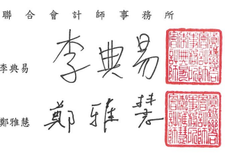

會計師核閱報告
(111)財審報字第 22001772 號 瑞昱半導體股份有限公司 公鑒:

## 前言

瑞昱半導體股份有限公司及子公司民國 111年及 110年9月30日之合併資產負債 表,民國111年及110年7月1日至9月30日、民國 111年及110年1月1日至9月 30 日之合併綜合損益表,暨民國 11年及 110年1月1日至 9月30 日之合併權益變動 表、合併現金流量表,以及合併財務報表附註(包括重大會計政策彙總),業經本會計師 核閱獎事。依證券發行人財務報告編製準則及金融監督管理委員會認可之國際會計準則 第三十四號「期中財務報導」編製允當表達之合併財務報表係管理階層之責任,本會計 師之責任係依據核閱結果對合併財務報表作成結論。

## 範圍

除保留結論之基礎段所述者外,本會計師係依照審計準則公報第六十五號「財務報 表之核閱」執行核閱工作。核閱合併財務報表時所執行之程序包括查詢(主要向負責財 務與會計事務之人員查詢)、分析性程序及其他核聞程序。核閱工作之範圍明顯小於查 核工作之範圍,因此本會計師可能無法察覺所有可藉由查核工作辨認之重大事項,故無 法表示查核意見。

## 保留結論之基礎

如合併財務報表附註四(三)及六(七)所述,列入上開合併財務報表之部分非重要子 公司及採權益法之投資,其同期間財務報表及附註十三所揭露之相關資訊,條依據各該 公司同期間自編未經會計師核閱之財務報表所編製而得。該等子公司民國 111年及110 年9月30日之寶產總額分別為新台幣7,000,513 仟元及新台幣 6,251,356 仟元,分別 占合併資產總額之 5.21%及 6.13%;負債總額分別為新台幣 1,576,349 仟元及新台幣 1,270,772 仟元,分別占合併負債總額之1.80%及 1.89%;其民國 111年及 110年7月 1 日至 9月30日、民國 111年及 110年1月1日至 9月 30日之綜合(損)益總額分別為新 台幣 9,143 仟元、新台幣 131,835 仟元、新台幣(449,291)仟元及新台幣 510,772 仟元, 分別占合併綜合(損)益總額之 0.11%、2.55%、(2.19)%及 4.16%。另對於採權益法之投 資,民國 111年及 110年9月30日採權益法之投資餘額分別為新台幣 176,891 仟元及
~4~

新台幣 192,976 仟元;其民國 111年及 110年7月1日至 9月30日、民國 111年及 110 年1月1日至9月30日所認列之投資損失分別為新台幣 3,222 仟元、新台幣 1,921 仟 元、新台幣14,503 仟元及新台幣10,514 仟元。

## 保留結論

依本會計師核閱結果,除保留結論之基礎段所述部分非重要子公司及採檔益法之投 資其財務報表倘經會計師核閱,對合併財務報表可能有所調整之影響外,並未發現上開 合併财務報表在所有重大方面有未依照證券發行人財務報告編製準則及金融監督管理 委員會認可之國際會計準則第三十四號「期中財務報導」編製,致無法允當表達瑞昱半 導體股份有限公司及子公司民國 111年及 110年 9月 30 日之合併財務狀況,民國 111 年及 110年7月1日至 9月30日、民國 111年及 110年1月1日至 9月 30日之合併財 務績效,暨民國 111年及 110年1月1日至9月30日之合併現金流量之情事。

資 誠

$$\operatorname{fm}$$

會計師 金融監督管理委員會 核准簽證文號:金管證審字第 1020028992 號 前行政院金融監督管理委員會證券期貨局 核准簽證文號:金管證六字第 0960072936 號

* [10] M. C. Gonzalez-Garcia, M. C. Gonzalez-Garcia, M.  
~5~