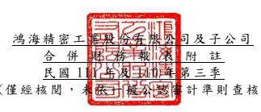

單位:新 台幣仟 元 (除特別註 明者外 )

## 一、 公司沿革

鴻海精密 工業股 份有限 公司 (以 下簡稱「 本公司 」)於 中華民 國設立,本 公司及 子 公司(以下 統稱「本集團 」)主 要營業 項 目為資訊 產業、通訊產 業、自 動化設 備 產 業、精密 機械產 業、汽 車產業 與消費 性 電子產業 有關之 各種連 接器、機殼、散 熱 器、有線/無線 通訊產 品、光學產 品、電 源供應模 組、應用模 組組裝 產品以 及網 路線纜裝 配等產 品之製 造、銷 售及服 務 。

## 二、 通過財務 報告之 日期及 程序

本合併財 務報告 已於民國 111 年 11 月 10 日提報董事 會後發 布 。

三、 新發布及 修訂準 則及解 釋之適 用
(一)已採用金 融監督 管理委 員會 (以 下簡稱「 金管會 」)認 可之新 發布、修 正 後國 際財務報 導準則 之影響 下列彙列 金管會 認可之 民國 111 年適用 之國際財 務報導 準則之 新發布 、修 正及修訂 之準則 及解釋 :

|                             | 國際會計準則理事會            |              |                 |                 |
|-----------------------------|-------------------------------|--------------|-----------------|-----------------|
|                             | 新發布/修正/修訂準則及解釋    | 發布之生效日 |                 |                 |
| 國際財務報導準則第3號之修正 | 「對觀念架構之索引」          |              | 民國111年1月1日 |                 |
| 國際會計準則第16號之修正    | 「不動產                      | 、廠房及設備 | :達到預定      | 民國111年1月1日 |
| 使用狀態前之價款」          |                               |              |                 |                 |
| 國際會計準則第37號之修正    | 「虧損性合約─履行合約之成本」 |              | 民國111年1月1日 |                 |
| 2018-2020週期之年度改善     | 民國111年1月1日               |              |                 |                 |

本集團經 評估上 述準則 及解釋 對本集 團 財務狀況 與 財務 績效並 無重大 影響。

(二)尚未採用 金管會 認可之 新發布 、修正 後 國際財務 報導準 則之影 響

| 國際會計準則理事會         |                                |                 |                 |
|----------------------------|--------------------------------|-----------------|-----------------|
| 新發布/修正/修訂準則及解釋 | 發布之生效日                   |                 |                 |
| 國際會計準則第1號之修正    | 「會計政策之揭露」             |                 | 民國112年1月1日 |
| 國際會計準則第8號之修正    | 「會計估計之定義」             |                 | 民國112年1月1日 |
| 國際會計準則第12號之修正   | 「與單一交易所產生之資產及負債 | 民國112年1月1日 |                 |
| 有關之遞延所得稅」         |                                |                 |                 |

下表彙列 金管會 認可之 民國 112 年適用 之國際財 務報導 準則之 新發布 、修 正及修訂 之準則 及解釋 :
本集團經 評估上 述準則 及解釋 對本集 團 財務狀況 與 財務 績效並 無重大 影響。

## (三)國際會計準則理事會已發布但尚未經金管會認可之國際財務報導準則之影

響 下 表 彙 列 國 際 會 計 準 則 理 事 會 已 發 布 但 尚 未 納 入 金 管 會 認 可 之 國 際 財 務 報 導準則之 新發布 、修正 及修訂 之準則 及 解釋:

|                                                  | 國際會計準則理事會         |                 |                 |
|--------------------------------------------------|----------------------------|-----------------|-----------------|
|                                                  | 新發布/修正/修訂準則及解釋 | 發布之生效日    |                 |
| 國際財務報導準則第10號及國際會計準則第28號之修正 | 「投資 待國際會計準則理事  |                 |                 |
| 者與其關聯企業或合資間之資產出售或投入」         |                            | 會決定          |                 |
| 國際財務報導準則第16號之修正                     | 「售後租回中之租賃負債」   |                 | 民國113年1月1日 |
| 國際財務報導準則第17號                           | 「保險合約」               |                 | 民國112年1月1日 |
| 國際財務報導準則第17號                           | 「保險合約」之修正         | 民國112年1月1日 |                 |
| 國際財務報導準則第17號之修正                     | 「初次適用國際財務報導準則 | 民國112年1月1日 |                 |
| 第17號及國際財務報導準則第9號—比較資訊」         |                            |                 |                 |
| 國際會計準則第1號之修正                          | 「負債之流動或非流動分類」 |                 | 民國113年1月1日 |
| 國際會計準則第1號之修正                          | 「具合約條款之非流動負債」 |                 | 民國113年1月1日 |

本集團經 評估上 述準則 及解釋 對本集 團 財務狀況 與 財務 績效並 無重大 影響。

## 四、 重大會計 政策之 彙總說 明

除另有說明外, 下 列 編 製 本 合 併 財 務 報 表 所 採 用 重 大 會 計 政 策 在 所 有 報 導 期 間 一致適用 。 (一)遵循聲明 本 合 併 財 務 報 告 係 依 據 證 券 發 行 人 財 務 報 告 編 製 準 則 與 金 管 會 認 可 之 國 際 會計準則第 34 號 「期中 財務報 導」編 製 。

## (二)編製基礎

1.除下列 重要項 目外, 本合併 財務報 告 係按歷史 成本編 製:
(1)按 公 允 價 值 衡 量 之 透 過 損 益 按 公 允 價 值 衡 量 之 金 融 資 產 及 負 債 (包 括 衍生工具)。

(2)按公允 價值衡 量之 透 過其他 綜合損 益 按公允價 值衡量 之金融 資產 。 (3)按退休 基金資 產減除 確定福 利義務 現 值之淨額 認列之 確定福 利負債 。

2.編製符 合金管 會認可 之國際 財務報 導 準則、國際 會計準 則、解釋 及解釋 公 告(以下簡稱 IFRSs)之財務 報告需 要使 用一些重 要會計 估計,在應 用本集 團 的 會 計 政 策 過 程 中 亦 需 要 管 理 階 層 運 用 其 判 斷 , 涉 及 高 度 判 斷 或 複 雜 性之項目,或涉及 合併財 務報 告 之重大 假設及估 計之項 目,請詳 附註五 說 明。

## (三)合併基礎

1.合併報 表編製 原則
(1)本集團 將所有 子公司 納入合 併財務 報 告編製之 個體。 子公司 指受本 集 團控制之 個體( 包括結 構型個 體),當本 集團暴露 於來自 對該個 體之參 與之變動 報酬或 對該等 變動報 酬享有 權 利,且透過對該 個體之 權力有 能力影響 該等報 酬時,本集 團即控 制該 個體。子公 司自本 集團取得 控 制之日起 納入合 併財務 報告, 於喪失 控 制之日起 終止合 併。

(2)集團內 公司間 之交易 、餘額 及未實 現 損益業已 銷除。 子公司 之會計 政