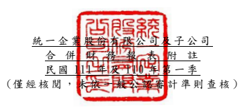

單位:新 台幣仟 元 (除特別註 明者外 )

## 一、 公司沿革

(一)統一企業 股份有 限公司 (以下簡 稱「本 公 司 」)係依 據中華 民國公 司法及 其 他有關法 令之規 定,於 民國 56 年 8 月奉 准創立。 主要經 營項目 為各種 飲 料、食品 、飼料 、麵粉 等之製 造、加 工 及買賣業 務。 列 入本公 司及子 公司
(以下統稱 「本集 團 」)合併財 務報告 之 子公司主 要經營 項目, 請詳附 註四 (三)合併 基礎之 說明。

(二)本公司股 票自 民國 76 年 12 月 起在台 灣 證券交易 所上市 買賣。

二、 通過財務 報告之 日期及 程序 本合併財 務報告 已於民國 111 年 5 月 11 日經董事 會通過 後發布 。

三、 新發布及 修訂準 則及解 釋之適 用
(一)已採用金 融監督 管理委 員會 (以 下簡稱「 金管會 」)認可 之新發 布、修正後 國 際財務報 導準則 之影響 下表彙列 金管會 認可之 民國 111 年適用 之國際財 務報導 準則之 新發布 、修 正及修訂 之準則 及解釋 :

|                             | 國際會計準則理事會             |              |                 |
|-----------------------------|--------------------------------|--------------|-----------------|
|                             | 新發布/修正/修訂準則及解釋     | 發布之生效日 |                 |
| 國際財務報導準則第3號之修正 | 「對觀念架構之索引」           |              | 民國111年1月1日 |
| 國際會計準則第16號之修正    | 「不動產、廠房及設備           | :達到預定   | 民國111年1月1日 |
| 使用狀態前之價款」          |                                |              |                 |
| 國際會計準則第37號之修正    | 「虧損性合約-履行合約之成本」 |              | 民國111年1月1日 |
| 2018-2020週期之年度改善     | 民國111年1月1日                |              |                 |

本 集 團 經 評 估 上 述 準 則 及 解 釋 對 本 集 團 財 務 狀 況 與 財 務 績 效 並 無 重 大 影 響。

(二)尚未採用 金管會 認可之 新發布 、修正 後 國際財務 報導準 則之影 響 無。

(三)國際會計準則理事會已發布但尚未經金管會認可之國際財務報導準則之影 響 下 表 彙 列 國 際 會 計 準 則 理 事 會 已 發 布 但 尚 未 納 入 金 管 會 認 可 之 國 際 財 務 報 導準則之 新發布 、修正 及修訂 之準則 及 解釋: