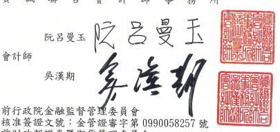

會計師核閱報告 台灣化學纖維股份有限公司 公鑒:

## 前言

(112)財審報字第 23000292 號 台灣化學織維股份有限公司及其子公司(以下簡稱「台化集團」)民國 112 年及 111 年3月31日之合併資產負債表,暨民國 112年及 111年1月1日至3月31日之合併綜 合損益表、合併檔益變動表、合併現金流量表,以及合併財務報表附註(包括重大會計政 策彙總),業經本會計師核閱竣事。依證券發行人財務報告編製準則及經金融監督管理 委員會認可並發布生效之園際會計準則第 34 號「期中財務報導」編製允當表達之合併 財務報表係管理陪層之責任,本會計師之貴任條依據核閱結果對合併財務報表作成結 論。

## 範圍

除保留結論之基礎段所述者外,本會計師係依照中華民國核閱準則 2410 號「財務 報表之核閱」執行核閱工作。核閱合併財務報表時所執行之程序包括查詢(主要向負責 財務與會計事務之人員查詢)、分析性程序及其他核閱程序。核閲工作之範圍明顯小於 查核工作之範圍,因此本會計師可能無法察覺所有可藉由查核工作辨認之重大事項,故 無法表示查核意見。

## 保留結論之基礎

如合併財務報表附註四(三)及六(七)所述,列入上開合併財務報表之部分非重要子 公司及採用權益法之投資之同期間財務報表未經會計師核閱,該等公司民國 112 年及 111 年 3 月 31 日之資產總額(含採用權益法之投資)分別為新台幣 96,447,414 仟元及新 台幣 102,261,962 仟元,皆占合併資產總額之 17%;負債總額分別為新台幣 22,496,330 仟元及新台幣 20,640,277 仟元,分別占合併負債總額之 11%及 13%;其民國 112 年及 111 年1月1日至3月 31 日之綜合損益總額(含採用權益法之關聯企業及合資損益之份 額及採用權益法認列之關聯企業及合資之綜合損益份額)分別為損失新台幣 554,625 仟 元及利益新台幣 1,748,715 仟元,分別占合併綜合損益總額之 4%及 14%。

## ~4~ 保留結論

依本會計師核聞結果及其他會計師之核閱報告(請參閱其他事項段),除保留結論之 基礎段所述部分非重要子公司及採用權益法之投資之財務報表倘經會計師核閱:對合併 財務報表可能有所調整之影響外,並未發現上開合併財務報表在所有重大方面有未依照 證券發行人財務報告編製準則及經金融監督管理委員會認可並發布生效之國際會計準 則第 34號「期中財務報導」編製,致無法允當表達台化集團民國 112年及 111年 3月 31 日之合併財務狀況,豎民國 112年及 111年1月1日至3月31日之合併財務績效及 合併現金流量之情事。

## 其他事項-提及其他會計師之核閱

列入台化集團合併財務報表之部分採用權益法之被投資公司,其財務報表未經本會 計師核閱,而係由其他會計師核閱。因此,本會計師對上開合併財務報表所出具之核閱 報告中,有關該等公司財務報表所列之金額,條依據其他會計師之核閱報告。民國 112 年及 111年3月31日對前述公司採用權益法之投資金額分別為新台幣 75,845,981 仟元 及 89,036,276 仟元,分別占合併資產總額之 13%及 14%,民國 112年及 111年1月1日 至 3月 31 日對前述公司認列之綜合損益分別為利益新台幣 3,054,296 仟元及利益新台 幣 2,955,553 仟元,各占合併綜合損益之 23%及 24%。

資 誠

$\mathrm{H}_{\mathrm{T}}^{\mathrm{t}\mathrm{a}}$

* [16] M. C.  
新 के
務 所

前財政部證券暨期貨管理委員會 核准簽證文號:(90)台財證(六)字第 157088 號 中 華 民 國 112年5月5 日