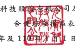

司及子公司

光寶科技股

1 日至 3 月 31 日 民國 111年及 1
(僅經核閱,未依一般公認審計準則查核)
單位:新台幣仟元,惟 每股盈餘為元

| 111年1月1日至3月31日     | 110年1月1日至3月31日     |               |            |             |             |           |     |
|--------------------------|--------------------------|---------------|------------|-------------|-------------|-----------|-----|
| 金                       | 額                       | %             | 金         | 額          | %           |           |     |
| 代 碼                    | 營業收入(附註二四及三十) | $ 38,506,956  | 102        |             |             |           |     |
| 4110                     | 銷貨收入                 | $ 42,149,777  | 102        | 700,861     |             |           |     |
| 4190                     | 減:銷貨折讓              | 830,075       | 2          | 2           |             |           |     |
| 4170                     | 銷貨退回                 | 89,754        | ___        | 88,079      | -           |           |     |
|                          | 100                      |               |            |             |             |           |     |
| 4000                     | 營 業收入合計            | 41,229,948    | 100        | 37,718,016  |             |           |     |
| 營業成本                 |                          |               |            |             |             |           |     |
| 5110                     | 銷貨成本(附註十二、二    | (_34,163,091) | ( 82)      |             |             |           |     |
| 五及三十)                | ( 83)                    | (_31,000,331) |            |             |             |           |     |
| 5900                     | 營業毛利                 | 7,066,857     | _17        | 6,717,685   | 18          |           |     |
| 營業費用(附註二五及三十) |                          |               |            |             |             |           |     |
| 6100                     | 推銷費用                 | 1,427,940 )   | (          | 3)          | 1,288,490 ) | (         | ব ) |
| 6200                     | 管理费用                 | 1,036,664 )   | (          | 3)          | 1,533,404 ) | (         | 4)  |
| 6300                     | 研究發展费用             | 1,619,297 )   | 4)         | 1,251,238 ) | (           | 3)        |     |
| 6450                     | 預期信用減損損失(附註    |               |            |             |             |           |     |
| 十一及二四)              | 1,719)                   | -             | 537,955)   | 1)          |             |           |     |
| 6000                     | 營業費用合計             | 4,085,620)    | 10)        | 4,611,087 ) | 12)         |           |     |
| 6900                     | 签業利益                 | 2,981,237     | 7          | 2,106,598   | 6           |           |     |
| 梦業外收入及支出         |                          |               |            |             |             |           |     |
| 7060                     | 採用權益法認列之關聯     | 2,860 )       |            |             |             |           |     |
| 企業損失份額             | (                        | 1,581 )       | -          | (           | 167,057     |           |     |
| 7100                     | 利息收入                 | 147,606       | -          | -           |             |           |     |
|                          | 191,980                  |               |            |             |             |           |     |
| 7190                     | 其他收入(附註三十)       | 143,260       | -          | -           |             |           |     |
| 7230                     | 外幣兌換淨損             | (             | 776,788) ( | 2)          | (           | 176,646 ) | ।   |
| 7235                     | 透過損益按公允價值衡     | 3,463,057     | 9          |             |             |           |     |
| 量之金融商品净益         | 208,673                  | 1             |            |             |             |           |     |
| 7235                     | 透過損益按公允價值衡     |               |            |             |             |           |     |
| 量之金融商品净益—        | 72,337                   |               |            |             |             |           |     |
| 結構性商品               | 83,357                   | -             |            |             |             |           |     |
| (接次頁)                 |                          |               |            |             |             |           |     |

| 111年1月1日至3月31日      | 110年1月1日至3月31日   |             |           |                |           |          |    |
|---------------------------|------------------------|-------------|-----------|----------------|-----------|----------|----|
| 代 碼                     | 会                     | 額          | %         | 金             | 額        | %        |    |
| 7510                      | 利息費用(附註二五)     | ($          | 58,749 )  | =              | ( સે       | 39,506)  | -  |
| 7590                      | 什項支出               | (           | 75,701 )  | -              | (         | 81,784 ) | -  |
| 7610                      | 處分不動產、廠房及設備 |             |           |                |           |          |    |
| 净益                      | 5,553                  | -           | 9,392     | -              |           |          |    |
| 7670                      | 減損損失(附註十五及十  |             |           |                |           |          |    |
| ハ)                       | --                     | -------     | 222,310)  | (__ 1)         |           |          |    |
| 7000                      | 誉 紫外收入及支出      |             |           |                |           |          |    |
| 合計                      | 324,370)               | (____ T)    | 3,380,717 | 8              |           |          |    |
| 7900                      | 稅前淨利               | 2,656,867   | 6         | 5,487,315      | Jイ       |          |    |
| 7950                      | 所得稅費用(附註二六)   | (_ 544,653) | (_        | (__ 1,212,118) | (__ 3)    |          |    |
| 8200                      | 浮                     | 利          | 2,112,214 | __             | 4,275,197 | _ 11     |    |
| 其他綜合損益(附註二三及二 |                        |             |           |                |           |          |    |
| 六)                       |                        |             |           |                |           |          |    |
| 8310                      | 不重分類至損益之項目   |             |           |                |           |          |    |
| 8316                      | 透過其他綜合損益       |             |           |                |           |          |    |
| 按公允價值街量            |                        |             |           |                |           |          |    |
| 之權益工具投資            |                        |             |           |                |           |          |    |
| 未實現評價利益            | 9,213                  | 30,496      |           |                |           |          |    |
|                           | =                      |             |           |                |           |          |    |
|                           | 9,213                  | ==          | 30,496    | ==             |           |          |    |
| 8360                      | 後續可能重分類至損益   |             |           |                |           |          |    |
| 之項目:                   |                        |             |           |                |           |          |    |
| 8361                      | 國外營運機構財務       |             |           |                |           |          |    |
| 報表換算之兌換            |                        |             |           |                |           |          |    |
| 差額                      | 3,493,527              | 9           | 860,190   | 2              |           |          |    |
| 8370                      | 採用權益法認列關       |             |           |                |           |          |    |
| 聯企業之其他綜            |                        |             |           |                |           |          |    |
| 合利益之份額              | 53,824                 | -           | 13,828    | -              |           |          |    |
| 8399                      | 與可能重分類至損       |             |           |                |           |          |    |
| 益之項目相關之            |                        |             |           |                |           |          |    |
| 所得稅                    | 691,40Z )              | (_          | 180,647 ) |                |           |          |    |
| 2,855,944                 | 7                      | 693,371     | 2         |                |           |          |    |
| 8300                      | 其他綜合損益合計       | 2,865,157   | _Z        | 723,867        | 2         |          |    |
| 8500                      | 綜合損益總額           | $ 4,977,371 | _12       | $ 4,999,064    | 13        |          |    |

| 111年1月1日至3月31日   | 110年1月1日至3月31日   |           |           |        |           |           |    |
|------------------------|------------------------|-----------|-----------|--------|-----------|-----------|----|
| 代 碼                  | 金                     | 額        | %         | 額     | %         |           |    |
|                        | 金                     |           |           |        |           |           |    |
| 淨利歸屬於:            |                        |           |           |        |           |           |    |
| 8610                   | 母公司業主             | ട്         | 2,103,750 | 5      | $         | 4,263,410 | 11 |
| 8620                   | 非控制權益             | 8,464     | ـــ       | 11,787 | '         |           |    |
| 8600                   | ട്                      |           |           |        |           |           |    |
| 169                    | 2,112,214              | 5         | 4,275,197 | 11     |           |           |    |
| 綜合損益總額歸屬於 :   |                        |           |           |        |           |           |    |
| 8710                   | 母公司業主             | $         | 4,939,238 | $      |           |           |    |
|                        | 12                     | 4,996,646 | 13        |        |           |           |    |
| 8720                   | 非控制權益             | 38,133    | -         | 2,418  | -         |           |    |
| 8700                   | ക                      | 4,977,371 | 12        | ക      | 4,999,064 | 13        |    |
| 毎股盈餘(附註二七)     |                        |           |           |        |           |           |    |
| 9750                   | 基                     | 本        | $         | 0.92   | $         | 1.83      |    |
| 9850                   | 稀                     | 釋        | ക്ക        | 0.91   | $         | 1.82      |    |

後附之附註條本合併財務報告之一部分。

(請參閱勤業眾信聯合會計師事務所民國 111年 4月 28 日核閱報告)

