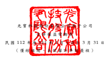
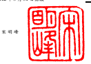
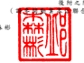

|                                                                             | ,係新台幣仟元                                 |                                                                                           |                                                    |                                                 |                      |              |              |             |               |              |                     |               |                                           |                               |                                 |              |         |              |           |
|-----------------------------------------------------------------------------|------------------------------------------------|-------------------------------------------------------------------------------------------|----------------------------------------------------|-------------------------------------------------|----------------------|--------------|--------------|-------------|---------------|--------------|---------------------|---------------|-------------------------------------------|-------------------------------|---------------------------------|--------------|---------|--------------|-----------|
| 歸                                                                          | 屬                                             | 於                                                                                        | 母                                                 | 公                                              | 司                   | 業           | 主           | 之          | 權            | 益           |                     |               |                                           |                               |                                 |              |         |              |           |
|                                                                             | 其                                             | 他                                                                                        | 權                                                 | 益                                              | 項                   | 目           | (           | 附          | 註            | 二 三 )     |                     |               |                                           |                               |                                 |              |         |              |           |
|                                                                             | 透 過 其 他 綜 合 損 益 按 公 允               |                                                                                           |                                                    |                                                 |                      |              |              |             |               |              |                     |               |                                           |                               |                                 |              |         |              |           |
|                                                                             | 國 外 營 運 機 構 價 值 衡 量 之               |                                                                                           |                                                    |                                                 |                      |              |              |             |               |              |                     |               |                                           |                               |                                 |              |         |              |           |
| 股                                                                          | 本                                             | (                                                                                        | 附                                                 | 註                                              | 二 三 ) 資本公積 保 | 留           | 盈           | 餘          | (            | 附           | 註                  | 二            | 三                                        | ) 財 務 報 表 換 算 金融資產 | 庫藏股 票 非 控 制 權 益        |              |         |              |           |
| 代 碼                                                                       | 股 數 ( 仟 股 ) 金                           | 額 待 註 銷 股 本 ( 附 註 二 三 ) 法 定 盈 餘 公 積 特 別 盈 餘 公 積 未 分 配 盈 餘 合 | 計 之 兌 換 差 額 未實現(損)益 員工未賺得酬勞 合 | 計 ( 附 註 二 三 ) ( 附 註 二 三 ) 權益總額 |                      |              |              |             |               |              |                     |               |                                           |                               |                                 |              |         |              |           |
| A1                                                                          | 111 年 1 月 1 日餘額                           | 2,350,867                                                                                 | $ 23,508,670                                       | $                                               | -                    | $ 21,836,342 | $ 15,613,679 | $ 5,940,218 | $ 15,199,955  | $ 36,753,852 | ( $ 5,820,080 ) ( $ | 236,908 )     | $                                         | -                             | ( $ 6,056,988 ) ( $ 3,700,808 ) | $            | 532,459 | $ 72,873,527 |           |
| 盈餘分配:                                                                  |                                                |                                                                                           |                                                    |                                                 |                      |              |              |             |               |              |                     |               |                                           |                               |                                 |              |         |              |           |
| B5                                                                          | 現金股利                                       | -                                                                                         | -                                                  | -                                               | -                    | -            | -            | (           | 5,776,013 ) ( | 5,776,013 )  | -                   | -             | -                                         | -                             | -                               | -            | (       | 5,776,013 )  |           |
| O1                                                                          | 非控制權益變動                                 | -                                                                                         | -                                                  | -                                               | -                    | -            | -            | -           | -             | -            | -                   | -             | -                                         | -                             | 28,284                          | 28,284       |         |              |           |
| M5                                                                          | 實際處分子公司部分權益                         | -                                                                                         | -                                                  | -                                               | 30,549               | -            | -            | -           | -             | -            | -                   | -             | -                                         | -                             | -                               | 30,549       |         |              |           |
| C7                                                                          | 採用權益法認列之關聯企業及合資 之變動數        | -                                                                                         | -                                                  | -                                               | 4,822                | -            | -            | -           | -             | -            | -                   | -             | -                                         | -                             | -                               | 4,822        |         |              |           |
| M1                                                                          | 發放予子公司股利調整資本公積                   | -                                                                                         | -                                                  | -                                               | 60,948               | -            | -            | -           | -             | -            | -                   | -             | -                                         | -                             | -                               | 60,948       |         |              |           |
| D1                                                                          | 111 年 1 月 1 日至 3 月 31 日淨利              | -                                                                                         | -                                                  | -                                               | -                    | -            | -            | 2,103,750   | 2,103,750     | -            | -                   | -             | -                                         | -                             | 8,464                           | 2,112,214    |         |              |           |
| D3                                                                          | 111 年 1 月 1 日至 3 月 31 日其他綜合 利益     | -                                                                                         | -                                                  | -                                               | -                    | -            | -            | -           | -             | 2,826,275    | 9,213               | -             | 2,835,488                                 | -                             | 29,669                          | 2,865,157    |         |              |           |
| D5                                                                          | 111 年 1 月 1 日至 3 月 31 日綜合利益 總額     | -                                                                                         | -                                                  | -                                               | -                    | -            | -            | 2,103,750   | 2,103,750     | 2,826,275    | 9,213               | -             | 2,835,488                                 | -                             | 38,133                          | 4,977,371    |         |              |           |
| Z1                                                                          | 111 年 3 月 31 日餘額                          | 2,350,867                                                                                 | $ 23,508,670                                       | $                                               | -                    | $ 21,932,661 | $ 15,613,679 | $ 5,940,218 | $ 11,527,692  | $ 33,081,589 | ( $ 2,993,805 ) ( $ | 227,695 )     | $                                         | -                             | ( $ 3,221,500 ) ( $ 3,700,808 ) | $            | 598,876 | $ 72,199,488 |           |
| A1                                                                          | 112 年 1 月 1 日餘額                           | 2,363,083                                                                                 | $ 23,630,830                                       | $                                               | -                    | $ 22,706,153 | $ 16,780,649 | $ 3,214,551 | $ 21,736,118  | $ 41,731,318 | ( $ 2,315,737 ) ( $ | 304,465 ) ( $ | 623,682 ) ( $ 3,243,884 ) ( $ 3,468,412 ) | $                             | 631,122                         | $ 81,987,127 |         |              |           |
| 盈餘分配:                                                                  |                                                |                                                                                           |                                                    |                                                 |                      |              |              |             |               |              |                     |               |                                           |                               |                                 |              |         |              |           |
| B5                                                                          | 現金股利                                       | -                                                                                         | -                                                  | -                                               | -                    | -            | -            | (           | 6,966,279 ) ( | 6,966,279 )  | -                   | -             | -                                         | -                             | -                               | -            | (       | 6,966,279 )  |           |
| C7                                                                          | 採用權益法認列之關聯企業及合資 之變動數        | -                                                                                         | -                                                  | -                                               | 25                   | -            | -            | -           | -             | -            | -                   | -             | -                                         | -                             | -                               | 25           |         |              |           |
| L3                                                                          | 庫藏股註銷                                     | (                                                                                         | 462 ) (                                            | 4,620 )                                         | -                    | (            | 17,972 )     | -           | -             | -            | -                   | -             | -                                         | -                             | -                               | 22,592       | -       | -            |           |
| M1                                                                          | 發放予子公司股利調整資本公積                   | -                                                                                         | -                                                  | -                                               | 61,948               | -            | -            | -           | -             | -            | -                   | -             | -                                         | -                             | -                               | 61,948       |         |              |           |
| M3                                                                          | 處分子公司權益                                 | -                                                                                         | -                                                  | -                                               | -                    | -            | -            | -           | -             | 25,303       | -                   | -             | 25,303                                    | -                             | -                               | 25,303       |         |              |           |
| N1                                                                          | 股份基礎給付交易                               | (                                                                                         | 624 ) (                                            | 5,280 ) (                                       | 960 )                | 6,240        | -            | -           | -             | -            | -                   | -             | 93,224                                    | 93,224                        | -                               | -            | 93,224  |              |           |
| O1                                                                          | 非控制權益變動                                 | -                                                                                         | -                                                  | -                                               | -                    | -            | -            | -           | -             | -            | -                   | -             | -                                         | -                             | (                               | 1,126 ) (    | 1,126 ) |              |           |
| D1                                                                          | 112 年 1 月 1 日至 3 月 31 日淨利              | -                                                                                         | -                                                  | -                                               | -                    | -            | -            | 2,352,973   | 2,352,973     | -            | -                   | -             | -                                         | -                             | 11,823                          | 2,364,796    |         |              |           |
| D3                                                                          | 112 年 1 月 1 日至 3 月 31 日其他綜合 (損)益 | -                                                                                         | -                                                  | -                                               | -                    | -            | -            | -           | -             | (            | 233,393 )           | 64,135        | -                                         | (                             | 169,258 )                       | -            | 5,407   | (            | 163,851 ) |
| D5                                                                          | 112 年 1 月 1 日至 3 月 31 日綜合利益 總額     | -                                                                                         | -                                                  | -                                               | -                    | -            | -            | 2,352,973   | 2,352,973     | (            | 233,393 )           | 64,135        | -                                         | (                             | 169,258 )                       | -            | 17,230  | 2,200,945    |           |
| Z1                                                                          | 112 年 3 月 31 日餘額                          | 2,361,997                                                                                 | $ 23,620,930                                       | ( $                                             | 960 )                | $ 22,756,394 | $ 16,780,649 | $ 3,214,551 | $ 17,122,812  | $ 37,118,012 | ( $ 2,523,827 ) ( $ | 240,330 ) ( $ | 530,458 ) ( $ 3,294,615 ) ( $ 3,445,820 ) | $                             | 647,226                         | $ 77,401,167 |         |              |           |
| 後 附 之附註係本 合 併 財務報 告 之一部分。                                 |                                                |                                                                                           |                                                    |                                                 |                      |              |              |             |               |              |                     |               |                                           |                               |                                 |              |         |              |           |
| (請參閱勤業眾信聯合 會 計 師 事 務 所 民 國 112 年 4 月 27 日 核 閱 報告) |                                                |                                                                                           |                                                    |                                                 |                      |              |              |             |               |              |                     |               |                                           |                               |                                 |              |         |              |           |

董事長: 宋明峰 經理人: 邱森彬 會計主管: 蕭庭宇

- 9 -

