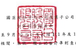

# 民副 111 年及 110 年 7 月 1 日至 9 月

1年及 110年1月1日至9月30日

(值經檢閱,

|                                      | 單位:新台幣仟元,惟                       |                  |                  |              |                |              |              |               |          |       |
|--------------------------------------|------------------------------------------|------------------|------------------|--------------|----------------|--------------|--------------|---------------|----------|-------|
|                                      | 每股盈餘為元                             |                  |                  |              |                |              |              |               |          |       |
| 110年7月1日 至9月30日                | 110年1月1日 至9月30日                    |                  |                  |              |                |              |              |               |          |       |
|                                      | 111年1月1日 至9月30日                    | (宣编接盖姬被罚) |                  |              |                |              |              |               |          |       |
| 111年7月1日 至9月30日                | (童編獲正經經閱)                         |                  |                  |              |                |              |              |               |          |       |
| 新                                   |                                          | 1                | 频               | તેરે           | �              | 项           | જે            | 哈            | 頭       | 96    |
| 代 码                                | স                                        |                  |                  |              |                |              |              |               |          |       |
| 参案收入(附註三四)                   |                                          |                  |                  |              |                |              |              |               |          |       |
| 4100                                 | 鎮實收入一净额                           | $ 30,795,422     | 100              | $ 33,283,135 | 100            | $ 92,251,747 | 100          | $ 93,267,378  | 100      |       |
| 管業成本(附註十二、二五及三四)       | 18,940,123                               | ... 61           | 19,914,421       | 60           | 56,758,003     | - হুই         | 56,590,501   | 61            |          |       |
| 5000                                 | 13,368,714                               | 40               | 35,493,744       | ્રકૃ           | 36,676,877     | 39           |              |               |          |       |
| 5900                                 | 餐第毛利                                 | 11,855,299       | 39               |              |                |              |              |               |          |       |
| 参案费用(附註二五及三四)             | 1,654,611                                | 1,692,833        | 5                | 4.959.010    | 5              | 4,795,173    | 5            |               |          |       |
| 6100                                 | 纤维费用                                 | 6                | 5,363,986        | 6            | 5.565.409      | 6            |              |               |          |       |
| 6200                                 | 管理员用                                 | 1,834,214        | 6                | 1,982,827    | 6              |              |              |               |          |       |
| 6300                                 | 研究發展費同                             | 694,431          | N                | 744,003      | 2              | 2,117,975    | N            | 2,254,261     | 2        |       |
| 6450                                 | 預期信用減損損失〔迴轉利品〕〔附註十一〕 | 5,133 )          | .                | (            | 112,490 )      | 2,112        | .            | (             | 112181 ) |       |
| 4,178,123                            | -14                                      | 4,307,173        | _13              | 12.443.083   | 13             | 12,502,662   | 13           |               |          |       |
| 6000                                 | 梦宾费用合計                             | 25               | 24,174,215       | 26           |                |              |              |               |          |       |
| 6900                                 | 巷案净利                                 | 7,677,176        | 25               | 9,061,541    | _ 27           | 23,050,661   |              |               |          |       |
| 管案外收入及支出                     | 848,484 )                                | 1) (             | 816,528 )      ( | 1)           |                |              |              |               |          |       |
| 7050                                 | 财務成本(附註二五)                       | (                | 343,528 ) (      | 1) (         | 257,064 ) (    | 1) (         | 173,690      | 144,204       |          |       |
| 7060                                 | 絲用樣益法認列之歸帶企業及合資損益份領   | 36,301           | 60,390           |              |                |              |              |               |          |       |
| 7100                                 | 利息收入                                 | 421,231          | 2                | 246,052      | 1              | 1,013,359    | l            | 726,742       | 1        |       |
| 7110                                 | 租金收入(附註三四)                       | 9,337            | .                | 9,768        | .              | 28,064       | -            | 30,993        | .        |       |
| 7235                                 | 选遇捐益按公允價值衝量之全融商品净利益   | 55,883 )         | 722,352          | 1            | 142,918 )      | .            |              |               |          |       |
| (摘失)                               | 362,138                                  | 1                | (                | .            | (              |              |              |               |          |       |
| 7020                                 | 其他利益及損失(附註二五)                 | 99,903           | .                | 84,692       | -              | 545,609      | 1            | -             | 920,353  | 1     |
| 7000                                 | 管案外收入及支出合計                     | 585,382          | 2                | 87,955       | --             | 1,634,590    | -2           | 862,846       | ---      |       |
|                                      | 27                                       | 24,685,251       | 27               | 25,037,061   | 27             |              |              |               |          |       |
| 7900                                 | 程前净利                                 | 8,262,558        | 27               | 9,149,496    |                |              |              |               |          |       |
| 7950                                 | 所得稅費用(附註四及二六)                 | 1,860,494        | _6               | 2,137,565    | _6             | 6,083,273    | -7           | 5,814,944     | - হ      |       |
| 8200                                 | 6,402,064                                | ___21            | 7,011,931        | 21           | 18,601,978     | 20           | 19,222,117   | _21           |          |       |
| 本期净利                             |                                          |                  |                  |              |                |              |              |               |          |       |
| 其他综合捕鱼                         |                                          |                  |                  |              |                |              |              |               |          |       |
| 不重分顏至擴盈之項目                 |                                          |                  |                  |              |                |              |              |               |          |       |
| 8316                                 | 透過其他綜合損益按公允續值戰量之權       |                  |                  |              |                |              |              |               |          |       |
| 益工具投资未實現評價損益(附註二      | 1,223                                    | 55,316 )         | .                | 2,580        | .              |              |              |               |          |       |
| ចរ )                                 | (                                        | 38,994 )         | .                | .            | (              |              |              |               |          |       |
| 8320                                 | 採用權益法認列之關聯企業及合質之具       |                  |                  |              |                |              |              |               |          |       |
| 他综合损益之份額(附註二四)           | 10,192 )                                 | =                | 3,258            | -            | 17,987         | 1.           | 7.147        |               |          |       |
| 8310                                 | 49,186 )                                 | -                | 2,035 )          | =            | (5             | 73,303 )     | 1            | 9.727         | =        |       |
| 後續可能更分類亞捐益之項目:          |                                          |                  |                  |              |                |              |              |               |          |       |
| 8361                                 | 圆外管運機構财務報表換算之父換是額       |                  |                  |              |                |              |              |               |          |       |
| (附註二四)                           | 8,334,092                                | 27               | 759,412 )        | (            | 2)             | 16,524,885   | 18           | 6,102,712 ) ( | 7)       |       |
| 8368                                 | 避险工具之损炎                           | 62,234           | .                | 145,140 )    | 402,702        | 1            | 238,340 )    |               |          |       |
| 8370                                 | 採用推益法認列之間得企業及合質之其       | .                |                  |              |                |              |              |               |          |       |
| 他综合捐益之份额(附註二四)           | 44,780                                   | 5,777            | .                | 78,114       | -              | (            | 41,146 )     |               |          |       |
| 8399                                 | 爽可能重分類之項目相關之所得稅(附        |                  |                  |              |                |              |              |               |          |       |
| 註四及二六)                          | 1,675,210 )                              | _5)              | 146.095          | 3,326,094 )  | (-             | ন )          | 1.170.575    | 1             |          |       |
| (-                                   |                                          |                  |                  |              |                |              |              |               |          |       |
| 8360                                 | 6,765,896                                | 22               | 752.680 )        | _2)          | 13,679,607     | 15           | 5,211,623 )  | _6)           |          |       |
| 本期其他综合损益(税搜净额)           | 22                                       | 754,715 )        | (____ 2)         | 13,606,304   | _15            | (            | 5,201,896 )  | (             | 6)       |       |
| 8300                                 | 6,716,710                                |                  |                  |              |                |              |              |               |          |       |
| 8500                                 | 本期综合捐益總領                         | $_13,118,774     | -13              | $ 6,257,216  | 18             | $ 32,208,282 | 35           | $ 14,020.221  | _15      |       |
| 净利飾屬於 :                         | 21                                       | $                | 6,829,687        | 20           | $ 18,566,994   | 20           | $ 18,166,082 | 20            |          |       |
| 8610                                 | 本公司第三                               | S                | 6,397,381        |              |                |              |              |               |          |       |
| 8615                                 | 共同控制下前手强监净利                   | '                | 7,394            | -            | 1,245          | .            | 49,630       |               |          |       |
| 8620                                 | 邦控制模互                               | 4.683            | 174.850          | 33,739       | 1,005,405      |              |              |               |          |       |
| 8600                                 | $ 6,402,064                              | 21               | $ __ 7,011,931   | .21          | $ _ 18,601,978 | _20          | $ 19,222,117 | 21            |          |       |
| 旅合損益總額飾展於 :                 | $ 32,164,279                             | $ 13,315,926     | 14               |              |                |              |              |               |          |       |
| 8710                                 | 本公司案生                               | $ 13,111,270     | 43               | S            | 6,135,520      | 19           | 35           |               |          |       |
| 8715                                 | 共同控制下前手模品综合报益               | -                | 4,622            | -            | 1,245          | .            | 31,214       |               |          |       |
| 8720                                 | 7.504                                    | 117.074          | 42.758           | 673.081      |                |              |              |               |          |       |
| 非控制建设                           | $ 13,118.774                             | _ 43             | $ ... 6,257,216  | 19           | $_32,208,282   | 35           | $ 14.020.221 | 15            |          |       |
| 8700                                 | 每股盈餘(附註二七)                       |                  |                  |              |                |              |              |               |          |       |
| 9750                                 | 基                                       | 本               | S                | 12.10        | 13.84          | 34.74        | S            | 36.76         |          |       |
| 9850                                 | 彩                                       | 菲               | KA               | 11.97        | ક              | 13.42        | 5            | 34.05         | S        | 35.71 |
| 後附之附註後本合併財務報合之一部分。 |                                          |                  |                  |              |                |              |              |               |          |       |
| (请参閲勤案尽信聘合會計師事務所      | 年 11 月 10 日 横 間 報告 >              |                  |                  |              |                |              |              |               |          |       |
| 经理人:王浚如                        | 會計主管,楊文期                          |                  |                  |              |                |              |              |               |          |       |
| 董事長:陳春銘                        | - 6 -                                    |                  |                  |              |                |              |              |               |          |       |
