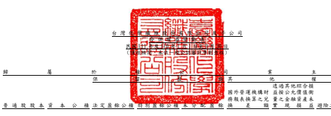
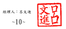

單位:新台幣仟元 實現損益 避險工具之損益 庫藏股票 總 計 非控制權益 權益總額

| 附                                                  | 註 普通股股本 資本公積 法定盈餘公積 特別盈餘公積 未分配盈餘 換   | 差          | 額 實現損益 避險工具之損益 庫藏股票 總   | 計 非控制權益 權益總額   |                                            |                           |                           |                        |                        |                          |              |            |            |
|-----------------------------------------------------|------------------------------------------------------------------|-------------|------------------------------------------|--------------------------|--------------------------------------------|---------------------------|---------------------------|------------------------|------------------------|--------------------------|--------------|------------|------------|
| 110 年 1 月 1 日至 9 月 30 日  110 年 1 月 1 日餘額 | $ 58,611,863                                                     | $ 9,167,637 | $ 64,335,076                             | $ 66,328,339             | $ 53,380,101 ($ 5,272,606) $ 98,095,277    | $                         | 32,123 ($                 | 323,952) $ 344,353,858 | $ 51,098,671           | $ 395,452,529            |              |            |            |
| 110 年 1 月 1 日至 9 月 30 日淨利                   | -                                                                | -           | -                                        | -                        | 34,794,804                                 | -                         | -                         | -                      | -                      | 34,794,804               | 3,481,927    | 38,276,731 |            |
| 110 年 1 月 1 日至 9 月 30 日其他綜合損益           | 六(十八)                                                         | -           | -                                        | -                        | -                                          | - (                       | 1,330,954)                | 24,308,663 (           | 19,578)                | -                        | 22,958,131   | 1,563,312  | 24,521,443 |
| 110 年 1 月 1 日至 9 月 30 日綜合損益總額           | -                                                                | -           | -                                        | -                        | 34,794,804 (                               | 1,330,954)                | 24,308,663 (              | 19,578)                | -                      | 57,752,935               | 5,045,239    | 62,798,174 |            |
| 110 年股東會盈餘分配                                | 六(十七)                                                         |             |                                          |                          |                                            |                           |                           |                        |                        |                          |              |            |            |
|                                                     | 法定盈餘公積                                                     | -           | -                                        | 1,978,906                | - (                                        | 1,978,906)                | -                         | -                      | -                      | -                        | -            | -          | -          |
|                                                     | 特別盈餘公積                                                     | -           | -                                        | -                        | 3,704,582 (                                | 3,704,582)                | -                         | -                      | -                      | -                        | -            | -          | -          |
|                                                     | 現金股利                                                         | -           | -                                        | -                        | - ( 14,652,966)                            | -                         | -                         | -                      | - ( 14,652,966)        | - ( 14,652,966)          |              |            |            |
| 採用權益法認列之關聯企業股權淨值之變動數            | 六(十六)                                                         | -           | 81                                       | -                        | -                                          | 2,446                     | - (                       | 2,446)                 | -                      | -                        | 81           | -          | 81         |
| 逾期股利轉列資本公積                                | 六(十六)                                                         | -           | 12,366                                   | -                        | -                                          | -                         | -                         | -                      | -                      | -                        | 12,366       | -          | 12,366     |
| 發放予子公司股利調整資本公積                        | 六(十六)                                                         | -           | 11,379                                   | -                        | -                                          | -                         | -                         | -                      | -                      | -                        | 11,379       | -          | 11,379     |
| 發放已轉列資本公積之逾期股利                        | 六(十六)                                                         | - (         | 405)                                     | -                        | -                                          | -                         | -                         | -                      | -                      | - (                      | 405)         | - (        | 405)       |
| 對子公司所有權權益變動                              | 六(十六)                                                         | -           | 927                                      | -                        | -                                          | -                         | -                         | -                      | -                      | -                        | 927          | 1,346      | 2,273      |
| 處分透過其他綜合損益按公允價值衡量之權益工具        | 六(十八)                                                         | -           | -                                        | -                        | -                                          | 1,321,409                 | - (                       | 1,321,409)             | -                      | -                        | -            | 181,018    | 181,018    |
| 合併子公司發放現金股利                              | -                                                                | -           | -                                        | -                        | -                                          | -                         | -                         | -                      | -                      | - (                      | 2,550,389) ( | 2,550,389) |            |
| 110 年 9 月 30 日餘額                               | $ 58,611,863                                                     | $ 9,191,985 | $ 66,313,982                             | $ 70,032,921             | $ 69,162,306 ($ 6,603,560) $ 121,080,085   | $                         | 12,545 ($                 | 323,952) $ 387,478,175 | $ 53,775,885           | $ 441,254,060            |              |            |            |
| 111 年 1 月 1 日至 9 月 30 日  111 年 1 月 1 日餘額 | $ 58,611,863                                                     | $ 9,192,999 | $ 66,313,982                             | $ 70,032,921             | $ 72,145,718 ($ 6,240,670) $ 121,228,401   | $                         | 9,270 ($                  | 323,952) $ 390,970,532 | $ 53,010,422           | $ 443,980,954            |              |            |            |
| 111 年 1 月 1 日至 9 月 30 日淨利                   | -                                                                | -           | -                                        | -                        | 14,864,265                                 | -                         | -                         | -                      | -                      | 14,864,265               | 2,244,603    | 17,108,868 |            |
| 111 年 1 月 1 日至 9 月 30 日其他綜合損益           | 六(十八)                                                         | -           | -                                        | -                        | -                                          | -                         | 5,108,616 ( 41,853,179) ( | 9,799)                 | - ( 36,754,362) (      | 3,066,824) ( 39,821,186) |              |            |            |
| 111 年度綜合損益總額                                | -                                                                | -           | -                                        | -                        | 14,864,265                                 | 5,108,616 ( 41,853,179) ( | 9,799)                    | - ( 21,890,097) (      | 822,221) ( 22,712,318) |                          |              |            |            |
| 111 年股東會盈餘分配                                | 六(十七)                                                         |             |                                          |                          |                                            |                           |                           |                        |                        |                          |              |            |            |
|                                                     | 法定盈餘公積                                                     | -           | -                                        | 3,910,207                | - (                                        | 3,910,207)                | -                         | -                      | -                      | -                        | -            | -          | -          |
|                                                     | 特別盈餘公積                                                     | -           | -                                        | -                        | 6,428,356 (                                | 6,428,356)                | -                         | -                      | -                      | -                        | -            | -          | -          |
|                                                     | 現金股利                                                         | -           | -                                        | -                        | - ( 28,133,694)                            | -                         | -                         | -                      | - ( 28,133,694)        | - ( 28,133,694)          |              |            |            |
| 採用權益法認列之關聯企業股權淨值之變動數            | 六(十六)                                                         | -           | 145                                      | -                        | -                                          | 2,428                     | - (                       | 2,428)                 | -                      | -                        | 145          | -          | 145        |
| 逾期股利轉列資本公積                                | 六(十六)                                                         | -           | 18,445                                   | -                        | -                                          | -                         | -                         | -                      | -                      | -                        | 18,445       | -          | 18,445     |
| 發放予子公司股利調整資本公積                        | 六(十六)                                                         | -           | 21,847                                   | -                        | -                                          | -                         | -                         | -                      | -                      | -                        | 21,847       | -          | 21,847     |
| 發放已轉列資本公積之逾期股利                        | 六(十六)                                                         | - (         | 536)                                     | -                        | -                                          | -                         | -                         | -                      | -                      | - (                      | 536)         | - (        | 536)       |
| 對子公司所有權權益變動                              | 六(十六)                                                         | -           | 1,689                                    | -                        | - (                                        | 7,640)                    | -                         | -                      | -                      | - (                      | 5,951)       | 2,784 (    | 3,167)     |
| 處分透過其他綜合損益按公允價值衡量之權益工具        | 六(十八)                                                         | -           | -                                        | -                        | - (                                        | 43,321)                   | -                         | 43,321                 | -                      | -                        | - (          | 5,410) (   | 5,410)     |
| 合併子公司發放現金股利                              | -                                                                | -           | -                                        | -                        | -                                          | -                         | -                         | -                      | -                      | - (                      | 3,440,570) ( | 3,440,570) |            |
| 非控制權益增加-取得子公司股權                       | -                                                                | -           | -                                        | -                        | -                                          | -                         | -                         | -                      | -                      | -                        | 395,447      | 395,447    |            |
| 111 年 9 月 30 日餘額                               | $ 58,611,863                                                     | $ 9,234,589 | $ 70,224,189                             | $ 76,461,277             | $ 48,489,193 ($ 1,132,054) $ 79,416,115 ($ | 529) ($                   | 323,952) $ 340,980,691    | $ 49,140,452           | $ 390,121,143          |                          |              |            |            |

董事長:洪福源 經理人:呂文進 會計主管:鄭文彥

後附合併財務報表附註為本合併財務報告之一部分,請併同參閱。

