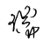
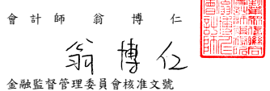

會 計 師 核 閱 報告

亞德 客 國際 集 團 公鑒 : 前 言 亞 德客 國 際集 團 及 其 子公 司 民國 112 年 及 111 年 3 月 31 日 之 合併 資 產負 債表,暨 民 國 112 年 及 111 年 1 月 1 日 至 3 月 31 日 之合併綜 合 損益 表、合 併 權 益 變 動 表 、 合 併 現 金 流 量 表 , 以 及 合 併 財 務 報 表 附 註 ( 包 括 重 大 會 計 政 策 彙總 ),業 經本 會 計 師核 閱 竣事。依 證 券發 行 人財 務 報告 編製 準 則及 經 金融 監 督管 理 委員 會 認可 並發 布 生效 之 國際 會計 準 則 第 34 號「 期中 財 務報 導 」編 製 允當表達之財務報表係管理階層之責任,本會計師之責任係依據核閱結果對 合併 財 務報 表 作成 結論 。 範 圍 本 會計 師 係依 照核閱準則 2410 號「財 務報 表 之核 閱 」執 行核 閱 工作。核 閱合併財務報表時所執行之程序包括查詢(主要向負責財務與會計事務之人 員查 詢)、分 析 性 程 序及 其 他核 閱 程序。核 閱工 作 之 範圍 明顯 小 於查 核 工作 之 範圍,因此 本 會 計 師 可 能 無 法 察 覺 所 有 可 藉 由 查 核 工 作 辨 認 之 重 大 事 項 , 故 無法 表 示查 核 意見 。 結 論 依 本 會 計 師 核 閱 結 果 , 並 未 發 現 上 開 合 併 財 務 報 表 在 所 有 重 大 方 面 有 未 依照證券發行人財務報告編製準則及經金融監督管理委員會認可並發布生效 之國 際 會計 準 則 第 34 號「 期 中財 務 報導 」編 製,致 無 法允 當表 達 亞德 客 國際 集團 及 其子 公 司民 國 112 年 及 111 年 3 月 31 日 之合 併 財 務狀 況 ,暨 民 國 112 年 及 111 年 1 月 1 日 至 3 月 31 日 之 合 併財 務 績效 及 合併 現金 流 量之 情 事。

勤業 眾 信聯 合 會計 師事 務 所

會 計 師 池 瑞 全 會 計 師 翁 博 仁
金融監督管理委員會核准文號 金 管 證審 字 第 1060023872 號

金 管 證審 字 第 1010028123 號

中 華 民 國 1 1 2 年 5 月 3 日
$$1\ 1\ 2$$
$\mathcal{H}$
$\mathbf{B}$

