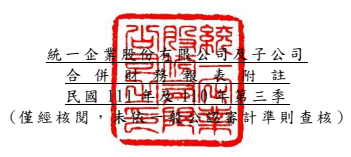

單位:新 台幣仟 元 (除特別註 明者外 )

## 一、 公司沿革

(一)統一企業 股份有 限公司 (以下簡 稱「 本公 司 」)係依據 中華民國 公司法 及其他 有關法令 之規定 ,於民國 56 年 8 月 奉 准創立。 主要經 營項目 為各種 飲料 、
食品、飼料、麵粉 等之製 造、加工 及買 賣業務。 列入 本公司 及子公 司(以下 統稱「本 集團 」)合併財 務報告 之子公 司 主要經營 項目,請詳附註 四(三)合 併基礎之 說明。

(二)本公司股 票自 民國 76 年 12 月 起在台 灣 證券交易 所上市 買賣。

二、 通過財務 報告之 日期及 程序 本合併財 務報告 已於民國 111 年 11 月 9 日經董事 會通過 後發布 。

三、 新發布及 修訂準 則及解 釋之適 用
(一)已採用金 融監督 管理委 員會 (以 下簡稱「 金管會 」)認可 之新發 布、修正後 國 際財務報 導準則 之影響 下表彙列 金管會 認可之 民國 111 年適用 之國際財 務報導 準則之 新發布 、修 正及修訂 之準則 及解釋 :

|                             | 國際會計準則理事會             |              |                 |
|-----------------------------|--------------------------------|--------------|-----------------|
|                             | 新發布/修正/修訂準則及解釋     | 發布之生效日 |                 |
| 國際財務報導準則第3號之修正 | 「對觀念架構之索引」           |              | 民國111年1月1日 |
| 國際會計準則第16號之修正    | 「不動產、廠房及設備           | :達到預定   | 民國111年1月1日 |
| 使用狀態前之價款」          |                                |              |                 |
| 國際會計準則第37號之修正    | 「虧損性合約-履行合約之成本」 |              | 民國111年1月1日 |
| 2018-2020週期之年度改善     | 民國111年1月1日                |              |                 |

本 集 團 經 評 估 上 述 準 則 及 解 釋 對 本 集 團 財 務 狀 況 與 財 務 績 效 並 無 重 大 影 響。

(二)尚未採用 金管會 認可之 新發布 、修正 後 國際財務 報導準 則之影 響

| 國際會計準則理事會         |                                |                 |                 |
|----------------------------|--------------------------------|-----------------|-----------------|
| 新發布/修正/修訂準則及解釋 | 發布之生效日                   |                 |                 |
| 國際會計準則第1號之修正    | 「會計政策之揭露」             |                 | 民國112年1月1日 |
| 國際會計準則第8號之修正    | 「會計估計之定義」             |                 | 民國112年1月1日 |
| 國際會計準則第12號之修正   | 「與單一交易所產生之資產及負債 | 民國112年1月1日 |                 |
| 有關之遞延所得稅」         |                                |                 |                 |

下表彙列 金管會 認可之 民國 112 年適用 之國際財 務報導 準則之 新發布 、修 正及修訂 之準則 及解釋 :