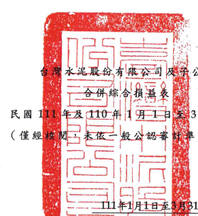
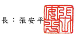
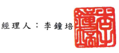
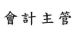
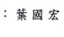

公司

3 月 31 日 則查核)

|                           | 單位:除每股盈餘為新台     |                      |              |           |          |    |    |
|---------------------------|---------------------------|----------------------|--------------|-----------|----------|----|----|
|                           | 幣元外,餘為仟元           |                      |              |           |          |    |    |
|                           | 31日                      | 110年1月1日至3月31日 |              |           |          |    |    |
| 代                        | 碼                        | %                    | 金           | 額        | %        |    |    |
| 4000                      | 營業收入(附註三           | 100                  | $ 22,037,652 | 100       |          |    |    |
| 5000                      | 營業成本(附註十二、二二、 |                      |              |           |          |    |    |
| 二四及三一)               | 20,977,100                | 91                   | 16,512,812   | 75        |          |    |    |
| 5900                      | 營業毛利                  | 1,996,361            | 9            | 5,524,840 | 25       |    |    |
| 營業費用(附註二二、二四及 |                           |                      |              |           |          |    |    |
| 三一)                     |                           |                      |              |           |          |    |    |
| 6100                      | 推銷費用                  | 202,622              | 1            | 173,130   | 1        |    |    |
| 6200                      | 管理費用                  | 6                    |              |           |          |    |    |
| 1,448,902                 | 1,144,134                 | 5                    |              |           |          |    |    |
| 6300                      | 研究發展費用              | 137,214              | 1            | -         | :        |    |    |
| 6000                      | 營業費用合計              | 1,788,738            | 8            | 1,317,264 | 6        |    |    |
| 6900                      | 營業淨利                  | 207,623              | 1            | 4,207,576 | 19       |    |    |
| 誉業外收入及支出          |                           |                      |              |           |          |    |    |
| 7060                      | 採用權益法認列之關聯      |                      |              |           |          |    |    |
| 企業及合資損益份額        |                           |                      |              |           |          |    |    |
| (附註十四)                | 622,247                   | 3                    | 714,592      | 3         |          |    |    |
| 7100                      | 利息收入                  | 372,039              | 1            | 354,116   | 2        |    |    |
| 7130                      | 股利收入                  | 405,293              | 2            | -         |          |    |    |
| 7190                      | 其他收入                  | 81,506               | -            | 135,434   | 1        |    |    |
| 7210                      | 處分不動產、廠房及設備    |                      |              |           |          |    |    |
| 利益(損失)                | 37,346                    | .                    | 5,574)       | -         |          |    |    |
| 7630                      | 外幣兌換淨益(損)          | 404,744              | 2            | 21,281 )  | -        |    |    |
| 7050                      | 財務成本(附註二四)        | 525,210)             | (            | 2)        | 417,888) | (  | 2) |
| 7590                      | 其他支出                  | 191,246 )            | (            | 1)        | 107,774) | (  | 1) |
| 7635                      | 透過損益按公允價值衡      |                      |              |           |          |    |    |
| 量金融資產及負債之        |                           |                      |              |           |          |    |    |
| 淨損                      | 242,231 )                 | (____ 1)             | (_ 4,128)    | =         |          |    |    |
| 7000                      | 誉業外收入及支出          |                      |              |           |          |    |    |
| 合計                      | 964,488                   | ব                    | 647,497      | _ 3       |          |    |    |
| (接次頁)                  |                           |                      |              |           |          |    |    |

| 111年1月1日至3月31日      | 110年1月1日 至3月31日   |              |             |           |           |           |    |
|---------------------------|-------------------------|--------------|-------------|-----------|-----------|-----------|----|
| 代                        | 碼                      | 金           | 額          | %         | 金        | 額        | %  |
| 7900                      | 繼續營業單位稅前淨利    | $            | 1,172,111   | 5         | ર્         | 4,855,073 | 22 |
| 7950                      | 所得稅費用(附註二五)    | 315,605      | 1           | 1,113,682 | 5         |           |    |
| 8000                      | 繼續營業單位本期淨利    | 856,506      | 4           | 3,741,391 | 17        |           |    |
| 8100                      | 停業單位損失(附註十一)  | ==           | =           | ( ______  | 11,154)   | --        |    |
| 8200                      | 本期淨利                | 856,506      | 4           | 3,730,237 | _ 17      |           |    |
| 本期其他綜合損益淨額(附註 |                         |              |             |           |           |           |    |
| 二三)                     |                         |              |             |           |           |           |    |
| 8310                      | 不重分類至損益之項目:   |              |             |           |           |           |    |
| 8316                      | 透過其他綜合損益        |              |             |           |           |           |    |
| 按公允價值衡量            |                         |              |             |           |           |           |    |
| 之權益工具投資            |                         |              |             |           |           |           |    |
| 未實現評價損益            | 588,133                 | 3            | 851,853     | 4         |           |           |    |
| 8320                      | 採用權益法認列之        |              |             |           |           |           |    |
| 關聯企業及合資            |                         |              |             |           |           |           |    |
| 之其他綜合損益            |                         |              |             |           |           |           |    |
| 之份額                    | 45,410                  | 91,778       |             |           |           |           |    |
|                           | =                       | .            |             |           |           |           |    |
| 633,543                   | 3                       | 943,631      | 4           |           |           |           |    |
| 8360                      | 後續可能重分類至損益    |              |             |           |           |           |    |
| 之項目:                   |                         |              |             |           |           |           |    |
| 8361                      | 國外營運機構財務        |              |             |           |           |           |    |
| 報表換算之兌換            |                         |              |             |           |           |           |    |
| 差額                      | 7,655,591               | 33           | (           | 105,125)  | -         |           |    |
| 8370                      | 採用權益法認列之        |              |             |           |           |           |    |
| 關聯企業及合資            |                         |              |             |           |           |           |    |
| 之其他綜合損益            |                         |              |             |           |           |           |    |
| 份額                      | 955,191                 | 4            | 1,531,530)  | Z)        |           |           |    |
| 8,610,782                 | 37                      | 1,636,655)   | Z)          |           |           |           |    |
| 8300                      | 其他綜合損益淨額        | 9,244,325    | 40          | 693,024 ) | 3)        |           |    |
| 8500                      | 本期綜合損益總額        | $ 10,100,831 | $ 3,037,213 |           |           |           |    |
|                           | - 44                    | 14           |             |           |           |           |    |
| 淨利歸屬於                |                         |              |             |           |           |           |    |
| 8610                      | 本公司業主              | ક            | 1,204,144   | 5         | $         | 3,318,974 | 15 |
| 8620                      | 非控制權益              | 347,638)     | (           | 1)        | 411,263   | 2         |    |
| 8600                      | S                       | 856,506      | 4           | ಕ         | 3,730,237 | _17       |    |

| 111年1月1日至3月31日   | 110年1月1日 至3月31日   |              |           |           |           |      |
|------------------------|-------------------------|--------------|-----------|-----------|-----------|------|
| 代 碼                  | 金                      | 額           | %         | 金        | 額        | %    |
| 綜合損益總額歸屬於     |                         |              |           |           |           |      |
| 8710                   | 本公司業主              | $ 10,317,964 | 45        | ക         | 2,621,147 | 12   |
| 8720                   | 非控制權益              | (            | 217,133 ) | ( 1)      | 416,066   | 2    |
| 8700                   | $ 10,100,831            | त्त्व          | ട്ട        | 3,037,213 | ।ব        |      |
| 每股盈餘(附註二六)     |                         |              |           |           |           |      |
| 來自繼續營業單位及停   |                         |              |           |           |           |      |
| 業單位                 |                         |              |           |           |           |      |
| 9750                   | 基                      | 本           | ട്ട        | 0.20      | S         | 0.57 |
| 9850                   | 釋                      |              |           |           |           |      |
| 稀                     | ક                       | 0.20         | llev      | 0.55      |           |      |
| 來自繼續營業單位       |                         |              |           |           |           |      |
| 9710                   | 基                      | 本           | S         | 0.20      | ಿಕಾ         | 0.57 |
| 9810                   | 稀                      | 經           | ತ         | 0.20      | llet      | 0.55 |

後附之附註條本合併財務報告之一部分。

(請參閱勤業眾信聯合會計師事務所民國 111年5月 10日核閱報告)

董事長:張安卓

會計主管:禁國宏

- 8 -