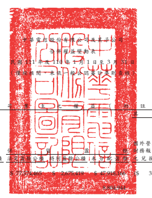
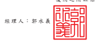
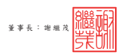

單位:新台幣仟元

| 歸    | 屬                                                                                               | 於                      | 母                 | 公           | 司          | 業           | 主     | 之          | 權          | 益        | (           | 附           | 註           | 十           | 三           | 、   | 二   | 十   | 及   | 二   | 九   | )   |
|-------|--------------------------------------------------------------------------------------------------|-------------------------|--------------------|--------------|-------------|--------------|--------|-------------|-------------|-----------|--------------|--------------|--------------|--------------|--------------|------|------|------|------|------|------|------|
|       | 其                                                                                               | 他                      | 權                 | 益           |             |              |        |             |             |           |              |              |              |              |              |      |      |      |      |      |      |      |
|       | 透過其他綜合 損益按公允 價值衡量 之                                                              |                         |                    |              |             |              |        |             |             |           |              |              |              |              |              |      |      |      |      |      |      |      |
|       | 國外營運機構 金融資產                                                                            | 非控制權益              |                    |              |             |              |        |             |             |           |              |              |              |              |              |      |      |      |      |      |      |      |
| 保    | 留                                                                                               | 盈                      | 餘 財務報表換算 未 | 實           | 現          | (附註十三   |        |             |             |           |              |              |              |              |              |      |      |      |      |      |      |      |
| 代 碼 | 股本-普通股 資本公積 法定盈餘公積 特別盈餘公積 未分配 盈 餘 之兌換差額 評價損益 避險工具損益 總 | 計 及 二 九 ) 權益總額 |                    |              |             |              |        |             |             |           |              |              |              |              |              |      |      |      |      |      |      |      |
| A1    | 110 年 1 月 1 日餘額                                                                             | $ 77,574,465            | $171,261,379       | $ 77,574,465 | $ 2,675,419 | $ 47,918,166 | ($     | 314,531)    | $ 1,239,901 | $         | 1,752        | $377,931,016 | $ 11,327,441 | $389,258,457 |              |      |      |      |      |      |      |      |
| D1    | 110 年 1 月 1 日至 3 月 31 日淨利                                                                | -                       | -                  | -            | -           | 8,804,944    | -      | -           | -           | 8,804,944 | 316,686      | 9,121,630    |              |              |              |      |      |      |      |      |      |      |
| D3    | 110 年 1 月 1 日至 3 月 31 日其他綜合損益淨額                                                    | -                       | -                  | -            | -           | 758          | (      | 35,695) (   | 945,986) (  | 3,616) (  | 984,539) (   | 1,537) (     | 986,076)     |              |              |      |      |      |      |      |      |      |
| D5    | 110 年 1 月 1 日至 3 月 31 日綜合損益總額                                                        | -                       | -                  | -            | -           | 8,805,702    | (      | 35,695) (   | 945,986) (  | 3,616)    | 7,820,405    | 315,149      | 8,135,554    |              |              |      |      |      |      |      |      |      |
| Q1    | 處分透過其他綜合損益按公允價值衡量之權益工具投 資                                                | -                       | -                  | -            | -           | 94,392       | -      | (           | 94,392)     | -         | -            | -            | -            |              |              |      |      |      |      |      |      |      |
| O1    | 子公司股份基礎給付交易                                                                           | -                       | 15,568             | -            | -           | -            | -      | -           | -           | 15,568    | 41,161       | 56,729       |              |              |              |      |      |      |      |      |      |      |
| Z1    | 110 年 3 月 31 日餘額                                                                            | $ 77,574,465            | $171,276,947       | $ 77,574,465 | $ 2,675,419 | $ 56,818,260 | ($     | 350,226)    | $           | 199,523   | ($           | 1,864)       | $385,766,989 | $ 11,683,751 | $397,450,740 |      |      |      |      |      |      |      |
| A1    | 111 年 1 月 1 日餘額                                                                             | $ 77,574,465            | $171,279,625       | $ 77,574,465 | $ 2,675,419 | $ 50,639,022 | ($     | 392,276) ($ | 7,588) ($   | 8,286)    | $379,334,846 | $ 11,927,604 | $391,262,450 |              |              |      |      |      |      |      |      |      |
| O1    | 子公司股東現金股利                                                                               | -                       | -                  | -            | -           | -            | -      | -           | -           | -         | (            | 370,957) (   | 370,957)     |              |              |      |      |      |      |      |      |      |
| C7    | 採用權益法認列關聯企業及合資之資本公積變動數                                                     | -                       | (                  | 1,159)       | -           | -            | -      | -           | -           | -         | (            | 1,159) (     | 51) (        | 1,210)       |              |      |      |      |      |      |      |      |
| D1    | 111 年 1 月 1 日至 3 月 31 日淨利                                                                | -                       | -                  | -            | -           | 9,059,580    | -      | -           | -           | 9,059,580 | 331,397      | 9,390,977    |              |              |              |      |      |      |      |      |      |      |
| D3    | 111 年 1 月 1 日至 3 月 31 日其他綜合損益淨額                                                    | -                       | -                  | -            | -           | 1,524        | 66,473 | (           | 37,495)     | 16,341    | 46,843       | 3,318        | 50,161       |              |              |      |      |      |      |      |      |      |
| D5    | 111 年 1 月 1 日至 3 月 31 日綜合損益總額                                                        | -                       | -                  | -            | -           | 9,061,104    | 66,473 | (           | 37,495)     | 16,341    | 9,106,423    | 334,715      | 9,441,138    |              |              |      |      |      |      |      |      |      |
| O1    | 子公司股份基礎給付交易                                                                           | -                       | 13,147             | -            | -           | -            | -      | -           | -           | 13,147    | 38,269       | 51,416       |              |              |              |      |      |      |      |      |      |      |
| Z1    | 111 年 3 月 31 日餘額                                                                            | $ 77,574,465            | $171,291,613       | $ 77,574,465 | $ 2,675,419 | $ 59,700,126 | ($     | 325,803) ($ | 45,083)     | $         | 8,055        | $388,453,257 | $ 11,929,580 | $400,382,837 |              |      |      |      |      |      |      |      |

後附之附註係本合併財務報告之一部分。

董事長:謝繼茂 經理人:郭水義 會計主管:陳淑玲

- 8 - 

