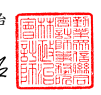
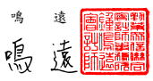

會計師 核 閱 報告

智邦 科 技股 份 有限 公司 公鑒 :

## 前 言

 智 邦科 技 股份 有限 公 司 及 子 公司 民國 112 年及 111 年 3 月 31 日之 合 併 資 產負 債 表, 暨 民 國 112 年及 111 年 1 月 1 日 至 3 月 31 日 之 合併 綜 合損 益 表、
合併權益變動表、 合併現金流量表, 以及合併財務報表附註(包括重大會計 政策 彙 總),業 經 本 會計 師 核閱 竣 事。依證 券 發行 人 財務 報告 編 製準 則 及經 金 融監 督 管理 委 員會 認可 並 發布 生 效之 國際 會 計準 則 第 34 號「 期 中財 務 報導 」
編製允當表達之 合 併 財 務 報 表 係 管 理 階 層 之 責 任 , 本 會 計 師 之 責 任 係 依 據 核 閱結 果 對合 併 財務 報表 作 成結 論 。

## 範 圍

 除 保留 結 論之 基礎 段 所述 者 外,本會 計 師係 依 照 核 閱準 則 2410 號「 財 務 報表 之 核閱 」執行 核閱 工 作。核 閱合 併財 務 報表 時 所執 行之 程 序包 括 查詢( 主 要向 負 責財 務 與會 計事 務 之人 員 查詢 )、分 析性 程 序 及其 他核 閱 程序。核 閱 工 作之範圍明顯小於查核工作之範圍,因此本會計師可能無法察覺所有可藉由 查核 工 作辨 認 之重 大事 項 ,故 無 法表 示查 核 意見 。

## 保 留 結 論 之 基礎

 如 合 併 財 務 報 表 附 註 十 二 所 述 , 列 入 上 開 合 併 財 務 報 表 之 部 分 非 重 要 子 公司 之 同期 間 財務 報表 未 經會 計 師核 閱,其民 國 112 年 及 111 年 3 月 31 日 之 資產 總 額分 別 為新 台幣( 以 下同 )5,714,952 仟元 及 4,800,053 仟 元,分 別占 合 併資 產 總額 之 12%及 13%;負債 總 額分 別 為 1,656,601 仟 元 及 1,460,694 仟元, 分別 占 合併 負 債總 額之 7%及 8%;其 民國 112 年及 111 年 1 月 1 日 至 3 月 31 日之 綜 合損 益 總額 分別 為 8,263 仟元 及 119,664 仟 元,分 別占 合 併綜 合 損益 總 額 之 1%及 8%。 如 合併 財 務報 表 附註 十三 所 述, 民 國 112 年 及 111 年 3 月 31 日採 用 權益 法 之投 資餘 額 分別 為 10,336 仟元及 11,299 仟 元,以 及 民國 112 年 及 111 年 1 月 1 日 至 3 月 31 日採 用 權益 法認 列 之關 聯 企業 損益 份 額分 別 為 (51)
仟 元 及 (227)仟 元 , 係 依 據 被 投 資 關 聯 企 業 同 期 間 未 經 會 計 師 核 閱 之 財 務 報 表 認列 。

## 保 留 結 論

 依 本 會 計 師 核 閱 結 果 , 除 保 留 結 論 之 基 礎 段 所 述 部 分 非 重 要 子 公 司 及 採 用 權 益 法 之 投 資 之 財務報表倘經會計師核閱,對合併財務報表可能有所調整 之影響外,並未發現上開合併財務報表在所有重大方面有未依照證券發行人 財務報告編製準則及經金融監督管理委員會認可並發布生效之國際會計準則 第 34 號「期 中 財務 報導 」編 製,致無 法允 當 表達 智 邦科 技股 份 有限 公 司 及 子 公司 民 國 112 年 及 111 年 3 月 31 日之 合 併財 務 狀況,暨 民 國 112 年 及 111 年 1 月 1 日至 3 月 31 日之 合 併財務績效 及合 併 現金 流 量之 情事 。

勤業 眾 信聯 合 會計 師事 務 所

$$\begin{array}{r l r l}{\Leftrightarrow}&{{}\nexists+}&{{}\nexists\nexists}\end{array}$$
$$\begin{array}{r l r l}{\Leftrightarrow}&{{}{\hat{\mathbf{n}}}+}&{{}{\hat{\mathbf{n}}}\pi}\end{array}$$

$$\mathbb{H}$$

會 計 師 林 政 治 會 計 師 鍾 鳴 遠
金融監督管理委員會核准文號 金 管 證六 字 第 0930160267 號 金融監督管理委員會核准文號 金 管 證審 字 第 1050024633 號

$${\begin{array}{l l}{{\frac{\frac{\pi\hbar}{2}}{\pi}}}&{\qquad}&{\mathbb{R}}\end{array}}$$
$\Phi$. 

中 華 民 國 1 1 2 年 5 月 1 1 日

