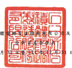

台灣 後 體

及子公司 日及 3 月 31 日 單位:新台努仟元

|                                    | 單位:新台努仟元                                    |                 |                |                |                |                |                |             |                |      |
|------------------------------------|----------------------------------------------------|-----------------|----------------|----------------|----------------|----------------|----------------|-------------|----------------|------|
| 112 年 3 月 31 日                  | 111 年 12 月 31 ฿                                  | 111 年3月 31 日 |                |                |                |                |                |             |                |      |
| (經檢閱)                           | (经核同)                                           |                 |                |                |                |                |                |             |                |      |
|                                    | (经查核)                                           |                 |                |                |                |                |                |             |                |      |
| |                                  | |送                                                |                 |                |                |                |                |                |             |                |      |
| ન્દ                                 | 域                                                 |                 | 産 金          | 新             | 会             | n              | %              | �           | 发             |      |
| 流处货產                           |                                                    |                 |                |                |                |                |                |             |                |      |
| 1100                               | 观会及约當現金(附註六〕                            | $1,385,232,810  | 27             | $1,342,814,083 | 27             | $1,151,589,646 | 29             |             |                |      |
| 1110                               | 透過損益按公允價值街量之金融資產〔附註七〕         | 982.014         | 1,070,398      | 758,452        |                |                |                |             |                |      |
| 1120                               | 透過其他綜合積益按公允價值街量之会融資產〔附註八〕 | 129.541.034     | 3              | 122.998.543    | 2              | 120.995.765    | 3              |             |                |      |
| 1136                               | 2                                                  | 2               | 8,425,386      |                |                |                |                |             |                |      |
| 投弹绑提成本街量之金融资産(別迎九) | 73,428,595                                         | 94,600,219      | .              |                |                |                |                |             |                |      |
| 1139                               | 過險之金融資產《肘誌十)                            | 70              | 2,329          | -              | 286,824        |                |                |             |                |      |
| 147,715,125                        |                                                    |                 |                |                |                |                |                |             |                |      |
| 1170                               | 應收票據及帳款淨額(附註十一)                       | 3               | 229,755,887    | 5              | 212,846,891    | 5              |                |             |                |      |
| 1180                               | 應收關係人數項《肘誌三二)                          | 332,554         | .              | 1,583,958      | '              | 581,010        | -              |             |                |      |
| 1210                               | 其他應收關係人數項(附註三二)                       | 76,608          | 68,975         | 58,165         |                |                |                |             |                |      |
| 1310                               | 存食(附註十二)                                     | 216.067.981     | 4              | 221.149.148    | 4              | 200.118.682    | 5              |             |                |      |
| 1476                               | 其他金融資産(附註三三)                             | 26,007,016      | 1              | 25,964,428     | l              | 16,243,656     | 1              |             |                |      |
| 1479                               | 其他流動質產                                       | 16,343,714      | 12,888,776     | 10,333,155     |                |                |                |             |                |      |
| 11XX                               | 流動資產合計                                       | 1,995,727,521   | 40             | 2,052,896,744  | 41             | 1,722,237,632  | _ 43           |             |                |      |
| 师流動質產                         |                                                    |                 |                |                |                |                |                |             |                |      |
| 1517                               | 透過其他綜合損益按公允價值街量之金融資產〔附註入〕 | 6,918,090       | 6,159,200      | 6,011,937      | .              |                |                |             |                |      |
| 1535                               | 按擁鋪後成本街量之全融資產(附註九)                 | 34,512,468      | l              | 35,127,215     | l              | 15,605,898     |                |             |                |      |
| 1550                               | 28,483,064                                         | 1               | 1              | 1              |                |                |                |             |                |      |
| 採用模型法之投資(附誌十三)         | 27,641,505                                         | 24,119,008      |                |                |                |                |                |             |                |      |
| 1600                               | 不锈盖 廠房及级偶(附进十四)                        | 2,833,396,892   | 56             | 2,693,836,970  | 54             | 2,104,330,654  | 53             |             |                |      |
| 1755                               | 使用程资產(附註十五)                               | 42,018,656      | 1              | 41,914,136     | 1              | 32,922,146     | 1              |             |                |      |
| 1780                               | 無形資産(附註十六)                                 | 24,296,839      | 25,999,155     | l              | 25,620,051     | 1              |                |             |                |      |
| 1840                               | 墙延所得规黄產(附註四)                             | 68,775,652      | 1              | 69,185,842     | 1              | 53,903,541     | 1              |             |                |      |
| 1920                               | 存出保证金                                         | 4,218,206       | .              | 4,467,022      | -              | 4,073,354      | .              |             |                |      |
| 1990                               | 其他非流野黄產                                     | 7,496,960       | 7.551.089      | 3.852.446      |                |                |                |             |                |      |
| 15XX                               | 摩流動資產合計                                     | 3,050,116,827   | 60             | 2,911,882,134  | રેઠ             | 2,270,439,035  | 57             |             |                |      |
| 1XXX                               | 資                                                 | 産              | 세             | 하             | $5,045,844,348 | _100           | $4,964,778,878 | _100        | $3.992.676.667 | _100 |
| 绩                                 | 原                                                 | 權              | ম              |                |                |                |                |             |                |      |
| p                                  |                                                    |                 |                |                |                |                |                |             |                |      |
| 波動負債                           |                                                    |                 |                |                |                |                |                |             |                |      |
| 2100                               | 短期借款(附註十七及三十)                           | ഗ               | ଡା              | $ 144,550,897  | 4              |                |                |             |                |      |
| 2120                               | 透過頻溢按公允價值衝量之全融資價(附註七)           | 620,967         | .              | 116,215        | 2,203,138      |                |                |             |                |      |
| 2126                               | 避險之金融負債(附註十)                             | 39,108          | 813            | .              |                |                |                |             |                |      |
| 2170                               | 烏付帳款                                           | 46,302,185      | 1              | 54,879,708     | 1              | 48,653,183     | 1              |             |                |      |
| 2180                               | 應付關條人款項 (附註三二)                          | 1,079,764       | 1,642,637      | -              | 1,450,896      |                |                |             |                |      |
| 2201                               | 應付紓賣及獎金                                     | 24,518,981      | I              | 36,435,509     | 1              | 21,077,111     | 1              |             |                |      |
| 2206                               | 息付員工副务及董事副资(附註二八)                   | 74.158.512      | 1              | 61.748.574     | 1              | 48.766.534     | 1              |             |                |      |
| 2213                               | 應付工程及設備款                                   | 157,374,807     | 3              | 213.499.613    | 4              | 122.915.512    | 3              |             |                |      |
| 2216                               | 應付現金股利(附該二十)                             | 142,617,093     | 3              | 142,617,093    | 3              | 142,617,093    | 4              |             |                |      |
| 2230                               | 本期所得就負債〔附註四〕                           | 157,215,093     | 3              | 120,801,814    | 3              | 87,693,132     | 2              |             |                |      |
| 2320                               | 一年内到期長期負債(朋友十八、十九及三十)           | 8,040,000       | 19,313,889     | 16,791,667     |                |                |                |             |                |      |
| 2399                               | 應付費用及其他流動負債(附註十五、二一、三十及三二) | 261,123,411     | ્ર              | 293,170,952    | 186,148,544    | 5              |                |             |                |      |
| 21XX                               | 流動負債合計                                       | 873,089,921     | 17             | 944,226,817    | 19             | 822,867,707    | 21             |             |                |      |
| 非過釣負債                         |                                                    |                 |                |                |                |                |                |             |                |      |
| 2530                               | 應付公司債(附註十八及三十)                         | 848,637,481     | 17             | 834,336,439    | 17             | 629,650,221    | 16             |             |                |      |
| 2541                               | 長期銀行借款(開註十九及三十)                       | 6,147,668       | .              | 4,760,047      | 3,087,714      |                |                |             |                |      |
|                                    | .                                                  | .               |                |                |                |                |                |             |                |      |
| 2573                               | 速延所得税負債(所註四)                             | 726,005         | 1,031,383      | 1,899,315      | .              |                |                |             |                |      |
| 2580                               | 租賃貸債(附註十五及三十)                           | 29,984,875      | 1              | 29,764,097     | =              | 21,065,933     | .              |             |                |      |
| 2640                               | 净確定福利負債(所註四)                             | 8,602,302       | -              | 9,321,091      | -              | 8,533,290      |                |             |                |      |
| 2645                               | 存入保護会                                         | 915,592         | -              | 892,021        | .              | 706,708        |                |             |                |      |
| 2670                               | 其他非流動負債(耐註二一)                           | 184,842,906     | 179,958,116    | 183,397,025    | 5              |                |                |             |                |      |
| 4                                  | 4                                                  |                 |                |                |                |                |                |             |                |      |
| 25XX                               | 非派野奥债合计                                     | 1,079,856,829   | 22             | 1,060,063,194  | 21             | 848,340,206    | _21            |             |                |      |
| 2XXX                               | 負債合計                                           | 1,952,946,750   | _32            | _2,004,290,011 | -              | - 40           | 1,671,207,913  | ----------- |                |      |
| 郎屬於母公司第主之權知             |                                                    |                 |                |                |                |                |                |             |                |      |
| 3110                               | 股本(附註二十)                                     |                 |                |                |                |                |                |             |                |      |
| 普通股股本                         | 259,320,710                                        | 5               | 259,303,805    | 5              | 259,317,675    |                |                |             |                |      |
| 3200                               | 膏本公積(附註二十及二七)                           | 69,894,441      | 1              | 69,330,328     | | 1            | 65,215,135     | | 1            |             |                |      |
| 保留屋绘(附誌二十)                 |                                                    |                 |                |                |                |                |                |             |                |      |
| 3310                               | 法定量综公積                                       | 311,146,899     | 6              | 311,146,899    | б              | 311,146,899    | 8              |             |                |      |
| 3320                               | 转剧直续公積                                       | 20,320,473      | 1              | 3,154,310      | -              | 62,608,515     | 1              |             |                |      |
| 3350                               | 未分配置依                                         | 2,441,820,698   | 48             | 2,323,223,479  | 1,664,506,123  | 42             |                |             |                |      |
|                                    | र्स                                                 |                 |                |                |                |                |                |             |                |      |
| 3300                               | 係留意統合計                                       | 2,773,288,070   | ___55          | 2,637,524,688  | -              |                | 2,038,261,537  | 51          |                |      |
| 3400                               | 其他握益〔附註二十及二七〉                         | 24,269,263 )    | 1              | 20,505,626 )   | |              | 47,492,685 )   | (_             | 1)          |                |      |
| 3500                               | 庫藏旺票(附註二十)                                 | 871,566 )       |                |                |                |                |                |             |                |      |
| 31XX                               | 最公司套在搬益合計                                 | 3,078,233,958   | 61             | 2,945,653,195  | 59             | 2,314,430,096  | 58             |             |                |      |
| 36XX                               | 非控制磁经                                         | 14,663,640      | 1.             | 14,835,672     | 1              | 7,038,658      | =              |             |                |      |
| 3XXX                               | 指当合时                                           | 3,092,897,598   | _61            | _2,960,488,867 | 60             | 2,321,468,754  | _58            |             |                |      |
| 負債 及 權 益 島 計                | $5,045,844,348                                     | _100            | $4,964,778,878 | _100           | $3,992,676,667 | -100           |                |             |                |      |

民國 112年3月 後朋之附註條本合併财務報告之一部分。

纪理人

