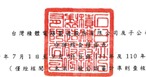
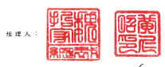

民国 111 年 及 110 年 7 月 1 日 及 110 年 1 月 1 日 至 9 月 30 日 單位:新台幣行元,推

|                           | 每股盈给為元                   |                       |                       |                |             |                |             |               |             |    |             |    |
|---------------------------|--------------------------------|-----------------------|-----------------------|----------------|-------------|----------------|-------------|---------------|-------------|----|-------------|----|
| 111年7月1日 至9月30日     | 110年7月1日 至9月30日          | 111年1月1日 至9月30日 | 110年1月1日 至9月30日 |                |             |                |             |               |             |    |             |    |
|                           | %                              | 查                    | 极                    | જેવ             | રુ           | ସ୍ଥ             | જુદ          |               |             |    |             |    |
| 代                        | पर्                             | 全                    | 新                    | જેવ             | 全          | કર             |             |               |             |    |             |    |
| 4000                      | 苍肃纹入净额(附注二一、三一及  | $ 414,670,379         | 100                   | $1,638,359,424 | 100         | $1,149,225,731 | 100         |               |             |    |             |    |
| 三六)                     | $ 613,142,743                  | 100                   |                       |                |             |                |             |               |             |    |             |    |
| 5000                      | 餐繁成本(附註十二、二八及三一) | 242,644,026           | 40                    | 201,924,184    | ਕੋਨੇ          | 679,189,547    | 41          | 560,443,288   | 49          |    |             |    |
| 5950                      | 管 第毛利                      | 212,746,195           | 959,169,877           | 52             | 588,782,443 | 51             |             |               |             |    |             |    |
| 370,498,717               | સ્                              | 기                    |                       |                |             |                |             |               |             |    |             |    |
| 營業費用(附註二八及三一)  |                                |                       |                       |                |             |                |             |               |             |    |             |    |
| 6300                      | 研究發展費用                   | 42,977,507            | 7                     | 30,866,634     | 7           | 118,675,177    | 7           | 92,496,368    | 8           |    |             |    |
| 6200                      | 管理费用                       | N                     | 8,929,793             | 2              | 36,567,623  | 2              | 23,280,651  | 2             |             |    |             |    |
| 14,499,002                | 6,929,370                      | 5,568,153             |                       |                |             |                |             |               |             |    |             |    |
| 6100                      | 行銷費用                       | 2,709,953             | 1,853,489             | 1              | 1           |                |             |               |             |    |             |    |
| 6000                      | 소                             | 科                    | 60,186,462            | 2              | 41,649,916  | 10             | 162,172,170 | 10            | 121,345,172 | 10 |             |    |
| 6500                      | 其他管累收益及食積净額(附註二  | 1                     | (_                    | 228,328)       |             |                |             |               |             |    |             |    |
| ハ)                       | 11,959                         | -                     | 92,731)               | -----          | 759,626)    | 1              | 1           |               |             |    |             |    |
| 6900                      | 誉黨净利〔附注三六)            | 310,324,214           | ___51                 | 171,003,548    | न           | 796,238,081    | __ 49       | 467,208,943   | __ ना        |    |             |    |
| 参案外收入及支出          |                                |                       |                       |                |             |                |             |               |             |    |             |    |
| 7060                      | 按用模益法認列之關興企業       |                       |                       |                |             |                |             |               |             |    |             |    |
| 损益份额                  | 2,077,809                      | 1,513,156             | -                     | 6,061,304      | 3,952,156   | -              |             |               |             |    |             |    |
| 7100                      | 利息收入(附注二二)             | 6,615,044             | 1                     | 1,356,544      | -           | 11,834,868     | ı           | 4,246,129     | .           |    |             |    |
| 7190                      | 其他致入                       | 120,905               | -                     | 155,818        | ﺘ           | 941,465        | 813,088     | -             |             |    |             |    |
| 7230                      | 外繁免换净益〔摄)〔附註三      |                       |                       |                |             |                |             |               |             |    |             |    |
| ต )                       | 3,748,421 )                    | (                     | 1 )                   | 3,724,723      | 1           | 5,859,265      | 9,848,594   | I             |             |    |             |    |
| 7050                      | 财務成本(附註二三)             | 3,370,018)            | {                     | 1,334,063)     | -           | (              | 8,415,015)  | (             | 1)          | (  | 3,240,557 ) | -  |
| 其他利益及損失净額(附註二 |                                |                       |                       |                |             |                |             |               |             |    |             |    |
| 7020                      | ସ )                            | 4,671,334             | 1                     | 2,568,087)     | (           | 2,999,124)     | (           | 4,521,250)    |             |    |             |    |
| 7000                      | 수                             | #                     | 6,366,653             | _1             | 2,848,091   | ך              | 13,282,763  | --            | 11,098,160  | 1  |             |    |
| 7900                      | 52                             | 173,851,639           | 42                    | 809,520,844    | 49          | 478,307,103    | 42          |               |             |    |             |    |
| 脱前净利                  | 316,690,867                    |                       |                       |                |             |                |             |               |             |    |             |    |
| 7950                      | 所得稅費用〔例誌因及二五〕     | 35,722,460            | হ                     | 17,372,485     | -1          | 88,498,811     | 5           | 47,607,484    | _5          |    |             |    |
| 8200                      | 本期净利                       | 280,968,407           | 46                    | 156,479,154    | 38          | 721,022,033    | _ 44        | 430,699,619   | _3Z         |    |             |    |
| 其他综合损益(附註二十)    |                                |                       |                       |                |             |                |             |               |             |    |             |    |
| 8310                      | 不重分類至損益之項目           |                       |                       |                |             |                |             |               |             |    |             |    |
| 8316                      | 造過其他综合损益按公           |                       |                       |                |             |                |             |               |             |    |             |    |
| 允價值街量之機益工        |                                |                       |                       |                |             |                |             |               |             |    |             |    |
| 具投資未實現評價損        |                                |                       |                       |                |             |                |             |               |             |    |             |    |
| ದ                         | (                              | 103,591 )             | :                     | 264,000        | -           | 68,610         | י           | 1,081,336     | -           |    |             |    |
| 8317                      | 避险工具之損益                 | .                     | -                     | -              | .           | 41,416)        | -           |               |             |    |             |    |
| 採用權益法認列之關聯      |                                |                       |                       |                |             |                |             |               |             |    |             |    |
| 8320                      | 企黨之其他綜合損益             |                       |                       |                |             |                |             |               |             |    |             |    |
| 份额                      | 21,431                         | -                     | 17,230                | -              | 76,518      | -              | 21,732      | .             |             |    |             |    |
| 8349                      | 與不重分類之項目相關           | 56,076)               |                       |                |             |                |             |               |             |    |             |    |
| 之所得税利益(资用)        | 31                             | 231 )                 | 262                   |                |             |                |             |               |             |    |             |    |
| 82,129)                   | ---                            | 280,999               | 1                     | 145,390        | .           | 1,005,576      | -           |               |             |    |             |    |
| 8360                      | 後墳可能重分顏至損益之項       |                       |                       |                |             |                |             |               |             |    |             |    |
| 日 :                      |                                |                       |                       |                |             |                |             |               |             |    |             |    |
| 8361                      | 图外蔓運機場財務級表           |                       |                       |                |             |                |             |               |             |    |             |    |
| 换算之兒换差额            | 34,872,636                     | 5                     | (                     | 541,643)       | .           | 68,084,934     | 4           | (             | 3,636,922)  | -  |             |    |
| 8367                      | 透過其他综合損益按公           |                       |                       |                |             |                |             |               |             |    |             |    |
| 允價值衡量之情務工        |                                |                       |                       |                |             |                |             |               |             |    |             |    |
| 具投资来實現評價損        |                                |                       |                       |                |             |                |             |               |             |    |             |    |
| ਜ਼                         | (                              | 2,973,821 )           | .                     | (              | 419,794)    | .              | (           | 11,263,186)   | .           | (  | 2,209,963)  | .  |
| 8368                      | 避险工具之损益                 | .                     | 1,347,573             | -              |             |                |             |               |             |    |             |    |
| 4,989                     |                                |                       |                       |                |             |                |             |               |             |    |             |    |
| 8370                      | 採用權益法認列之關聯           |                       |                       |                |             |                |             |               |             |    |             |    |
| 企業之其他綜合損益        |                                |                       |                       |                |             |                |             |               |             |    |             |    |
| 份额                      | 299,724                        | .                     | (                     | 26,886)        | .           | 591,374        | .           | (             | 100,543 )   | .  |             |    |
| 8399                      | 與可能重分顯之項目相           |                       |                       |                |             |                |             |               |             |    |             |    |
| 陨之所得现利益            | 6,036                          |                       |                       |                |             |                |             |               |             |    |             |    |
| 32,203,528                | _5                             | 988,323)              | 1                     | 58,766,731     | ব           | 5,947,428)     | 11          |               |             |    |             |    |
| 8300                      | 本期其他綜合攝益(稅            |                       |                       |                |             |                |             |               |             |    |             |    |
| 後净銅)                   | 32,121,399                     | _5                    | 707,324)              | =              | 58,912,121  | ন              | 4,941,852)  | 1             |             |    |             |    |
| 8500                      | 本期綜合攝益總額               | $ 313,089,806         | _श                    | $ 155,771,830  | _38         | $ 779.934.154  | --          | $ 425,257,767 | 37          |    |             |    |
| (接收页)                  |                                |                       |                       |                |             |                |             |               |             |    |             |    |

(承前頁)

| 111年7月1日 至9月30日   | 110年7月1日 至9月30日   | 111年1月1日至9月30日   | 110年1月1日至9月30日   |                               |         |               |       |               |     |               |    |       |
|-------------------------|-------------------------|------------------------|------------------------|-------------------------------|---------|---------------|-------|---------------|-----|---------------|----|-------|
| ્દ                       | દર્                      | 盘                     | अ                      | - %                           | 盒      | 新            | %     | 全            | 。  | ﺍﻟﻤﺴﺎﻋﺪﺓ ﺍﻟﻤﺘ | 剑 | 频 96 |
| 衣期淨利紓屬于          |                         |                        |                        |                               |         |               |       |               |     |               |    |       |
| 8610                    | 母公司第主              | $ 280,865,780          | 46                     | $ 156,258,287                 | 38      | $ 720,626,072 | 44    | $ 430,307,722 | 37  |               |    |       |
| 8620                    | 非控制權益              | 102,627                | 220,867                | 395,961                       | 391,897 |               |       |               |     |               |    |       |
| .                       |                         | િક નિ                    |                        |                               |         |               |       |               |     |               |    |       |
| $ 280,968,407           | | শ                     | $ 156,479,154          | _38                    | $ 721,022,033                 | । শ     | $ 430,699,619 |       |               |     |               |    |       |
| 本期综合損益總額飾局子  |                         |                        |                        |                               |         |               |       |               |     |               |    |       |
| 8710                    | 母公司案主              | $ 312,889,198          | 51                     | $ 155,549,779                 | 38      | $ 780,221,513 | 48    | $ 425,364,812 | 37  |               |    |       |
| 8720                    | 单控制程益              | 200,608                | 222,051                | 287,359)                      | 392,955 | ll.           |       |               |     |               |    |       |
| $ 313,089,806           | | 1                     | $ 155,771,830          | __                     | $ 779,934,154                 | | 18    | $ 425,757,767 |       |               |     |               |    |       |
| 每股盈餘(附註二六)      |                         |                        |                        |                               |         |               |       |               |     |               |    |       |
| 9750                    | 基本每股盛徐            | ડે                      | 10.83                  | ﺍﻟﻤﺴﺎﻋﺪ ﺍﻟﻤﺴﺎﺣﺔ ﺍﻟﻤﺴﺘﻮﻯ ﺍﻟﻤﺴﺘ | 6.03    | S             | 27.79 | |M            | 125 |               |    |       |
| 9850                    | 稀释每股盈餘            | 10.83                  | ા                       | 6.03                          | S       | 27.79         | S     | 16.59         |     |               |    |       |

後附之附註係本合併財務報告之一部分 "

- 6 -

