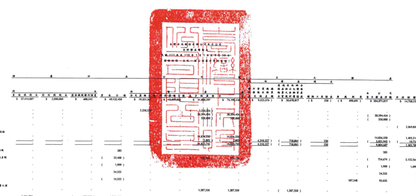

早点:新台中介无

|                                   | ....                                        | 56 50 0 0 10 10 4   |              |               |              |                  |                   |                 |                   |                 |               |              |                |              |               |
|-----------------------------------|---------------------------------------------|---------------------|--------------|---------------|--------------|------------------|-------------------|-----------------|-------------------|-----------------|---------------|--------------|----------------|--------------|---------------|
|                                   | 制量工业和管理                              |                     |              |               |              |                  |                   |                 |                   |                 |               |              |                |              |               |
| ર્દ                                | 看 场 成 本 特 别 观 股 本 信息摘肥根制设备 | 本 2                | 上文章 编    | 叶云中文 曲   | 文文出版     | 见 换 上 眼      | 本實與伊賀領土    |                 |                   |                 |               |              |                |              |               |
| 110年1月1日处理                   | 57,414,007                                  | $ 2,000,000         | n            | 688,542       | 5 49,122,450 | 5 19,351,34      | -63,014 840       | $ 41,808,297    | $ 74,198,514      | 15              | 理 制 图 及   | 星 其 高 叶  |                |              |               |
|                                   | 9,523,576 )                                 | $ 30,670,8117       | 250 1        | $ 204.071 817 | $ 14,756,216 | $ 218,830,053    |                   |                 |                   |                 |               |              |                |              |               |
| 109年度是由分配                   |                                             |                     |              |               |              |                  |                   |                 |                   |                 |               |              |                |              |               |
| 81                                | 深受政船企业                                | .                   | 2,530,55     | 2.530.54      |              |                  |                   |                 |                   |                 |               |              |                |              |               |
| 05                                | 本公司登陆股股票现金融利                    | 20,544,434          | 20.504.434   |               |              |                  |                   |                 |                   |                 |               |              |                |              |               |
| B7                                | 韩到股票会股时                              | 20,504,434 ]        | 20,594,434 ) |               |              |                  |                   |                 |                   |                 |               |              |                |              |               |
|                                   | 354.000                                     | 350,000 ]           | 150,000 )    |               |              |                  |                   |                 |                   |                 |               |              |                |              |               |
| ் 1                                | 子公司规意现金融利                          | 2,069,806 )         | (            | 2,069,806 )   |              |                  |                   |                 |                   |                 |               |              |                |              |               |
| 110年1月1日至9月30日综合模鼠绝销  |                                             |                     |              |               |              |                  |                   |                 |                   |                 |               |              |                |              |               |
| DI                                | ﻴ                                           | 45                  | 4 834 555    | 14 834,550    | 14,836,550   |                  |                   |                 |                   |                 |               |              |                |              |               |
| DJ                                | 其他所合插画                                | 4.310.527 )         | 718.861 )    | 1,403,511     | 16,240,061   |                  |                   |                 |                   |                 |               |              |                |              |               |
|                                   | 5.631.943 )                                 | 19,222 1            | 5.051.665 )  |               |              |                  |                   |                 |                   |                 |               |              |                |              |               |
| DS                                | 14,858,745                                  | 1000 745            | 4.344.532    | 711/41        | 229
229              | 9,804,600        | 1,353,729         | 11,188,366      |                   |                 |               |              |                |              |               |
| ూ                                  | 品用租赁法国利润那企業具备買二型彩票        | 283                 | 283          | 283           |              |                  |                   |                 |                   |                 |               |              |                |              |               |
| M5                                | 取得成绩安于公司或担管品利顿而做强是额      | ×                   | 22,400 |     | 754,674 }     | 5,132,564    | 4,377,890        |                   |                 |                   |                 |               |              |                |              |               |
| M7                                | 有于公司用它被部且受到                      | (                   | 1,999 }      | '             | (            | 1,999 }          | 1,099             |                 | 900 ]             |                 |               |              |                |              |               |
| NI                                | 系画胶周级周工运调之副务成本                | '                   | .            | 24.325        | .            | 24,325           | 24,325            |                 |                   |                 |               |              |                |              |               |
| NI                                | 局藏投阅报局工                              | .                   | (            | 14323 }       | .            | -                | 107,348           | 93,025          | 95,025            |                 |               |              |                |              |               |
| Qı                                | 威分退场其此班分镇巡视公文暨强制量之国      |                     |              |               |              |                  |                   |                 |                   |                 |               |              |                |              |               |
| 员工具                            | .                                           | .                   | 1,287,350    | 1,287,350     | -            | -                | 1,287,350 )       | -               | .                 | -               | -             |              |                |              |               |
| II                                | 可持推公司债券返                            | -- 3.821.293        | 0 -          | 682,322 )     | -- 4,282,423 | 9,421,552        | - 9,421,857       |                 |                   |                 |               |              |                |              |               |
| Z1                                | 110年9月30日放疆                            | 5 61,235,000        | 5 2,000,000  | 6.203         | 5 55,290,239 | 5 21,681,985     | 5 13.033.860      | 1 11.712.11     | 5 11.647.915      | ( { } } } ( } } | 3 28.666 000  | -302.343 >   | 5 201, 21:4007 | 5-19.245.882 | 5 220,920 158 |
| A1                                | 111 年 1 月 1 出始頭                        | $ 61,252,340        | 5            |               |              |                  |                   |                 |                   |                 |               |              |                |              |               |
| 5 2,000,000                       | 5 56,757,470                                | $ 21,881,915        | $ 13,039,560 | 5 39,018,077  | $ 73,509,852 | ( $ 16,068,895 ) | $ 26,958,909      | 5               | .                 | ( $ 392,343 )   | $ 204,477,333 | $ 21,177,340 | 5 225,634,673  |              |               |
| 110 年度互顿分配                  |                                             |                     |              |               |              |                  |                   |                 |                   |                 |               |              |                |              |               |
| BI                                | 法文监检公演                                | 2,068,477           | -            | 2,068,477 )   |              |                  |                   |                 |                   |                 |               |              |                |              |               |
| 85                                | 车公司看通规模意现会履利                    | .                   | 6,116,173 )  | 6,116,173 )   | 6,116,173 }  | 1                | ( בלן 116,176,173 |                 |                   |                 |               |              |                |              |               |
| 97                                | 植树顺现会胶州                              | -                   | 350,000 )    | 350,000 >     | 350,000 )    | 354.000 }        |                   |                 |                   |                 |               |              |                |              |               |
| 89                                | 者通股股票股份                              | 6,116,173           | -            | 6,116,173 )   | 6,116,173 )  |                  |                   |                 |                   |                 |               |              |                |              |               |
| 01                                | 于会可服求职会投刊                          | .                   | .            | -             | .            | -                | C                 | 1. 164. 176 ) { | 1,164,176 }       |                 |               |              |                |              |               |
| 111 年1月1日至9月30日統合議為臨職 |                                             |                     |              |               |              |                  |                   |                 |                   |                 |               |              |                |              |               |
| DI                                | 浮射(服)                                    | 2.917.831           | 2,917,831    | 2,917,831     | 1,563,448 )  | 1,554,383        |                   |                 |                   |                 |               |              |                |              |               |
| DS                                | 系统动合制及                                | 202 >               | 209 1        | 7.298.746 )   |              |                  |                   |                 |                   |                 |               |              |                |              |               |
| DS                                | 7612.729                                    | (32)                | 11.42        | ાનને કુલ         | 256,822      |                  |                   |                 |                   |                 |               |              |                |              |               |
|                                   | 2,917,622                                   | 2.917 632           | 7,199,266 )  | 2.129.262     | 1.218850 )   | 1.812 412        |                   |                 |                   |                 |               |              |                |              |               |
| C7                                | 标周相当法巡时时期是全家及分量之更的数      | 9,335               | -            | -             | .            | 9,335            | .                 | 9,335           |                   |                 |               |              |                |              |               |
| M5                                | 取得成绩分平公司股福便部副领会议是领        | .                   | .            | -             | .            | 106 )            | 106 )             | ッ              | <                 | 106 )           | 1.533.000     | 1,532,904    |                |              |               |
| M7                                | 见于空间所有理财益型自                      | .                   | 37 No2       | -             | -            | .                | 33 492            | 70,874 }        | 33,182 )          |                 |               |              |                |              |               |
| N1                                | 馬成股轉讓員不記憶之則等成本                | .                   | 66,820       | ្-             | 0            |                  |                   |                 |                   |                 |               |              |                |              |               |
|                                   | .                                           | -                   | -            | 1 64,820      | .            | 66.820           |                   |                 |                   |                 |               |              |                |              |               |
| NI                                | 总裁旋解破肖二                              | -                   | .            | 《            | 31,702 )     | .                | .                 | 1-0             | 190.535           | 150,833         | .             | נבת קפו      |                |              |               |
| ﺔ                                 | 基成胶监编                                  | (                   | 6,696 ]      | .             | (            | 22,512 )         | .                 | .               | 29,208            | .               |               |              |                |              |               |
| B17                               | 老分已重估之管是阳神好时发出公园            | 1.160 )             | 1,160        |               |              |                  |                   |                 |                   |                 |               |              |                |              |               |
| ZI                                | 111 本 9 月 30 日勤期                       | 2 22 341,022        | 5 2,000,000  | $ 56,817,167  | 5 23,250,350 | 5 13 at 700      | 27.285.87         | 5 - 46.275.012  | ( 5 - 2 451,166 ) | 5 19.589.141    | ( 122 )       | - 171 600 )  | 5 201 412.20   | 5 20.256.450 | 5 221,672,445 |

## 使用之同社会本合并则得相合之一部分。 (糖杂周到富尽生静企音时却学院列天国 211年 12月 10日被阅报台)

- 8 -