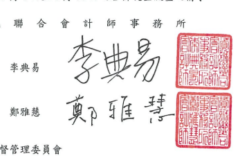

會計師核閱報告
(112)財審報字第 23001703 號 瑞昱半導體股份有限公司 公鑒:

## 前言

瑞昱半導體股份有限公司及子公司民國 112年及 111年9月 30 日之合併資產負債 表,民國112年及111年7月1日至9月30日、民國112年及111年1月1日至9月 30 日之合併綜合損益表,豎民國 112年及 111年1月1日至 9月30日之合併權益變動 表、合併現金流量表,以及合併財務報表附註(包括重大會計政策彙總),業經本會計師 核閱獎事。依證券發行人財務報告編製準則及經金融監督管理委員會認可並發布生效之 國際會計準則第 34 號「期中財務報導」編製允當表達之合併財務報表條管理階層之貴 任,本會計師之責任條依據核閱結果對合併財務報表作成結論。

## 範囲

除保留結論之基礎段所述者外,本會計師像依照中華民國核閱準則 2410 號「財務 報表之核閱」執行核閱工作。核閱合併財務報表時所執行之程序包括查詢(主要向負責 財務與會計事務之人員查詢)、分析性程序及其他核閱程序。核閱工作之範圍明顯小於 查核工作之範圍,因此本會計師可能無法察覺所有可藉由查核工作辨認之重大事項,故 無法表示查核意見。

## 保留結論之基礎

如合併財務報表附註四(三)及六(七)所述,列入上開合併財務報表之部分非重要子 公司及採權益法之投資,其同期間財務報表及附註十三所揭露之相關資訊,條依據各該 公司同期間自編未經會計師核閱之財務報表所編製而得。該等子公司民國 112年及 111 年9月30日之資產總額分別為新台幣7,061,316千元及新台幣7,000,513 仟元,分別 占合併資產總額 6.15%及 5.21%;負債總額分別為新台幣 1,390,761 仟元及新台幣 1,576,349 仟元,分別占合併負債總額之1.92%及 1.80%;其民國 112年及 111年7月1 日至 9月30日、民國 112年及 111年1月1日至9月30日之綜合(損)益總額分別為新
~4~

台幣 160,100 仟元丶新台幣 9,143 仟元、新台幣(40,135)仟元及新台幣(449,291)仟元, 分別占合併綜合(損)益總額之3.51%、0.11%、(0.42%)及(2.19%)。另對於採權益法之投 資,民國112年及111年9月30日採權益法之投資餘額分別為新台幣136,403 仟元及 新台幣176,891 仟元;其民國112年及111年7月1日至9月30日、民國112年及111 年1月1日至9月30日所認列之投資損失分別為新台幣14,942千元、新台幣3,222 仟 元、新台幣 42,580 仟元及新台幣 14,503 仟元。

## 保留結論

依本會計師核閱結果,除保留結論之基礎段所述部分非重要子公司及採權益法之投 資其財務報表倘經會計師核閱,對合併財務報表可能有所調整之影響外,並未發現上開 合併財務報表在所有重大方面有未依照證券發行人財務報告編製準則及經金融監督管 理委員會認可並發布生效之國際會計準則第 34號「期中財務報導」編製,致無法允當 表達瑞昱半導體股份有限公司及子公司民國112年及 111年9月 30日之合併財務狀況, 民國 112年及 111年7月1日至 9月30日、民國 112年及 111年1月1日至 9月30日 之合併財務績效,暨民國 112年及 111年1月1日至 9月 30日之合併現金流量之情事。

資 誠

金融監督管理委員會

$${\hat{\mathbb{H}}}\,{\hat{\mathbb{H}}}\,{\hat{\mathbb{H}}}{\hat{\mathbb{H}}}$$

核准簽證文號:金管證審字第 1020028992 號 前行政院金融監督管理委員會證券期貨局 核准簽證文號:金管證六字第 0960072936 號

* [10] A. A. K. 1 1 2 + 1 0 8 2 0 8
~5~