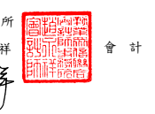

會計師核閱報告

國巨股份有限公司 公鑒:

## 前 言

 國巨股份有限公司 及 其子公司 ( 國 巨 集 團 )民 國 112 年及 111 年 9 月 30 日 之合併資產負債表,暨民國 112 年 及 111 年 7 月 1 日 至 9 月 30 日,以 及 民 國 112 年及 111 年 1 月 1 日至 9 月 30 日 之 合 併綜 合 損 益 表、民 國 112 年及 111 年 1 月 1 日 至 9 月 30 日 之 合 併 權 益 變動 表、合 併 現 金 流 量表,以及合併財務 報 表 附 註( 包 括 重 大 會 計政 策 彙 總 ),業 經 本 會 計 師核 閱 竣事。 依證券發行人 財 務 報 告 編 製 準 則 及 經 金 融 監 督 管 理 委 員 會 認 可 並 發 布 生 效 之 國 際 會 計 準 則 第 34 號 「 期 中 財 務報 導 」 編 製 允 當 表達 之 合 併 財 務 報 表 係管 理 階 層 之 責 任 ,
本會計師之責任係依據核閱結果對合併財務報表作成結論。

## 範 圍

 除保留結論之基礎段所述者外,本會計師係依照核 閱 準則 2410 號「財務 報 表 之 核 閱 」執 行 核 閱 工 作。核 閱 合 併 財務 報 表 時 所 執 行 之程 序 包 括 查 詢( 主 要 向 負 責 財 務 與 會 計 事 務 之人 員 查 詢 )、分析 性 程 序 及 其 他核 閱 程 序。核 閱 工 作 之 範 圍 明 顯 小 於 查 核 工 作 之 範 圍 , 因 此 本 會 計 師 可 能 無 法 察 覺 所 有 可 藉 由 查核工作辨認之重大事項,故無法表示查核意見。

## 保留結論之基礎

 如 合 併 財 務 報 表 附 註 十 三 所 述 , 列 入 上 開 合 併 財 務 報 表 之 部 分 非 重 要 子 公司之 同 期 間 財 務 報 表 未 經會 計 師 核 閱,其民國 112 年及 111 年 9 月 30 日 之 資產總額 分別為新台 幣( 以 下 同 )59,596,417 仟元及 56,562,303 仟 元,分 別 占 合 併資產總額之 18.96% 及 20.37% ;負債總額 分別為 13,077,731 仟元及 13,321,490 仟元 , 分 別 佔 合 併 負債 總 額 之 7.45%及 8.44%;民 國 112 年 及 111 年 7 月 1 日至 9 月 30 日 ,以 及 民 國 112 年 及 111 年 1 月 1 日 至 9 月 30 日 之 綜 合 損 益 淨 額 分 別 為 1,707,462 仟 元 、 2,277,326 仟 元 、 2,909,087 仟 元 及 3,317,820 仟 元,分 別 占 各 期 合 併 綜 合損 益 淨 額 之 17.12%、17.36%、15.06%及 10.30%。又 如 合 併 財 務報 表 附 註 十 四 所 述,民 國 112 年及 111 年 9 月 30 日 採 用權益法之投資餘額 共 計 分別 為 5,396,065 仟元及 3,312,555 仟 元 , 及其民國 112 年 及 111 年 7 月 1 日 至 9 月 30 日 ,以及民國 112 年 及 111 年 1 月 1 日 至 9 月 30 日認列之關聯企業損益份額共計分別為 79,741 仟 元、 36,301 仟 元 、
61,933 仟 元及 123,798 仟 元,暨合併財務報表附註三 八 附 註揭 露 事 項 所 述 轉 投 資 事 業 相 關 資 訊 , 係 依 據 被 投 資 公 司 同 期 間 未 經 會 計 師 核 閱 之 財 務 報 表 認 列 與揭露。

## 保留結論

 依 本 會 計 師 核 閱 結 果 , 除 保 留 結 論 之 基 礎 段 所 述 部 分 非 重 要 子 公 司 及 關 聯企業 之 財 務 報 表 倘 經 會 計 師 核 閱 , 對 合 併 財 務 報 表 可 能 有 所 調 整 之 影 響 外 , 並 未 發 現 上 開 合 併 財 務 報 表 在 所 有 重 大 方 面 有 未 依 照 證 券 發 行 人 財 務 報 告編製準則及經金融監督管理委員會認可並發布生效之國際會計準則第 34 號 「期中財務報導」編製,致無法允當表達 國 巨 集團 民 國 112 年 及 111 年 9 月 30 日 之 合 併 財 務 狀 況,暨 民 國 112 年及 111 年 7 月 1 日至 9 月 30 日 之合併 財 務績效,以 及 民 國 112 年 及 111 年 1 月 1 日 至 9 月 30 日 之合 併 財 務 績 效及合 併現金流量之情事。

* [10] M. C. Gonzalez-Garcia, M. C. Gonzalez-Garcia, M.  
會 計 師 趙永祥 會 計 師 張青霞
金融監督管理委員會核准文號 金管證審字第 1050024633 號 金融監督管理委員會核准文號 金管證審字第 1090347472 號

$\frac{4\uparrow}{4\uparrow}$ . 

$$\mathbb{R}_{\times}$$
中 華 民 國 112 年 1 0 月 2 6 日

$$\mathbb{A}$$
$$2\;6$$

$\square$