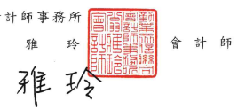
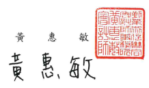

1073 台北市信義區松仁路100號

Deloitte & Touche 20F, Talpei Nan Shan Plaza No. 100, Songren Rd.,
Xinyi Dist., Taipei 11073, Taiwan Tel :+886 (2) 2725-9988 Fax +886 (2) 4051-6888 www.deloitte.com.tw 會計師核閱報告 台灣水泥股份有限公司 公鑒:

## 前 青

台灣水泥股份有限公司及子公司民國 112年及 111年 9月 30 日之合併資 產負債表,豎民國 112年及 111年 7月1日至 9月 30日,以及民國 112年及 111年1月1日至9月30日之合併綜合損益表、民國 112年及 111年1月1 日至9月30日之合併權益變動表與合併現金流量表,以及合併財務報表附註
(包括重大會計政策樂總),業經本會計師核閱竣事。依證券發行人財務報告 編製準則及經金融監督管理委員會認可並發布生效之國際會計準則第 34 號
「期中財務報導」編製允當表達之合併財務報表係管理階層之貪任,本會計 師之責任係依據核閱結果對合併財務報表作成結論。

## 範 团

除保留結論之基礎段所迦者外,本會計師係依照核閱準則2410號「財務 報表之核閱』執行核閱工作。核閱合併財務報表時所執行之程序包括查詢(主 要向負責財務與會計事務之人員查詢)、分析性程序及其他核閱程序。核閱工 作之範圍明顯小於查核工作之範圍,因此本會計師可能無法察覺所有可藉由 查核工作辨認之重大事項,故無法表示查核意見。

保留結論之基礎 如合併財務報告附註十二所述,列入上開合併財務報告之部分非重要子 公司之同期間財務報表未經會計師核聞,其民國 112年及 111年9月 30日之 資產總額分別為新台幣 86,788,628 仟元及 87,628,021 仟元,占合併資產總額 18%及 19%;負債總額分別為新台幣 13,193,645 仟元及 12,598,022 仟元, ェ 合併負債總額 6%及 5%;民國 112年及 111年 7月 1日至 9月 30日,以及民 國 112年及 111年1月1日至 9月 30日之綜合淨(損)益總額分別為新台幣
(522,373)仟元、(287,331)仟元、(556,486)仟元及(174,288)仟元,分別占合併 綜合損益總額之 6%、24%、5%及 9%。

保留結論 依本會計師核閱結果,除保留結論之基礎段所述部分非重要子公司之財 務報表倘經會計師核閱,對合併財務報表可能有所調整之影響外,並未發現 上開合併財務報表在所有重大方面有未依照證券發行人財務報告編製準則及 經金融監督管理委員會認可並發布生效之國際會計準則第 34號「期中財務報 導」編製,致無法允當表達台灣水泥股份有限公司及子公司民國 112年及 111 年9月30日之合併財務狀況,暨民國 112年及 111年 7月 1日至 9月 30日 之合併財務績效,以及民國 112年及 111年1月1日至 9月 30日之合併財務 績效及合併現金流量之情事。

* [16] A. A. K. K.  
* [10] M. C. Gonzalez-Garcia, M. C. Gonzalez-Garcia, M.  

金融監督管理委員會核准文號 金管證審字第 1020025513 號 金融監督管理委員會核准文號 金管證審字第 1070323246 號 中

$${\frac{\frac{d\hat{b}}{d\hat{b}}}{\#}}$$
$$\mathbb{R}\qquad\qquad\mathbb{R}\qquad\qquad1\,1\,2\qquad\qquad\mathbb{A}\qquad\qquad\qquad\mathbb{B}$$
$$\begin{array}{c c c c}{{}}&{{}}&{{1}}&{{}}&{{}}\\ {{}}&{{}}&{{}}&{{}}&{{\rlap{\nmid\!}1}}&{{}}&{{}}\end{array}$$
$$\mathbb{B}$$
