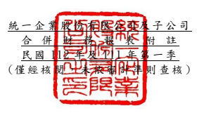

單位:新 台幣仟 元 (除特別註 明者外 )

## 一、 公司沿革

(一)統一 企業股 份有限 公司 (以 下簡稱「 本公司 」)係依 據中華 民國公 司法及 其他 有關法令 之規定 ,於民國 56 年 8 月奉 准 創立。主 要經營 項目為 各種飲 料、
食品、飼料、麵 粉等之 製造、加 工及買 賣業務。 列 入本公 司及子公 司(以 下 統稱「 本集團 」)合併財 務報告 之子公 司 主要經營 項目,請詳 附註四(三)合 併基礎之 說明。

(二)本公 司股票 自 民國 76 年 12 月起 在 台灣證券 交易所 上市買 賣。

二、 通過財務 報告之 日期及 程序 本合併財 務報告 已於民國 112 年 5 月 11 日經董事 會通過 後發布 。

三、 新發布及 修訂準 則及解 釋之適 用

(一)已採用金融監督管理委員會 (以 下 簡 稱 「 金 管 會 」 )認 可 並發布生效 之新發

布、修正 後國際 財務報 導準則 之影響

下表彙列 金管會 認可 並 發布生 效之民 國 112 年 適用之 國際財 務報導準 則之 新發布、 修正 及 修訂之 準則及 解釋:

|                          | 國際會計準則理事會             |                 |                 |
|--------------------------|--------------------------------|-----------------|-----------------|
|                          | 新發布/修正/修訂準則及解釋     | 發布之生效日    |                 |
| 國際會計準則第1號之修正  | 「會計政策之揭露」             |                 | 民國112年1月1日 |
| 國際會計準則第8號之修正  | 「會計估計之定義」             |                 | 民國112年1月1日 |
| 國際會計準則第12號之修正 | 「與單一交易所產生之資產及負債 | 民國112年1月1日 |                 |
| 有關之遞延所得稅」       |                                |                 |                 |

本 集 團 經 評 估 上 述 準 則 及 解 釋 對 本 集 團 財 務 狀 況 與 財 務 績 效 並 無 重 大 影 響。

(二)尚未採用 金管會 認可之 新發布 、修正 後 國際財務 報導準 則之影 響 無。