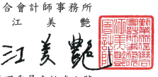
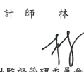

會計師核閱報告 台灣積體電路製造股份有限公司 公鑒:
前 言 台灣積體電路製造股份有限公司及其子公司(以下簡稱台積公司及其子 公司)民國 111年及 110年 9 月 30 日之合併資產負債表,暨民國 111 年及 110年7月1日至9月 30日奥民國 111年及 110年1月1日至 9月 30 日之 合併綜合損益表、民國 111年及 110年1月1日至 9月 30日之合併權益變動 表與合併現金流量表,以及合併財務報表附註(包括重大會計政策彙總),業 經本會計師核閱竣事。依證券發行人財務報告編製準則及經金融監督管理委 員會認可並發布生效之國際會計準則第 34 號「期中財務報導」編製允當表達 之財務報表係管理階層之責任,本會計師之責任係依據核閱結果對合併財務 報表作成結論。 範 图 本會計師條依照審計準則公報第六十五號「財務報表之核閱」執行核閱工 作。核閱合併財務報表時所執行之程序包括查詢(主要向負責財務與會計事務 之人員查詢)、分析性程序及其他核閱程序。核閱工作之範圍明顯小於查核工 作之範圍,因此本會計師可能無法察覺所有可藉由查核工作辨認之重大事項, 故無法表示查核意見。

编 論 依本會計師核閱結果,並未發現上開合併財務報表在所有重大方面有未 依照證券發行人財務報告編製準則及經金融監督管理委員會認可並發布生效 之國際會計準則第 34號「期中財務報導」編製,致無法允當表達台積公司及 其子公司民國 111 年及 110 年 9 月 30 日之合併財務狀況,暨民國 111 年及 110 年 7 月 1 日至 9 月 30 日之合併財務 績效及民國 111 年及 110 年 1 月 1 日 至9月 30日之合併財務績效及合併現金流量之情事。

師 會 計

勤業眾信聯合會計師事務所

證券暨期貨管理委員會核准文號 台財證六字第 0930128050 號

中

菲 民

$\mathbf{a}$

$\mathbf{a}$
$$1\ 1\ 1$$
$$\mathbf{\ddot{r}}$$

年

$$1\ 1$$

月 8

## 日

金融監督管理委員會核准文號 金管證審字第 1090347472 號