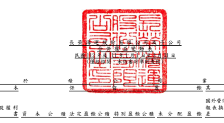
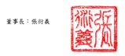
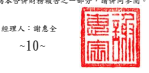
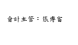

單位:新台幣仟元 歸 屬 於 母 公 司 業 主 之 權 益

 股 本 保留盈餘 其他權益 附 註 普通股股本 債券換股權利 國外營運機構財務 報表換 算之 兌換 差 額 透過其他綜合損 益按公允價值衡 量之金融資產未 實現損益 避險工具之損益 總 計 非控制權益 權益總額

| 111 年度  111 年 1 月 1 日餘額                          | 六(二十二)         | $ 52,908,484   | $       | -            | $ 15,762,185   | $ 8,122,482   | $             | 581,406       | $ 250,555,749 ($   | 6,733,006) $ 3,986,029   | $ 1,601,207   | $ 326,784,536   | $ 30,537,054   | $ 357,321,590   |               |
|---------------------------------------------------------|--------------------|----------------|---------|--------------|----------------|---------------|---------------|---------------|--------------------|--------------------------|---------------|-----------------|----------------|-----------------|---------------|
| 本期淨利                                                | 六(二十一)         | -              | -       | -            | -              | -             | 101,359,559   | -             | -                  | -                        | 101,359,559   | 4,791,718       | 106,151,277    |                 |               |
| 本期其他綜合損益                                        | 六(二十一)(二十二) | -              | -       | -            | -              | - (           | 190)          | 8,422,778     | 251,212 (          | 231,523)                 | 8,442,277     | 944,037         | 9,386,314      |                 |               |
| 本期綜合損益總額                                        | -                  | -              | -       | -            | -              | 101,359,369   | 8,422,778     | 251,212 (     | 231,523)           | 109,801,836              | 5,735,755     | 115,537,591     |                |                 |               |
| 採用權益法認列之關聯企業及合資之變動數 六(二十)(二十一) | -                  | -              | 121,045 | -            | -              | 127           | - (           | 127)          | -                  | 121,045                  | -             | 121,045         |                |                 |               |
| 其他資本公積變動數                                      | 六(二十)           | -              | - (     | 6)           | -              | -             | -             | -             | -                  | - (                      | 6)            | - (             | 6)             |                 |               |
| 可轉換公司債轉換                                        | 六(十九)(二十)     | 2,007          | 11      | 16,112       | -              | -             | -             | -             | -                  | -                        | 18,130        | -               | 18,130         |                 |               |
| 非控制權益變動數                                        | 六(三十五)         | -              | -       | -            | -              | -             | -             | -             | -                  | -                        | - (           | 5,566,864) (    | 5,566,864)     |                 |               |
| 111 年 3 月 31 日餘額                                   | $ 52,910,491       | $              | 11      | $ 15,899,336 | $ 8,122,482    | $             | 581,406       | $ 351,915,245 | $                  | 1,689,772                | $ 4,237,114   | $ 1,369,684     | $ 436,725,541  | $ 30,705,945    | $ 467,431,486 |
| 112 年度  112 年 1 月 1 日餘額                          | 六(二十二)         | $ 21,164,201   | $       | -            | $ 15,968,043   | $ 32,019,129  | $ 1,145,770   | $ 465,562,042 | $ 13,490,378       | $ 2,478,263              | $             | 386,203         | $ 552,214,029  | $ 30,336,006    | $ 582,550,035 |
| 本期淨利                                                | 六(二十一)         | -              | -       | -            | -              | -             | 5,042,719     | -             | -                  | -                        | 5,042,719     | 1,291,162       | 6,333,881      |                 |               |
| 本期其他綜合損益                                        | 六(二十一)(二十二) | -              | -       | -            | -              | - (           | 1,504) (      | 3,628,510)    | 18,140             | 42,878 (                 | 3,568,996) (  | 151,415) (      | 3,720,411)     |                 |               |
| 本期綜合損益總額                                        | -                  | -              | -       | -            | -              | 5,041,215 (   | 3,628,510)    | 18,140        | 42,878             | 1,473,723                | 1,139,747     | 2,613,470       |                |                 |               |
| 採用權益法認列之關聯企業及合資之變動數 六(二十)(二十一) | -                  | -              | 88,137  | -            | -              | -             | -             | -             | -                  | 88,137                   | -             | 88,137          |                |                 |               |
| 其他資本公積變動數                                      | 六(二十)           | -              | - (     | 4)           | -              | -             | -             | -             | -                  | - (                      | 4)            | - (             | 4)             |                 |               |
| 非控制權益變動數                                        | 六(三十五)         | -              | -       | -            | -              | -             | -             | -             | -                  | -                        | - (           | 94,859) (       | 94,859)        |                 |               |
| 112 年 3 月 31 日餘額                                   | $ 21,164,201       | $              | -       | $ 16,056,176 | $ 32,019,129   | $ 1,145,770   | $ 470,603,257 | $             | 9,861,868          | $ 2,496,403              | $             | 429,081         | $ 553,775,885  | $ 31,380,894    | $ 585,156,779 |

董事長:張衍義 經理人:謝惠全 會計主管:張傳富

後附合併財務報表附註為本合併財務報告之一部分,請併同參閱。

