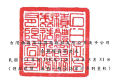

早在:新台参好元

|                                            |  怡                                                                                                                                             | 这两其他 综合                      |              |                 |                                                             |                |                 |                |                           |                    |                   |                 |                |                 |          |                 |            |                 |
|--------------------------------------------|-------------------------------------------------------------------------------------------------------------------------------------------------|------------------------------------|--------------|-----------------|-------------------------------------------------------------|----------------|-----------------|----------------|---------------------------|--------------------|-------------------|-----------------|----------------|-----------------|----------|-----------------|------------|-----------------|
|                                            | 铜造按公允恒证                                                                                                                                  |                                    |              |                 |                                                             |                |                 |                |                           |                    |                   |                 |                |                 |          |                 |            |                 |
| 后                                         | 图片会逐换播时获 对爱之会融资直                                                                                                                 | 设公司意立                         |              |                 |                                                             |                |                 |                |                           |                    |                   |                 |                |                 |          |                 |            |                 |
| 股此(份股)                                 | 特别量程公园 本 宁旺 图 保留意的合作 媒体制定线播放 本页时预报 当地工事装置 日本娱乐网站 苏州省五分六 周 版 双 2 道 金 竹 呼 在韩国 张 红 分 小 |                                    |              |                 |                                                             |                |                 |                |                           |                    |                   |                 |                |                 |          |                 |            |                 |
| 11] 年1月1日給顧                           | 5                                                                                                                                               | $ 1,506,806'23 (8) 199/628'906'1 $ | 574,310 5    | 120,536 5       | - (5                                                        | 62,608,515) $  | $ 2,168,286,553 | 8              | 2,446,652 $ 2,170,733,205 |                    |                   |                 |                |                 |          |                 |            |                 |
| 25,930,380                                 | 259,303,806                                                                                                                                     | 311,146,899                        | 59,304,212   | $ 1,536,378,550 |                                                             |                |                 |                |                           |                    |                   |                 |                |                 |          |                 |            |                 |
| 互休分配                                   |                                                                                                                                                 |                                    |              |                 |                                                             |                |                 |                |                           |                    |                   |                 |                |                 |          |                 |            |                 |
| 特别盈给公园                               | 3,304,303 (                                                                                                                                     | 3,304,303)                         | 21,208,546)  |                 |                                                             |                |                 |                |                           |                    |                   |                 |                |                 |          |                 |            |                 |
| 观全局时                                   | 71,201,546)                                                                                                                                     | 21,308,546)                        | 71,305,546)  |                 |                                                             |                |                 |                |                           |                    |                   |                 |                |                 |          |                 |            |                 |
| 盟移会配合计                               | 3,304,203                                                                                                                                       | 74,612,849)                        | 71,308,546)  | 71,305,546)     | 71,308,546)                                                 |                |                 |                |                           |                    |                   |                 |                |                 |          |                 |            |                 |
|                                            | 200,732,975                                                                                                                                     | 140,399                            | 202,873,374  |                 |                                                             |                |                 |                |                           |                    |                   |                 |                |                 |          |                 |            |                 |
| 117年1月1日至3月31日洋利                   | 202,732,975                                                                                                                                     | 202,732,975                        |              |                 |                                                             |                |                 |                |                           |                    |                   |                 |                |                 |          |                 |            |                 |
| 111年1月1日至3月31日就没其他综             |                                                                                                                                                 |                                    |              |                 |                                                             |                |                 |                |                           |                    |                   |                 |                |                 |          |                 |            |                 |
| 合前监                                     | 19,649,475                                                                                                                                      | ( __ 4,278,602)                    | 679,806      | 15.580.672      | 15.550.679                                                  | ... 139,462)   | 15,411,217      |                |                           |                    |                   |                 |                |                 |          |                 |            |                 |
| 111年1月1日至3月31日综合销量地             |                                                                                                                                                 |                                    |              |                 |                                                             |                |                 |                |                           |                    |                   |                 |                |                 |          |                 |            |                 |
| बर्                                         | 202.732.975                                                                                                                                     | 202,732,975                        | 19849422     | 1               | 4,778,602)                                                  | - 679.806      | 15,550,679      | 218,283,654    | 937                       | _218,284,521       |                   |                 |                |                 |          |                 |            |                 |
| 股份基礎局付交易                           | 1,387                                                                                                                                           | 13,870                             | 438,029      | · (             | 425,224) (                                                  | 415,224)       | -               | 26,675         | 26,675                    |                    |                   |                 |                |                 |          |                 |            |                 |
| 息 最新最真 四                             | .                                                                                                                                               | י                                  | .            | ﺍﻟ              | .                                                           | - - - -        | 871,566) (      | 871,566)       | - 1                       | 871,566)           |                   |                 |                |                 |          |                 |            |                 |
| 成分透過其他城合提品按公允價值侧登         |                                                                                                                                                 |                                    |              |                 |                                                             |                |                 |                |                           |                    |                   |                 |                |                 |          |                 |            |                 |
| 之感益工具教育                             | .                                                                                                                                               | .                                  | .            | .               | 7.447                                                       | 2,447          | · (             | 7,447)         | ·                         | · X                | 7,447)            | E               | י              | -               |          |                 |            |                 |
| 國際工具新起展礎調整                       | .                                                                                                                                               | -                                  | .            | -               | ·                                                           | '              | .               | י              | · 8                       | 2,178)             | · · ·             | 2,178)          | - - -          | 2,178)          | · (      | 2,178}          |            |                 |
| 採用機設換網則之間即企業股損沖積之         | .                                                                                                                                               | 20                                 |              |                 |                                                             |                |                 |                |                           |                    |                   |                 |                |                 |          |                 |            |                 |
| 受角期                                     | 30                                                                                                                                              | .                                  | | 一         | ·               | -                                                           | .              | .               | -              | ・                        | 30                 |                   |                 |                |                 |          |                 |            |                 |
| 23 列外于会司所有程度益受到版              | 15,474                                                                                                                                          | 15,474                             | 4,587,381    | 4,602,855       |                                                             |                |                 |                |                           |                    |                   |                 |                |                 |          |                 |            |                 |
| 养技制度益增加                             | - TVER                                                                                                                                          | 3,650                              |              |                 |                                                             |                |                 |                |                           |                    |                   |                 |                |                 |          |                 |            |                 |
| 111 年3月 31 日休練                        | 25.931.767                                                                                                                                      | S 259.317.675                      | 65,215,235   | $ 311-146.859   | 62 HM 515                                                   | S_1.44.306.123 | ≤ 2,038,261,582 | ($ 43,653,886) | 4.211.239)                | 78.16              | 《S               | (25,224)        | 18 47,492,685) | 15              | 871.566) | S 2.314.420.036 | 7 1128.654 | 5 2 321 459 254 |
| 110年1月1日給紙                            | 25,930,380                                                                                                                                      | $ 259,303,905                      | $ 56,347,243 | $ 311,146,859   | $ 42,259,146 $ 1,235,280,036 $ 1,588,686,081 ($ 57,001,627) | 8 2,321,754    | ત               | .              | રે                         | · {$ 54,679,873] $ | - $ 1,849,657,256 | 5               | 964,743        | $ 1,850,621,999 |          |                 |            |                 |
| 监会分配                                   |                                                                                                                                                 |                                    |              |                 |                                                             |                |                 |                |                           |                    |                   |                 |                |                 |          |                 |            |                 |
| 将别量除公租                               | 12,420,727                                                                                                                                      | 12,420,727)                        | 64,825,951)  | 64,825,551)     |                                                             |                |                 |                |                           |                    |                   |                 |                |                 |          |                 |            |                 |
| 现金殿利                                   | 64,825,951 )                                                                                                                                    | 64,825,5511                        |              |                 |                                                             |                |                 |                |                           |                    |                   |                 |                |                 |          |                 |            |                 |
| 监徐分配合计                               | 12,420,322                                                                                                                                      | 77,246,678)                        | 64 KSS SS 1  | (4,835,951)     | 64,826,551)                                                 |                |                 |                |                           |                    |                   |                 |                |                 |          |                 |            |                 |
| 110年1月1日至3月31 日治利                  | 139/690/493                                                                                                                                     | 139,490,493                        | 139,650,493  | 48,256          | 139,738,749                                                 |                |                 |                |                           |                    |                   |                 |                |                 |          |                 |            |                 |
| 110年1月1日至3月318就像其他综              |                                                                                                                                                 |                                    |              |                 |                                                             |                |                 |                |                           |                    |                   |                 |                |                 |          |                 |            |                 |
| 合精品                                     | 7.831.185                                                                                                                                       | (_                                 | - 2001       | 5,966,818       | - Facellis                                                  | 192            | 5,967,010       |                |                           |                    |                   |                 |                |                 |          |                 |            |                 |
| 110 率 1月 1 日 里 3 月 31 日 % 合 級 產物 |                                                                                                                                                 |                                    |              |                 |                                                             |                |                 |                |                           |                    |                   |                 |                |                 |          |                 |            |                 |
| ધ                                          | 139 690,493                                                                                                                                     | 139 690.492                        | 2801 182     | -               | 1,522,951)                                                  | ---------      | 5,966,878       | 145,657,311    | ﺍﻟﻤﺴﺎﺣﺔ ﺍﻟﻤﺴﺘ             | -- 145,205,752     |                   |                 |                |                 |          |                 |            |                 |
| 成分退通其他综合新品接公光调值剧变         |                                                                                                                                                 |                                    |              |                 |                                                             |                |                 |                |                           |                    |                   |                 |                |                 |          |                 |            |                 |
| 之候强工具被复                             | 278,816) (                                                                                                                                      | 278,816}                           | 278,816      | .               | 278,816                                                     | .              |                 |                |                           |                    |                   |                 |                |                 |          |                 |            |                 |
| · · (                                      | ់                                                                                                                                                | .                                  |              |                 |                                                             |                |                 |                |                           |                    |                   |                 |                |                 |          |                 |            |                 |
| 进险工具新品品提调整                       | 41,416                                                                                                                                          | 41,416                             | 41,416       |                 |                                                             |                |                 |                |                           |                    |                   |                 |                |                 |          |                 |            |                 |
| '                                          | .                                                                                                                                               | .                                  | 41,416       |                 |                                                             |                |                 |                |                           |                    |                   |                 |                |                 |          |                 |            |                 |
| 抹用植盐涂铝列之副即会紧胶模净值之         |                                                                                                                                                 |                                    |              |                 |                                                             |                |                 |                |                           |                    |                   |                 |                |                 |          |                 |            |                 |
| 豐角製                                     | .                                                                                                                                               | -                                  | 82           | -               | .                                                           | *              | .               | -              | -                         | -                  | -                 | "               | צו             | .               | 82       |                 |            |                 |
| 實際處分子公司機種價格利極角價值差         |                                                                                                                                                 |                                    |              |                 |                                                             |                |                 |                |                           |                    |                   |                 |                |                 |          |                 |            |                 |
| દર                                         | "                                                                                                                                               | 8,406,282                          | -            | -               | .                                                           | 8,406,282      | 2,045,516       | 9,451,798      |                           |                    |                   |                 |                |                 |          |                 |            |                 |
| 呼拉制模品附近                             | 1,704                                                                                                                                           | 1,704                              |              |                 |                                                             |                |                 |                |                           |                    |                   |                 |                |                 |          |                 |            |                 |
| 取得于公司引擎款                           | 722                                                                                                                                             | 155                                |              |                 |                                                             |                |                 |                |                           |                    |                   |                 |                |                 |          |                 |            |                 |
| 110 年3月 31 日休飯                        | 25.930,381                                                                                                                                      | S 259,202,915                      | 5 61753.60   | S 311,146,859   | S 1.297 A45 035                                             | S_1/61-271 HD  | (8 49,120,442)  | -171 613       | 45.392.8221               | S 1,938,526,336    | 5 201315          | 5 1.940.936.962 |                |                 |          |                 |            |                 |
| 5 (679,873                                 | 会讲明感都会之一郎分                                                                                                                            |                                    |              |                 |                                                             |                |                 |                |                           |                    |                   |                 |                |                 |          |                 |            |                 |

 作 合对工程

