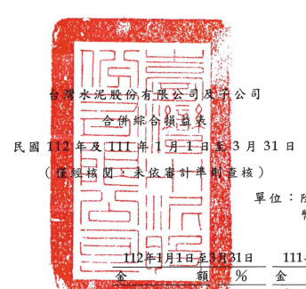
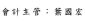

|                           | 單位:除每股盈餘為新台   |                      |              |             |    |
|---------------------------|-------------------------|----------------------|--------------|-------------|----|
|                           | 幣元外,餘為仟元         |                      |              |             |    |
|                           | 31日                    | 111年1月1日至3月31日 |              |             |    |
|                           | %                       | 金                   | 額           | %           |    |
| 代                        | 碼                      | 100                  | $ 22,973,461 |             |    |
| 4000                      | 營業收入(附註二三       | 100                  |              |             |    |
| 5000                      | 營業成本(附註十一       |                      |              |             |    |
| 二四及三三)               | 23,826,708              | 90                   | 20,886,629   | 91          |    |
| 5900                      | 營業毛利                | 2,469,221            | 10           | 2,086,832   | 9  |
| 營業費用(附註二一、二四及 |                         |                      |              |             |    |
| 三三)                     |                         |                      |              |             |    |
| 6100                      | 推銷費用                | 260,373              | 1            | 214,818     | 1  |
| 6200                      | 管理費用                | 1,711,430            | 7            | 1,346,287   | 6  |
| 6300                      | 研究發展費用            | 331,351              | 1            | 318,104     | l  |
| 6000                      | 菱業費用合計            | 2,303,154            | 9            | 1,879,209   | 8  |
| 6900                      | 營業淨利                | 166,067              | 1            | 207,623     | 1  |
| 營業外收入及支出          |                         |                      |              |             |    |
| 7060                      | 採用權益法認列之關聯    |                      |              |             |    |
| 企業及合資損益份額        |                         |                      |              |             |    |
| (附註十三)                | 1,004,735               | 4                    | 622,247      | 3           |    |
| 7100                      | 利息收入(附註二四)      | 741,718              | 3            | 372,039     | 1  |
| 7130                      | 股利收入                | .                    | 405,293      | 2           |    |
| 7190                      | 其他收入                | 121,037              | -            | 81,506      | -  |
| 7230                      | 外幣兌換淨益            | 80,228               | -            | 404,744     | 2  |
| 7235                      | 透過損益按公允價值衡    |                      |              |             |    |
| 量金融資產及負債之        |                         |                      |              |             |    |
| 浮益(損)                  | 311,852                 | 1                    | (            | 242,231 ) ( | 1) |
| 7050                      | 財務成本(附註二四及三   |                      |              |             |    |
| 三)                       | 829,265) ( 3) (         | 525,210) (           | 2)           |             |    |
| (                         |                         |                      |              |             |    |
| (接次頁)                  |                         |                      |              |             |    |

| 112年1月1日至3月31日      | 111年1月1日 至3月31日   |               |           |              |     |           |    |    |
|---------------------------|-------------------------|---------------|-----------|--------------|-----|-----------|----|----|
| 金                        | 額                      | %             | 金        | 額           | %   |           |    |    |
| 代 碼                     |                         |               |           |              |     |           |    |    |
| 7590                      | 其他支出                | ($            | 101,408)  | ي            | ($  | 191,246 ) | (  | 1) |
| 7610                      | 處分不動產、廠房及設備  |               |           |              |     |           |    |    |
| 利益(損失)                | (__ 14,075)             | 37,346        |           |              |     |           |    |    |
|                           | ----                    | ==            |           |              |     |           |    |    |
| 7000                      | 菱業外收入及支出        |               |           |              |     |           |    |    |
| 合計                      | 1,314,822               | __            | 964,488   | 4            |     |           |    |    |
| 7900                      | 税前淨利                | 1,480,889     | 6         | 1,172,111    | 5   |           |    |    |
| 7950                      | 所得稅費用(附註二五)    | 475,245       | 315,605   |              |     |           |    |    |
|                           | 2                       | 1             |           |              |     |           |    |    |
| 8200                      | 本期净利                | 1,005,644     | - 4       | 856,506      | - 4 |           |    |    |
| 本期其他綜合損益淨額(附註 |                         |               |           |              |     |           |    |    |
| 二二)                     |                         |               |           |              |     |           |    |    |
| 8310                      | 不重分類至損益之項目:   |               |           |              |     |           |    |    |
| 8316                      | 透過其他綜合損益        |               |           |              |     |           |    |    |
| 按公允價值街量            |                         |               |           |              |     |           |    |    |
| 之權益工具投資            |                         |               |           |              |     |           |    |    |
| 未實現評價損益            | 1,414,354               | 5             | 588,133   | 3            |     |           |    |    |
| 8320                      | 採用權益法認列之        |               |           |              |     |           |    |    |
| 關聯企業及合資            |                         |               |           |              |     |           |    |    |
| 之其他綜合損益            |                         |               |           |              |     |           |    |    |
| 之份額                    | 118,602                 | 45,410        |           |              |     |           |    |    |
|                           | 门                      | 5             |           |              |     |           |    |    |
|                           | 1,532,956               | 6             | 633,543   | 3            |     |           |    |    |
| 8360                      | 後續可能重分類至損益    |               |           |              |     |           |    |    |
| 之項目:                   |                         |               |           |              |     |           |    |    |
| 8361                      | 國外營運機構財務        |               |           |              |     |           |    |    |
| 報表換算之兌換            |                         |               |           |              |     |           |    |    |
| 差額                      |                         | 937,061) ( 4) | 7,655,591 | 33           |     |           |    |    |
| (                         |                         |               |           |              |     |           |    |    |
| 8370                      | 採用權益法認列之        |               |           |              |     |           |    |    |
| 關聯企業及合資            |                         |               |           |              |     |           |    |    |
| 之其他綜合損益            |                         |               |           |              |     |           |    |    |
| 份額                      | 904,874                 | র্ব            | 955,191   | 4            |     |           |    |    |
|                           | 32,187 )                | "             | 8,610,782 | 37           |     |           |    |    |
| 8300                      | 其他綜合損益淨額        | 9,244,325     |           |              |     |           |    |    |
|                           | 1,500,769               | 6             | 40        |              |     |           |    |    |
| 8500                      | 本期綜合損益總額        | $ 2,506,413   | 10        | $ 10,100,831 | 44  |           |    |    |
| (接次頁)                  |                         |               |           |              |     |           |    |    |

| 112年1月1日至3月31日   | 111年1月1日至3月31日   |             |           |              |              |         |          |    |
|------------------------|------------------------|-------------|-----------|--------------|--------------|---------|----------|----|
| 代 碼                  | 金                     | 額          | %         | 金           | 額           |         | %        |    |
| 淨利歸屬於             |                        |             |           |              |              |         |          |    |
| 8610                   | 本公司業主             | $ 1,407,161 | 5         | ക്ക           | 1,204,144    | 5       |          |    |
| 8620                   | 非控制權益             | (           | 401,517)  | (            |              | 1)      | 347,638) | 1) |
| 8600                   | $ 1,005,644            | ಕಿ           | 856,506   |              |              |         |          |    |
|                        | ন্                      | 4           |           |              |              |         |          |    |
| 綜合損益總額歸屬於     |                        |             |           |              |              |         |          |    |
| 8710                   | 本公司業主             | ર્સ          | 2,900,492 | 11           | $ 10,317,964 | 45      |          |    |
| 8720                   | 非控制權益             | 394,079)    | (_ 1)     | (___         | 217,133 )    | (___ 1) |          |    |
| 8700                   | lea                    | 2,506,413   | 10        | $ 10,100,831 | ਰਜ           |         |          |    |
| 每股盈餘(附註二六)     |                        |             |           |              |              |         |          |    |
| 9750                   | 基                     | 本          | ક         | 0.20         | ક            | 0.18    |          |    |
| 9850                   | 稀                     | 釋          | ತ         | 0.20         | $            | 0.18    |          |    |

後附之附註係本合併財務報告之一部分。

(請參閱勤業眾信聯合會計師事務所民國 112年5月11日核閱報告)

