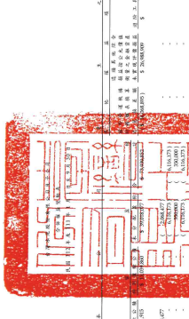
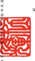
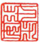

果但:新台警任元

| 9,335                              | 33,182                                                                        | 66,520                           | 145,345 )                  | 284                           | 732,459 |          | 128,452 )        | 37,766    | 131,200   |     |
|------------------------------------|-------------------------------------------------------------------------------|----------------------------------|----------------------------|-------------------------------|--------------------|------------------|-----------|-----------|-----|
| 6,116,173 ]
350,000 ]                                    | 1,164,176                                                                     | 1,554,363
1,510,472                                  | 1,532,904                  | 159,533                       | 3,566,091 }        | 100,200]         | 7,504,699 | $73,974   |     |
| $ 221,670,446                      | $ 238,275,780                                                                 | $ 24,726,491                     |                            |                               |                    |                  |           |           |     |
| 14 5 225,654,6                     |                                                                               |                                  |                            |                               |                    |                  |           |           |     |
| 피                                 | 70,874 )                                                                      | 84.5431                          |                            |                               |                    |                  |           |           |     |
| 1,164,176 ]                        | 一期2020                                                                      | 1,533,000                        | 145,345                    | 100,200 ]                     | 1,308,793
1,872,565                    | 874,640          |           |           |     |
| 5 20.256.450                       | $ 20,381,014                                                                  | $ 22.528.122                     |                            |                               |                    |                  |           |           |     |
| 4 8 21,177,342                     | 9,335                                                                         | 2                                | 37,1892                    | 66,820                        | 284                | 2                | 44,109    | 37,766    |     |
| 116,173
350,000                                    | - 2017/01                                                                     | 159,833                          | 3,544,091
350,000                            | 6.105.006
2.801.722                               | 732,459            | 131,200          |           |           |     |
| 1 6 1 1 1 1                        | 15 201417 2017                                                                | $ 217,894,766                    | $ 222.988.360              |                               |                    |                  |           |           |     |
| 29,208                             |                                                                               |                                  |                            |                               |                    |                  |           |           |     |
| 191,535                            | 171/600 )                                                                     | 732,459 )                        | 171,600                    |                               |                    |                  |           |           |     |
| (5 171/22)                         | ( 5 - 732 459                                                                 |                                  |                            |                               |                    |                  |           |           |     |
| 15                                 |                                                                               |                                  |                            |                               |                    |                  |           |           |     |
| 1,651 )                            | न्द्रन्त                                                                         | 4.838 )                          |                            |                               |                    |                  |           |           |     |
| - 131                              | (5 6321)                                                                      | (5                               |                            |                               |                    |                  |           |           |     |
| 7,399,768                          | -2002                                                                         |                                  |                            |                               |                    |                  |           |           |     |
| $ 19,589,141                       | $ 20,256,916                                                                  | $ 19,562,894                     |                            |                               |                    |                  |           |           |     |
| 1252                               | म् अस्ति । अस्ति । अस्ति । अस्ति । अस्ति । अस्ति । अस्ति । अस्ति । अस्ति । अस्ति । अस्ति । अस्ति ।  स्व |                                  |                            |                               |                    |                  |           |           |     |
| ($ 8.451.166)                      | ( $ 8,294,175 )                                                               | ( 5 4.255.134 )                  |                            |                               |                    |                  |           |           |     |
|                                    | (46)                                                                          |                                  |                            |                               |                    |                  |           |           |     |
| 6,116,173 ]
    350,000 ]
6,116,173 ]                                    | 2,9 7,531                                                                     | 3,566,091 )
3,50,000 j                                  | 6,195,906                  |                               |                    |                  |           |           |     |
| 5 64.275.022                       | 66,527,594                                                                    | 6,195,906                        | 5 68,506,743               | 天日 112 年 11 月 10 日 4     |                    |                  |           |           |     |
|                                    | 财函服合之一带分                                                              |                                  |                            |                               |                    |                  |           |           |     |
|                                    | (6)                                                                           |                                  |                            |                               |                    |                  |           |           |     |
| 1.160                              | 5,300                                                                         |                                  |                            |                               |                    |                  |           |           |     |
|                                    | 6,195,906                                                                     |                                  |                            |                               |                    |                  |           |           |     |
| 27,255,930                         | 29,572,801                                                                    | 6,155,906                        | 5 31 336,764               |                               |                    |                  |           |           |     |
| 1.160 >                            | 5,369 )                                                                       | 12.99932                         |                            |                               |                    |                  |           |           |     |
| $ 13.005.200                       | $ 13,004,401                                                                  |                                  |                            |                               |                    |                  |           |           |     |
| 2.068.477                          | 520,555                                                                       |                                  |                            |                               |                    |                  |           |           |     |
| 21,881,9                           | 5 21.650.322                                                                  | $ 23,950,392                     | 21.450,947                 |                               |                    |                  |           |           |     |
| 9,335                              | 33,492                                                                        | 66,820                           | 31,702 :                   | 22,512 )                      | 254                | 0,766            | 40,400    |           |     |
|                                    | 44,309                                                                        |                                  |                            |                               |                    |                  |           |           |     |
| 5 56,817,822                       | 65,055,565                                                                    | 65,939,406                       |                            |                               |                    |                  |           |           |     |
| 2001.000                           | $ 2,000,000                                                                   | 5 2,000.000                      |                            |                               |                    |                  |           |           |     |
| 6,696 )                            |                                                                               |                                  |                            |                               |                    |                  |           |           |     |
| 6,116,173                          | 67.361.817                                                                    | 71,561,817                       | ZLELELELEL                 |                               |                    |                  |           |           |     |
| 华                                 | 年1月1日至9月30日综合模直地理                                                 | 发成分子公司股值假临同候局價值最 | 千1月10至9月30日综合报道德 | ■基层的列開等企業及企旨之愛無 |                    |                  |           |           |     |
| 按照最后法四列时即会需及合同之处的 | 似祥成高分子公司股權償格到低血值值家                                          |                                  |                            |                               |                    |                  |           |           |     |
| 本在直在公园
本公司看球员就会属全联系
特别联赛全联科
香港股权系统利                                    | 谷巴童话汇管速距棒杯别量融会                                                  | 充分已重结之官是退棒转56盟验会程 |                            |                               |                    |                  |           |           |     |
| 高磁胶棒深具工溶膜之副等成本       | ]】不是互航令机                                                               | 早過般精護員工的購之翻發成本     |                            |                               |                    |                  |           |           |     |
| 免除合新品                         | 时子公司网有值强员受购                                                        | 时手公司所有权被照受的           |                            |                               |                    |                  |           |           |     |
| 下公司股东观全股利                 | 其他综合铜鼓                                                                  |                                  |                            |                               |                    |                  |           |           |     |
| 111 年 1 月 1 8 90 00              | 子公司股票观金股利                                                            | (第) HA                          | 111 年9月 30 日胎期        | 112 年1月1日最新              | 手公司减管无遗骸默 | 112年9月30日给新 |           |           |     |
| 110年度显示分配                    | 每点胶棒深员工                                                                | 通股價 00                        | # 减股结果具工             |                               |                    |                  |           |           |     |
| 品版社址                           |                                                                               |                                  |                            |                               |                    |                  |           |           |     |
| த                                  |                                                                               |                                  |                            |                               |                    |                  |           |           |     |
| ਟ ਟ                                | EBRE O                                                                        | 2 2 2 8 8 2                      | 2 2 2 2 8 2                | 日出版 5 5                    | 8 = 0 2 80         | ಬ್ಗ               | IN        | 红星      | ZI) |

8

计五督二届

資事長:張安中

