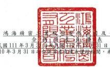
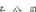
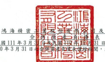
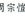

及子公

| 日 - 3月 31 日     |                           |                 |               |               |               |               |               |     |    |               |    |    |
|--------------------|---------------------------|-----------------|---------------|---------------|---------------|---------------|---------------|-----|----|---------------|----|----|
| (民國 111 年及     | 未依一般公認審計準則查核) | 單位:新台幣仟元 |               |               |               |               |               |     |    |               |    |    |
| 11                 | 31                        | 日              | 110           | 12            | 月            | 31            | 110           | स्ट  | 3  | 月            | 31 | 日 |
| ji                 | 附註                      | 新              | ୪୧            | 镇            | ా              |               |               |     |    |               |    |    |
| 2                  | रू                         | ক               | 領            |               |               |               |               |     |    |               |    |    |
| 流動資產           |                           |                 |               |               |               |               |               |     |    |               |    |    |
| 1100               | 現金及約當現金            | 六(一)          | $             | 1,184,629,960 | 30            | S             | 1,059,417,011 | 27  | S  | 1,112,174,828 | 32 |    |
| 1110               | 透過損益按公允價值        | 六(二)          |               |               |               |               |               |     |    |               |    |    |
| 衡量之金融资產一流 |                           |                 |               |               |               |               |               |     |    |               |    |    |
| 動                 | 6,156,336                 | 1,332,824       | .             | 4,252,850     | -             |               |               |     |    |               |    |    |
| 1120               | 透過其他綜合損益按        | 六(三)          |               |               |               |               |               |     |    |               |    |    |
| 公允價值街量之金融 |                           |                 |               |               |               |               |               |     |    |               |    |    |
| 資產一流動         | 135,191                   | .               | 130,622       | .             | 2             |               |               |     |    |               |    |    |
| 1136               | 按排銷後成本街量之        | 六(四)及八      |               |               |               |               |               |     |    |               |    |    |
| 金融資產一流動     | 62,174,507                | 2               | 48,008,438    | 1             | 46,576,058    | l             |               |     |    |               |    |    |
| 1139               | 避險之金融資產一流        | 六(五)          |               |               |               |               |               |     |    |               |    |    |
| 動                 | 716,456                   | g               | 1,068,785     | .             | 0.2           |               |               |     |    |               |    |    |
| 1170               | 應收帳款淨額              | 六(六)          | 856,704,700   | 22            | 1,125,762,611 | 29            | 745,890,062   | 22  |    |               |    |    |
| 1180               | 應收帳款一關係人淨        | ન્ટ              |               |               |               |               |               |     |    |               |    |    |
| 額                 | 23,719,390                | l               | 35,455,895    | l             | 29,730,781    | 1             |               |     |    |               |    |    |
| 1200               | 其他應收款                | 六(七)(十二)    | 60,690,767    | 2             | 59,510,406    | 2             | 52,187,919    | 2   |    |               |    |    |
| 1210               | 其他應收款一關係人        | さ              | 5,071,157     | .             | 2,777,421     | .             | 8,250,774     | .   |    |               |    |    |
| 130X               | 17                        |                 |               |               |               |               |               |     |    |               |    |    |
| 存貨               | 六(八)                    | 754,529,704     | 19            | 672,145,365   | 634,982,642   | 18            |               |     |    |               |    |    |
| 1410               | 預付款項                  | ት               | 20,894,884    | 1             | 18,057,414    | l             | 20,348,193    | 1   |    |               |    |    |
| 1470               | 其他流動資產              | 六(四)          | 8,752,619     | .             | 10,750,494    | .             | .             |     |    |               |    |    |
| 11XX               | 流動資產合計              | 2,984,175,671   | 77            | 3,034,417,286 | 78            | 2,654,394,107 | 77            |     |    |               |    |    |
| 非流動實產         |                           |                 |               |               |               |               |               |     |    |               |    |    |
| 1510               | 透過損益按公允價值        | 六(二)          |               |               |               |               |               |     |    |               |    |    |
| 街量之金融資產一非 |                           |                 |               |               |               |               |               |     |    |               |    |    |
| 流動               | 83,731,481                | 2               | 88,481,743    | 2             | 91,901,881    | 3             |               |     |    |               |    |    |
| 1517               | 透過其他綜合損益按        | 六(三)          |               |               |               |               |               |     |    |               |    |    |
| 公允價值街量之金融 |                           |                 |               |               |               |               |               |     |    |               |    |    |
| 資產一非流動       | 109,664,125               | 3               | 112,718,725   | 3             | 95,167,908    | 3             |               |     |    |               |    |    |
| 1535               | 按推銷後成本街量之        | 六(四)及八      |               |               |               |               |               |     |    |               |    |    |
| 金融資產一非流動   | 19.432.030                | 17.780.954      | I             |               |               |               |               |     |    |               |    |    |
| .                  | 23,449,084                | l               |               |               |               |               |               |     |    |               |    |    |
| 1550               | 採用權益法之投資          | 六(九)          | 197,609,614   | 5             | 194,593,652   | 5             | 171,861,057   | 5   |    |               |    |    |
| 1600               | 不動產、廠房及設備        | 六(十)及八      | 318,854,106   | 8             | 310,107,309   | 8             | 289,515,599   | 8   |    |               |    |    |
| 1755               | 使用程資產                | 六(十一)、七    |               |               |               |               |               |     |    |               |    |    |
| 及八               | 1                         | l               | I             |               |               |               |               |     |    |               |    |    |
| 40,965,857         | 40,260,192                | 45,650,542      |               |               |               |               |               |     |    |               |    |    |
| 1760               | 授實性不動產淨額          | 六(+三)         | 10,758,498    | 10,356,499    | 10,689,636    |               |               |     |    |               |    |    |
| 1780               | 总形黄產                  | 六(十四)        | 45,352,837    | 1             | 46,375,679    | 1             |               |     |    |               |    |    |
| 47,453,586         | 1                         |                 |               |               |               |               |               |     |    |               |    |    |
| 1840               | 遞延所得稅資產            | 20,424,679      | 1             | 20,443,452    | .             | 21,133,944    | 1             |     |    |               |    |    |
| 1900               | 其他非流動資產            | 六(+二)         |               |               |               |               |               |     |    |               |    |    |
| (+五)              | 60,386,516                | 2               | 28,697,615    | 1             | 11,880,286    | .             |               |     |    |               |    |    |
| 15XX               | 非流動資產合計            | 909,280,492     | 23            | 874,461,108   | 22            | 801,957,486   | 23            |     |    |               |    |    |
| 1 XXX              | 資產總計                  | 44              | 3,893,456,163 | 100           | 3,908,878,394 | 100           | 3,456,351,593 | 100 |    |               |    |    |
| રે                  | ક                         |                 |               |               |               |               |               |     |    |               |    |    |
| (續 次 頁)         |                           |                 |               |               |               |               |               |     |    |               |    |    |

及子公司 31 日 - 3月 31 日

| (民國 111年及 110年3月 31   | 閔,未依一般公認審計準則查核)   | 單位:新台幣仟元   |               |               |               |               |             |               |      |    |    |
|-----------------------------|--------------------------------|-------------------|---------------|---------------|---------------|---------------|-------------|---------------|------|----|----|
| 11                          | 3 1                            | 日                | 110           | 年 12 月      | 31            | ម             | 110         | 年            | 3 月 | 31 | 日 |
| 負債及權益                  | 附註                           | SP                |               |               |               |               |             |               |      |    |    |
| 频                          | 全                             | 領                | 金            | જેવ            | శి             |               |             |               |      |    |    |
| 流動負債                    |                                |                   |               |               |               |               |             |               |      |    |    |
| 2100                        | 短期借款                       | 六(十七)          | 665,565,587   | 17            | ﺟﻬ            | 546,372,008   | 14          | 464,506,666   | 13   |    |    |
| 2110                        | 應付短期票券                   | 六(十六)          | 7,130,489     | 23,999,117    | 1             | 43,945,617    | 1           |               |      |    |    |
| .                           |                                |                   |               |               |               |               |             |               |      |    |    |
| 2120                        | 透過損益按公允價值             | 六(二)            |               |               |               |               |             |               |      |    |    |
| 衡量之金融負債一流          |                                |                   |               |               |               |               |             |               |      |    |    |
| 動                          | 1,342,589                      | .                 | 964,015       | 2,010,356     |               |               |             |               |      |    |    |
| 2170                        | 應付帳款                       | 872,446,561       | 22            | 1,055,155,222 | 27            | 780,891,457   | 23          |               |      |    |    |
| 2180                        | 應付帳款一關係人               | 七                | 15,997,012    | .             | 21,022,980    | 22,892,268    | 1           |               |      |    |    |
| 2200                        | 其他應付款                     | 六(十八)及七      | 258,616,049   | 7             | 213,094,933   | 5             | 248,018,907 | 7             |      |    |    |
| 2230                        | 本期所得稅負債                 | 26.191.031        | l             | 26,474,025    | l             | 24,641,380    | 1           |               |      |    |    |
| 2250                        | 負債準備一流動                 | 六(二十五)        | 3,233,896     | .             | 2,876,585     | .             | 3,706,271   | .             |      |    |    |
| 租賃負債一流動              |                                |                   |               |               |               |               |             |               |      |    |    |
| 2280                        | 七                             | 7,359,055         | .             | 7,364,055     | 8,963,534     | 100           |             |               |      |    |    |
| 2320                        | 一年或一营業週期內             | 六(二十)          |               |               |               |               |             |               |      |    |    |
| 到期長期負債                | 37,233,853                     | 74,427,834        |               |               |               |               |             |               |      |    |    |
| (ニ+ー)                     | 1                              | 38,586,760        | l             | 2             |               |               |             |               |      |    |    |
| 2399                        | 其他流動負債一其他             | 六(十九)          | 72,271,312    | 2             | 61,770,571    | 2             | 45,167,255  | 2             |      |    |    |
| 21XX                        | 流動負債合計                   | 1,967,387,434     | 50            | 1,997,680,271 | 51            | 1,719,171,545 | 50          |               |      |    |    |
| 非流動負債                  |                                |                   |               |               |               |               |             |               |      |    |    |
| 2530                        | 應付公司債                     | 六(二十)          | 227,533,331   | 226,258,790   | 200,396,220   |               |             |               |      |    |    |
| 6                           | 6                              | 6                 |               |               |               |               |             |               |      |    |    |
| 2540                        | 長期借款                       | 六(二十一)        | 50,722,463    | 1             | 49,340,778    | 1             | 30,256,144  | 1             |      |    |    |
| 2550                        | 負債準備一非流動               | 六(二十五)        | 434,333       | 430,648       | 408,165       | 00            |             |               |      |    |    |
| 2570                        | 透延所得稅負債                 | 31,950,704        | 1             | 32,228,229    | 1             | 21,910,058    | 1           |               |      |    |    |
| 2580                        | 租賃負債一非流動               | 七                | 18,261,281    | 1             | 18,217,030    | 19,649,996    |             |               |      |    |    |
|                             | 1                              | .                 |               |               |               |               |             |               |      |    |    |
| 2600                        | 其他非流動負債                 | 六(二十四)        | 12,078,531    | 11,462,530    | 10,490,038    |               |             |               |      |    |    |
| .                           |                                |                   |               |               |               |               |             |               |      |    |    |
| 25XX                        | 非流動負債合計                 | 340,980,643       | 9             | 337,938,005   | 9             | 283,110,621   | 8           |               |      |    |    |
| 2XXX                        | 負債總計                       | 2,308,368,077     | 59            | 2,335,618,276 | 60            | 2,002,282,166 | 58          |               |      |    |    |
| 權益                        |                                |                   |               |               |               |               |             |               |      |    |    |
| 師屬於母公司業主之權        |                                |                   |               |               |               |               |             |               |      |    |    |
| 益                          |                                |                   |               |               |               |               |             |               |      |    |    |
| 股本                        | 六(二十六)                     |                   |               |               |               |               |             |               |      |    |    |
| 3110                        | 普通股股本                     | 138,629,906       | 4             | 138,629,906   | 4             | 138,629,906   | 4           |               |      |    |    |
| 贤本公積                    | 六(二十七)                     |                   |               |               |               |               |             |               |      |    |    |
| 3200                        | 資本公積                       | 202,354,644       | 5             | 202,084,430   | 5             | 200,484,799   | 6           |               |      |    |    |
| 保留监徐                    | 六(二十八)                     |                   |               |               |               |               |             |               |      |    |    |
| 3310                        | 法定盈餘公積                   | 170.755.591       | 5             | 170,755,591   | 4             | 161,043,748   | 5           |               |      |    |    |
| 3320                        | 特別盈餘公積                   | 87,315,126        | 2             | 87,315,126    | 2             | 102.451.720   | 3           |               |      |    |    |
| 3350                        | 未分配盈徐                     | 829,183,459       | 21            | 871,193,344   | 22            | 752,676,042   | 22          |               |      |    |    |
| 其他權益                    | 六(二十九)                     |                   |               |               |               |               |             |               |      |    |    |
| 3400                        | 其他權益                       | 42,097,602) (     | 1) (          | 89,505,893) ( | 2) (          | 81,263,647) ( | 3)          |               |      |    |    |
| 3500                        | 庫藏股票                       | 六(二十六)        | 15,194)       | = (           | 15,194)       | = (           | 15,194)     | -             |      |    |    |
| 邮属於母公司集主            |                                |                   |               |               |               |               |             |               |      |    |    |
| 31XX                        | 之權益合計                     | 1,386,125,930     | 36            | 1,380,457,310 | 35            | 1,274,007,374 | 37          |               |      |    |    |
| 36XX                        | 非控制權益                     | 六(三十)          | 198,962,156   | 5             | 192,802,808   | 5             | 180,062,053 | 5             |      |    |    |
| 3XXX                        | 程益總計                       | 1,585,088,086     | 41            | 1,573,260,118 | 40            | 1,454,069,427 | 42          |               |      |    |    |
| 重大或有負債及未認          | 九                             |                   |               |               |               |               |             |               |      |    |    |
| 列之合约承诺                |                                |                   |               |               |               |               |             |               |      |    |    |
| 重大之期後事項              |                                |                   |               |               |               |               |             |               |      |    |    |
| 3X2X                        | 負債及權益總計                 | S                 | 3,893,456,163 | 100 $         | 3,908,878,394 | 100           | ક           | 3,456,351,593 | 100  |    |    |

後附合併財務報表附註為本合併財務報告之一部分,請併同參閱。

經理人:劉揚偉

