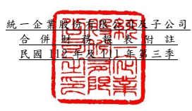

單位:新 台幣仟 元 (除特別註 明者外 )

## 一、 公司沿革

(一)統一 企業股 份有限 公司 (以 下簡稱「 本公司 」)係依 據中華 民國公 司法及 其他 有關法令 之規定 ,於民國 56 年 8 月奉 准 創立。主 要經營 項目為 各種飲 料、 食品、飼料、麵 粉等之 製造、加 工及買 賣業務。 列 入本公 司及子公 司(以 下 統稱「 本集團 」)合併財 務報告 之子公 司 主要經營 項目,請詳 附註四(三)合 併基礎之 說明。

(二)本公 司股票 自 民國 76 年 12 月起 在 台灣證券 交易所 上市買 賣。

## 二、 通過財務 報告之 日期及 程序

本合併財 務報告 已於民國 112 年 11 月 9 日經董事 會通過 後 發布 。

三、 新發布及 修訂準 則及解 釋之適 用
(一)已採用金融監督管理委員會 (以 下 簡 稱 「 金 管 會 」 )認 可 並發布生效 之新發 布、修正 後國際 財務報 導準則 之影響 下表彙列 金管會 認可 並 發布生 效之民 國 112 年 適用之 國際財 務報導準 則之 新發布、 修正 及 修訂之 準則及 解釋:

此 修 正 為 認 列 或 揭 露 因 施 行 經 濟 合 作 暨 發 展 組 織 發 布 之 支 柱 二 規 則 範 本 而 已 立 法 或 已 實 質 性 立 法 之 稅 法 產 生 之 遞 延 所 得 稅 提 供 一 暫 時 性 例 外 規 定 , 企 業 既 不 得 認 列 有 關 支 柱 二 所 得 稅 之 遞 延 所 得 稅 資 產 及 負 債 , 亦 不 得 揭 露 其相關資 訊。

 新發布/修正/修訂準則及解釋

 國際會計準則理事會

發布之生效日

| 國際會計準則第1號之修正   | 「會計政策之揭露」             |                  | 民國112年1月1日    |
|---------------------------|--------------------------------|------------------|--------------------|
| 國際會計準則第8號之修正   | 「會計估計值之定義」           |                  | 民國112年1月1日    |
| 國際會計準則第12號之修正  | 「與單一交易所產生之資產及負債 | 民國112年1月1日  |                    |
| 有關之遞延所得稅」        |                                |                  |                    |
| 國際會計準則第12號之修正  | 「國際租稅變革-支柱二規則範   | 民國112年5月23日 |                    |
|                           | 本」                           |                  | 國際會計準則理事會 |
|                           | 新發布/修正/修訂準則及解釋     | 發布之生效日     |                    |

除 下 列 所 述 者 外 , 本 集 團 經 評 估 上 述 其 他 準 則 及 解 釋 對 本 集 團 財 務 狀 況 與 財務績效 並無重 大影響 : 國際會計 準則第 12 號之 修正「 國際稅 務 變革 -支 柱二規 則範本 」 下表彙列 金管會 認可之 民國 113 年適用 之國際財 務報導 準則之 新發布 、修 正及修訂 之準則 及解釋 :

|                                                | 國際會計準則理事會         |                 |                 |
|------------------------------------------------|----------------------------|-----------------|-----------------|
|                                                | 新發布/修正/修訂準則及解釋 | 發布之生效日    |                 |
| 國際財務報導準則第16號之修正                   | 「售後租回中之租賃負債」   |                 | 民國113年1月1日 |
| 國際會計準則第1號之修正                        | 「負債之流動或非流動分類」 |                 | 民國113年1月1日 |
| 國際會計準則第1號之修正                        | 「具合約條款之非流動負債」 |                 | 民國113年1月1日 |
| 國際會計準則第7號及國際財務報導準則第7號之修正 | 「供應                     | 民國113年1月1日 |                 |
| 商融資安排」                                   |                            |                 |                 |

本 集 團 經 評 估 上 述 準 則 及 解 釋 對 本 集 團 財 務 狀 況 與 財 務 績 效 並 無 重 大 影 響。

(三)國際會計準則理事會已發布但尚未經金管會認可之國際財務報導準則之影

## 響

| 導準則之 新發布 、修正 及修訂 之準則 及 解釋:                                                    | 國際會計準則理事會         |                 |                 |
|---------------------------------------------------------------------------------------------------|----------------------------|-----------------|-----------------|
|                                                                                                   | 新發布/修正/修訂準則及解釋 | 發布之生效日    |                 |
| 國際財務報導準則第10號及國際會計準則第28號之修正                                                  | 「投資                     | 待國際會計準則  |                 |
| 者與其關聯企業或合資間之資產出售或投入」                                                          |                            | 理事會決定      |                 |
| 國際財務報導準則第17號                                                                            | 「保險合約」               |                 | 民國112年1月1日 |
| 國際財務報導準則第17號                                                                            | 「保險合約」之修正         | 民國112年1月1日 |                 |
| 國際財務報導準則第17號之修正                                                                      | 「初次適用國際財務報導準則 | 民國112年1月1日 |                 |
| 第17號及國際財務報導準則第9號—比較資訊」                                                          |                            |                 |                 |
| 國際會計準則第21號之修正                                                                          | 「缺乏可兌換性」           |                 | 民國114年1月1日 |
| 本 集 團 經 評 估 上 述 準 則 及 解 釋 對 本 集 團 財 務 狀 況 與 財 務 績 效 並 無 重 大 影 響。 |                            |                 |                 |

下 表 彙 列 國 際 會 計 準 則 理 事 會 已 發 布 但 尚 未 納 入 金 管 會 認 可 之 國 際 財 務 報 導準則之 新發布 、修正 及修訂 之準則 及 解釋:

## 四、 重大會計 政策之 彙總說 明

重大會計 政策除 遵循聲 明、編製基 礎、合併基礎、期 中財務 報表適 用部分 及新 增 部分說明 如下外,餘 與民國 111 年 度合 併財報表 附註四 相同。除另 有說明 外,此 等政策在 所有報 導期間 一致地 適用 。

## (一)遵循聲明

1.本 合 併 財 務 報 告 係 依 據 證 券 發 行 人 財 務 報 告 編 製 準 則 與 經 金 管 會 認 可 並 發布生效 之國際 會計準 則第 34 號「期 中 財務報導 」編製 。

2.本合併 財務報 告應併 同民國 111 年 度 合併財務 報告閱 讀。

## (二)編製基礎

1.除下列 重要項 目外, 本合併 財務報 告 係按歷史 成本編 製:
(1)按 公 允 價 值 衡 量 之 透 過 損 益 按 公 允 價 值 衡 量 之 金 融 資 產 及 負 債 (包 括 衍生工具)。