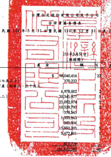

月 31 日

|                                    | 單位:新台餐仔元                                           |              |               |             |               |             |               |            |               |     |
|------------------------------------|-----------------------------------------------------------|--------------|---------------|-------------|---------------|-------------|---------------|------------|---------------|-----|
| 8                                  | 10                                                        | 15           |               |             |               |             |               |            |               |     |
| 1 43 43 8                          | 110年12月31日                                             | 110年3月31日 |               |             |               |             |               |            |               |     |
| 地圖                               | 〔經查些〕                                                | (经核間)     |               |             |               |             |               |            |               |     |
| મ્વ                                 | ন্ত্র                                                       | 贤           | -14           | 明          | ભ્રે            | ਭ           | 新            | %          |               |     |
| 演劇賣產                           |                                                           |              |               |             |               |             |               |            |               |     |
| 1100                               | 现金及约需现金(肘魅六)                                    | 5            | 98 040,416    | ક           | 91,121,942    | 21          | s             | 58,958,539 | 15            |     |
| 1110                               | 透過損益按公允價值得量之全融資産(別註七,                  | 370,222      | 363,813       | 344,694     |               |             |               |            |               |     |
| 1120                               | 透過其他綜合攝品按公允價值掛量之金融資產(別球)            |              |               |             |               |             |               |            |               |     |
| =)                                 | 6,978,002                                                 | 6,387,543    | 1             | 5,721,861   | 2             |             |               |            |               |     |
| 1136                               | 按維結技成本街量之金融資產(附註六及三二)                  | 20 341,977   | 15,508,688    | 4           | 9,459,089     | 3           |               |            |               |     |
| 1150                               | 應收票據 (所註元)                                         | 23,092,974   | 25,639,724    | 6           | 24,230,789    | 6           |               |            |               |     |
| 1170                               | 應收條款(用註丸及十)                                      | 10 329.793   | 9,844,002     | 2           | 8.671.152     | 2           |               |            |               |     |
| 1180                               | 應收票據及帳款一關係人(附註三一)                          | 378,563      | 457,203       | .           | 257,663       | -           |               |            |               |     |
| 1200                               | 其免患收款                                                | 1 (353,943   | 1,499,322     | .           | 651,122       |             |               |            |               |     |
| 1210                               | 其她感收放一脸像人(附姓三一)                              | 603,004 !    | 388,968       | 4,056       |               |             |               |            |               |     |
| 130X                               | 存货(附丝十二)                                            | 13 552 203   | 13,412,511    | 3           | 7,779,906     | 2           |               |            |               |     |
| 1410                               | 预付款项                                                  | 5,472,861-   | 3,935,575     | 1           | 3,545,177     | 1           |               |            |               |     |
| 1460                               | 将出售處分群組(附註四、十一及三二)                        | 10,453,562   | 3             |             |               |             |               |            |               |     |
| 1479                               | 其他演動買產                                              | 794,144      | 631,348       |             |               |             |               |            |               |     |
| 11XX                               | 適動實產總計                                              | 1. 183.054   | 240           | 169,353,435 | _38           | 130,708,958 | _ 34          |            |               |     |
| 非流動資產                         |                                                           |              |               |             |               |             |               |            |               |     |
| 1517                               | 透過其他综合振显按公允價值街量之全融資產(附該八、三十及三 | 28,349,964   | 6             | 27,835,864  | 6             | 32,628,494  | 8             |            |               |     |
| 1535                               | 按键编程成本街量之全融资產(附註六及三二)                  | 5,874,111    | 15,468,807    | 4           | ব             |             |               |            |               |     |
|                                    | 16,830,712                                                |              |               |             |               |             |               |            |               |     |
| 1550                               | 採用權益法之投費(附註十四及三二)                          | 48,438,239   | 11            | 46,781,575  | 11            | 48,566,560  | 13            |            |               |     |
| 1600                               | 不動産、廣得及設備(附註十五、二四及三二)                  | 103,227,319  | 23            | 98,196,032  | 22            | 87,517,403  | 22            |            |               |     |
| 1755                               | 使用權資產(附註十六及二四)                                | 15,433,901   | 3             | 14,992,784  | 3             | 13.544.117  | ব             |            |               |     |
| 1760                               | 投資性不動産(肘註十七、二四及三二)                        | 5,420,880    | 1             | 5,425,680   | 1             | 5,446,310   | 1             |            |               |     |
| 1780                               | 無形實産(所註十八及二四)                                  | 28,443,122   | 6             | 27,650,861  | 6             | 19,485,447  | 5             |            |               |     |
| 1915                               | 预付政绩款(附註十五、三一及三三)                          | 8,583,847    | 2             | 7,762,010   | 2             | 6,125,232   |               |            |               |     |
| 194D                               | 應收融資租貸款(別註十)                                    | 24,108,219   | 5             | 24,334,423  | 6             | 26,510,088  | 7             |            |               |     |
| 1975                               | 淨確定福利實產(肘註冊)                                    | 1,852,446    | 1             | 1,850,315   | 1,567,799     |             |               |            |               |     |
| 1995                               | 其他非流動質產                                            | 2,073,636    | 2,032,773     | 1,141,797   |               |             |               |            |               |     |
| 15XX                               | 非液動質產總計                                            | 271,805,684  | 60            | 272,331,124 | 62            | 259,363,959 | _66           |            |               |     |
| 1XXX                               | 貨                                                        | 產           | 总            | 対          | $ 452.838.271 | _100        | $ 441.684,559 | 100        | $ 390,072,917 | 100 |
| ્ર                                  | ત્ત્વ                                                       | A            | ff            | 及          | 样            | 点          |               |            |               |     |
| 值到良債                           |                                                           |              |               |             |               |             |               |            |               |     |
| 2100                               | 短期借款(财誌十九、二八及三二)                            | S            | 49,691,467    | 11          | $             | 48,440,514  | 11            | રુ          | 34,341,574    | 9   |
| 2110                               | 應付組期景春(附註十九)                                    | 6,159,512    | 1             | 6,769,046   | 5,244,925     | 1           |               |            |               |     |
|                                    | N                                                         |              |               |             |               |             |               |            |               |     |
| 2120                               | 透過損益投公允價值衝量之金融負債(附放七及三十)            | 461,702      | .             | 213,062     |               |             |               |            |               |     |
| 2130                               | 合约角债(附址十一)                                        | 1,398,293    | 1,439,222     | 4,797,343   | 1             |             |               |            |               |     |
| 2170                               | 應付要讓及帳款(附註三一)                                  | 11,279,929   | 3             | 10,023,071  | 2             | 6,461,632   | 2             |            |               |     |
| 2219                               | 其他應付數(附註十五及二一)                                | 8,768,775    | 2             | 10,238,196  | 2             | 8,689,161   | N             |            |               |     |
| 2220                               | 其他患付款一副像人(射註三一)                              | 27,392       | 1,391,057     | 6,155       |               |             |               |            |               |     |
| 2230                               | 本期所得就負債(附註四)                                    | 2,104,940    | .             | 2,490,823   | 1             | 3,559,196   | 1             |            |               |     |
| 2260                               | 與符出售處分群細直接相關之負債(附註四、十一及三一)        | .            | .             | 6,654,095   | 2             |             |               |            |               |     |
| 2280                               | 租賃負債(附註十六及三一)                                  | 416,321      | 407,652       | 334,155     | .             |             |               |            |               |     |
| 2322                               | 一年内到期之長期借款(用这十九、二八及三二)                | 17,098,439   | 4             | 7,091,417   | 2             | 4,520,000   | i             |            |               |     |
| 2323                               | 一年内到期之長期應付業讓(附近十九)                        | 11,981,855   | 3             | .           |               |             |               |            |               |     |
| 2399                               | 其他演劇自播                                              | 269,506      | 183,908       | 43,933      |               |             |               |            |               |     |
| 21XX                               | 演费角资魅好                                              | 109,658,131  | 24            | 88,687,968  | 20            | 74,652,169  | 12            |            |               |     |
| 非流動負債                         |                                                           |              |               |             |               |             |               |            |               |     |
| 2530                               | 應付公司價(開班二十)                                      | 81,616,287   | 18            | 81,526,445  | 18            | 49,555,822  | 13            |            |               |     |
| 2540                               | 長期借款(附註十九、二八及三二)                            | 8,455,784    | 2             | 16,695,836  | ﺖ             | 20,500,521  | 5             |            |               |     |
| 2580                               | 组贸良債(附註十六及三一)                                  | 3,222,571    | 1             | 3,261,791   | 1             | 2,129,894   | 1             |            |               |     |
| 2570                               | 遮延所得就負債(附註四)                                    | 12,075,590   | 3             | 11,922,865  | 3             | 11,685,987  | 3             |            |               |     |
| 2610                               | 長期應付業據(所註十九)                                    | 697,646      | 12,680,086    | 3           | 4,991,392     |             |               |            |               |     |
| .                                  | 1                                                         |              |               |             |               |             |               |            |               |     |
| 2640                               | 淨確定福利負債(肘註四)                                    | 84,705       | .             | 143,201     | 68,546        | .           |               |            |               |     |
| 2670                               | 其他非派動負債(別誌十四及十五)                            | 1,269,802    | 1.111.694     | 858,572     |               |             |               |            |               |     |
| 25XX                               | 非流動負債總計                                            | 107,422,385  | 24            | 127,341,918 | 29            | 89,790,734  | 23            |            |               |     |
| 2XXX                               | 具價總計                                                  | 217,080,516  | 48            | 216,029,836 | 49            | 164,442,903 | 12            |            |               |     |
| 本公司案主催益施计(射註二三)       |                                                           |              |               |             |               |             |               |            |               |     |
| 3110                               | 股                                                        | 本           | 63,252,340    | 14          | 63,252,340    | 14          | 60,956,456    | 16         |               |     |
| 3130                               | 債券換股權利貸書                                          | 617,947      |               |             |               |             |               |            |               |     |
| 3200                               | 資本公積                                                  | 56,758,936   | 12            | 56,757,470  | 13            | 52,019,465  | 13            |            |               |     |
| 3300                               | 伴知道绘                                                  | 75,140,220   | 17            | 73,939,852  | 17            | 77,166,710  | 20            |            |               |     |
| 3400                               | 其他推进                                                  | 20,037,610   | ﻀ             | 10,920,014  | న             | 20,449,164  | 5             |            |               |     |
| 3500                               | 庫藏股票                                                  | (            | 392,343 )     | 392,343 )   | 499,691 )     |             |               |            |               |     |
| 31XX                               | 本公司實主權益總計                                        | 214,796,763  | 47            | 204,477,333 | 46            | 210,710,051 | સ             |            |               |     |
| 36XX                               | 非控制模益(附拉二三)                                      | 20,960,992   | _5            | 21,177,340  | .5            | 14,919,963  | ﺤﺎ            |            |               |     |
| 3XXX                               | 植益施计                                                  | 235,757,755  | _52           | 225,654,673 | - 51          | 225,630,014 | - 28          |            |               |     |
| 員 債 與 權 益 總 計               | $ 452,838,271                                             | 100          | $ 441,684,559 | 102         | $ 390.072.917 | 100         |               |            |               |     |
| 装朋之附近係本合併对药候合之一部分 |                                                           |              |               |             |               |             |               |            |               |     |

(靖參閱勤鑫翠信聘合會計師事務所民國 111年 5月 10日被閱報告)
童事長:張安平

经理人:李维培

令计生管:第四次

