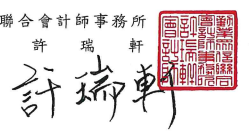
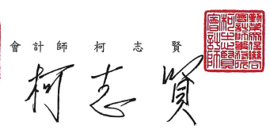

# Deloit

11073 台北市信義區松仁路100號 Deloitte & Touche 20F, Taipei Nan Shan Plaza No. 100, Songren Rd.

Xinyi Dist., Taipei 11073, Taiv Tel :+886 (2) 2725-9981 Fax +886 (2) 4051-6888 www.deloitte.com.tw 會計師核閱報告 中國鋼鐵股份有限公司 公鑒:

## 前 言

中國鋼鐵股份有限公司(中網公司)及其子公司民國 111年及 110年 3 月 31 日之合併資產負債表,暨民國 111 及 110年 1 月 1 日至 3 月 31 日之合 併綜合損益表、合併權益變動表、合併現金流量表以及合併財務報表附註(包 括重大會計政策樂總),業經本會計師核閱竣事。依證券發行人財務報告編製 準則及經金融監督管理委員會認可並發布生效之國際會計準則第 34號「期中 財務報導」編製允當表達之財務報表係管理階層之責任,本會計師之責任係 依據核閱結果對合併財務報表作成結論。

匯 範 本會計師係依照審計準則公報第六十五號「財務報表之核聞」執行核閱 工作,核閱合併財務報表時所執行之程序包括查詢(主要向負責財務與會計 事務之人員查詢)、分析性程序及其他核聞程序。核閲工作之範圍明顯小於查 核工作之範圍,本會計師可能無法察覺所有可藉由查核工作辨認之重大事 項,因此無法表示查核意見。

结 論 依本會計師核閱結果,並未發現上開合併財務報表在所有重大方面有未 依照證券發行人財務報告編製準則及經金融監督管理委員會認可並發布生效 之國際會計準則第 34號「期中財務報導」編製,致無法允當表達中鋼公司及 其子公司民國 111年及 110年3月 31日之合併財務狀況,暨民國 111及 110 年1月1日至3月31日之合併財務績效及合併現金流量之情事。

會 計 師

勤業眾信聯合會計師事務所
金融監督管理委員會核准文號 金管證審字第 1020025513 號 中 整 民 网 111 年 5 月 6

金融監督管理委員會核准文號 金管證六字第 0930160267 號