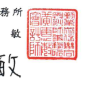
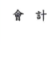
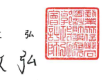

Fax:+886 (21 4051-6888

www.deloitte.com.tw 會計師核閱報告 台灣水泥股份有限公司 公鑒:
前 

## 言

台灣水泥股份有限公司及子公司民國 111年及 110年 9月 30日之合併資 產負債表,暨民國 111年及 110年 7月1日至 9月 30 日,以及民國 111年及 110年1月1日至9月30日之合併綜合損益表、民國 111年及 110年 1 月 1 日至9月30日之合併權益變動表與合併現金流量表,以及合併財務報表附註
(包括重大會計政策彙總),業經本會計師核閱竣事。依證券發行人財務報告 編製準則及經金融監督管理委員會認可並發布生效之國際會計準則第 34 號
「期中財務報導」編製允當表達之合併財務報表係管理階層之責任,本會計 師之責任係依據核閱結果對合併財務報表作成結論。

範

## 图

除保留結論之基礎段所述者外,本會計師係依照審計準則公報第六十五 號「財務報表之核閱」執行核閱工作。核閱合併財務報表時所執行之程序包 括查詢(主要向負責財務與會計事務之人員查詢)、分析性程序及其他核閱程 序。核閱工作之範圍明顯小於查核工作之範圍,因此本會計師可能無法察覺 所有可藉由查核工作辨認之重大事項,故無法表示查核意見。

保留結論之基礎 如合併財務報告附註十三所述,列入上開合併財務報告之部分非重要子 公司之同期間財務報表未經會計師核閱,其民國 111年及 110年 9月 30日之 資產總額分別為新台幣 87,628,021 仟元及 90,107,231 仟元,占合併資產總額 19%及 22%;負債總額分別為新台幣 12,598,022 仟元及 12,769,852 仟元,占 合併負債總額 5%及 7%;民國 111年及 110年 7月 1 日至 9 月 30 日,以及民 國 111 年及 110 年 1 月 1 日至 9 月 30 日之綜合淨益(損)總額分別為新台幣
(287,331)仟元、506,763 仟元、(174,288)仟元及 1,145,217 仟元,分別占合併 綜合損益總額之 24%、8%、9%及 10%。

保留结論 依本會計師核閱結果,除保留結論之基礎段所述部分非重要子公司之財 務報表倘經會計師核閱,對合併財務報表可能有所調整之影響外,並未發現 上開合併財務報表在所有重大方面有未依照證券發行人財務報告編製準則及 經金融監督管理委員會認可並發布生效之國際會計準則第 34號「期中財務報 導」編製,致無法允當表達台灣水泥股份有限公司及子公司民國 111年及 110 年 9 月 30 日之合併財務狀況,暨民國 111 年及 110 年 7 月 1 日至 9 月 30 日 之合併財務績效,以及民國 111年及 110年1月1日至 9月30日之合併財務 績效及合併現金流量之情事。

* [16] A. A. K. K.  
* [10] M. C. Gonzalez-Garcia, M. C. Gonzalez-Garcia, M.  

$$\begin{array}{c c c}{{\hat{\bar{g}}\bar{\hat{\jmath}}}}&{{\hat{\bar{g}}\bar{\hat{k}}}}&{{\hat{\bar{g}}\bar{\hat{k}}}}\\ {{}}&{{}}&{{}}\\ {{\hat{\bar{g}}\bar{\hat{\jmath}}}}&{{\hat{\bar{k}}\bar{\hat{k}}}}&{{\hat{\bar{g}}\bar{\hat{k}}}}\end{array}$$

金融監督管理委員會核准文號 金管證審字第 1070323246 號 證券暨期貨管理委員會核准文號 台財證六字第 0920123784 號

中

$$\begin{array}{l}{{\frac{\frac{\pi\hbar}{4}}{\pi}}}\end{array}$$
民 111 图 年 11 月 10

$$\mathbb{H}$$
