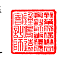
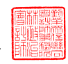

會計師 核 閱 報告

智邦 科 技股 份 有限 公司 公鑒 :

## 前 言

 智 邦科 技 股份 有限 公 司 及 子 公司 民國 112 年及 111 年 9 月 30 日之 合 併 資 產負 債 表,暨 民國 112 年及 111 年 7 月 1 日 至 9 月 30 日,以及 民 國 112 年及 111 年 1 月 1 日至 9 月 30 日 之合 併 綜 合損 益 表、 民 國 112 年 及 111 年 1 月 1 日至 9 月 30 日 合併 權益 變 動表 與 合併 現金 流 量表,以 及 合 併財 務 報表 附 註( 包 括重 大 會計 政 策彙 總),業 經 本會 計 師 核閱 竣 事。依 證券 發行 人 財務 報 告編 製 準則 及 經金 融 監督 管理 委 員會 認 可並 發布 生 效之 國 際會 計準 則 第 34 號「期 中 財務報導」編製允當表達之 合 併 財 務 報 表 係 管 理 階 層 之 責 任 , 本 會 計 師 之 責 任係 依 據核 閱 結果 對合 併 財務 報 表作 成結 論 。

## 範 圍

 除 保留 結 論之 基礎 段 所述 者 外,本會 計 師係 依 照 核 閱準 則 2410 號「財務 報表 之 核閱 」執行 核閱 工 作。核 閱合 併財 務 報表 時 所執 行之 程 序包 括 查詢( 主 要向 負 責財 務 與會 計事 務 之人 員 查詢 )、分 析性 程 序 及其 他核 閱 程序。核 閱 工 作之範圍明顯小於查核工作之範圍,因此本會計師可能無法察覺所有可藉由 查核 工 作辨 認 之重 大事 項 ,故 無 法表 示查 核 意見 。

## 保 留 結 論 之 基礎

 如 合 併 財 務 報 表 附 註 十 二 所 述 , 列 入 上 開 合 併 財 務 報 表 之 部 分 非 重 要 子 公司 之 同期 間 財務 報表 未 經會 計 師核 閱,其 民 國 112 年 及 111 年 9 月 30 日 之 資產 總 額分 別 為新 台幣( 以 下同 )6,557,853 仟元 及 4,627,393 仟 元,分 別占 合 併資 產 總額 之 13%及 11%;負債 總 額分 別 為 2,060,813 仟 元 及 1,113,856 仟元, 分別 占 合併 負 債總 額之 7%及 5%;其 民國 112 年及 111 年 7 月 1 日 至 9 月 30 日之綜合損 益 分別 為 184,140 仟元 及 335,779 仟 元,分 別占 合併 綜 合損 益 之 7%
及 13%,及民國 112 年 及 111 年 1 月 1 日 至 9 月 30 日 之綜 合 損益分別為 298,582 仟元 及 558,278 仟 元,分 別 占合 併 綜合 損益 之 4%及 9%。如合 併 財務 報 表附 註 十三 所 述,民國 112 年及 111 年 9 月 30 日採 用 權益 法 之投 資餘 額 分別 為 9,907 仟元 及 10,632 仟元;民 國 112 年 及 111 年 7 月 1 日 至 9 月 30 日,以及民 國 112 年及 111 年 1 月 1 日 至 9 月 30 日 認列 之 採用 權 益法 認列 之 關聯 企 業損 益 份額 分 別為 (174)仟 元、(354)仟 元、(480)仟元 及 (894)仟 元,係 依據 被 投資 關 聯 企業 同 期間 未 經會 計師 核 閱之 財 務報 表認 列 。

## 保留結論

 依 本 會 計 師 核 閱 結 果 , 除 保 留 結 論 之 基 礎 段 所 述 部 分 非 重 要 子 公 司 及 採 用權益法之投資財務 報 表 倘 經 會 計 師 核 閱 , 對 合 併 財 務 報 表 可 能 有 所 調 整 之 影響外,並未發現上開合 併 財 務 報 表 在 所有重大方面有 未依照證券發行 人 財 務報告編製準則及經金融監督管理委員會認可並發布生效之國際會計準則第 34 號 「 期中 財 務報 導」 編 製, 致 無法 允當 表 達 智 邦 科技 股份 有 限公 司 及子 公 司民 國 112 年及 111 年 9 月 30 日 之 合 併財 務 狀況 , 暨民 國 112 年及 111 年 7 月 1 日 至 9 月 30 日 之合 併 財務 績 效, 以及 民 國 112 年 及 111 年 1 月 1 日 至 9 月 30 日 之 合併 財 務 績效 及 合併 現 金流 量之 情 事。

勤業 眾 信聯 合 會計 師事 務 所

$$\begin{array}{r l r l}{\phi}&{{}\rightleftarrows}&{}&{{}\left[{\hat{a}}\pi\right]}\end{array}$$

$$\begin{array}{c c c}{{\hat{\phi}}}&{{\hat{\phi}\hat{\phi}}}&{{\hat{\phi}\hat{\phi}}}&{{\hat{\phi}\hat{\phi}}}\\ {{}}&{{}}&{{}}&{{}}\\ {{\hat{\phi}\hat{\phi}}}&{{}}&{{\hat{\phi}\hat{\phi}}}&{{\hat{\phi}\hat{\phi}}}\\ {{}}&{{}}&{{}}&{{}}\\ {{\hat{\phi}\hat{\phi}}}&{{}}&{{}}&{{}}\end{array}$$
會 計 師 鍾 鳴 遠 會 計 師 林 政 治
金融監督管理委員會核准文號 金 管 證審 字 第 1050024633 號 金融監督管理委員會核准文號 金 管 證六 字 第 0930160267 號

$\hat{\Phi}$. 
$${\mathbb{R}}$$
中 華 民 國 1 1 2 年 1 1 月 9 日
$$\begin{array}{c c}{{\mathbb{H}}}&{{}}&{{\mathbb{H}}}\end{array}$$
$\grave{\alpha}$. 

$$4\lambda_{1}\lambda_{2}\lambda_{3}\lambda_{2}\lambda_{3}$$

$$\mathbb{B}\qquad\quad1\;1\;2\qquad\quad\nleftarrow\qquad1\;1\qquad\quad\mathbb{A}$$
$$\mathbf{\Sigma}^{9}$$
$\mathbf{a}$