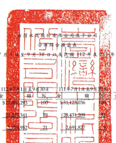
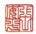
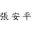
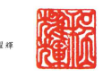
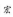

| 民 图 112 年及 111 年 7 月     | 1 1 年 1 月 1 日至 9 月 30 日        |                      |                       |              |              |              |             |              |              |           |    |             |    |    |
|--------------------------------|--------------------------------------|----------------------|-----------------------|--------------|--------------|--------------|-------------|--------------|--------------|-----------|----|-------------|----|----|
|                                | 單位:除每股盈餘為新台                |                      |                       |              |              |              |             |              |              |           |    |             |    |    |
|                                | 琴元外,榮佳仟元                      |                      |                       |              |              |              |             |              |              |           |    |             |    |    |
|                                | 新建                                 |                      |                       |              |              |              |             |              |              |           |    |             |    |    |
| 日至9月30日                    | 1年7月1日至9月                       | 112年1月1日至9月30日 | 111年1月1日 至9月30日 |              |              |              |             |              |              |           |    |             |    |    |
| 代                             | 11                                   | 会                   | -84                   | 00 ---       | 18           | 8真          | 1           | रू            | 領           | %         | रू  | 初          | જેર |    |
| 4000                           | 参業收入(附註二三及三三)             | 293-                 | 1-100                 | $31,123,036  | $ 80,966,464 | 100          | $79,274,330 | 100          |              |           |    |             |    |    |
| 5000                           | 營業成本(附註十一、二一、二四及三三) | 2                    | 128,431,209           | 66,737,333   | _82          | 74,472,393   | 94          |              |              |           |    |             |    |    |
| 5900                           | 管第毛利                             | 21                   | 2,691,827             | 14,229,131   | 18           | 4,801,937    | __ 6        |              |              |           |    |             |    |    |
| 參業費用(附註二十、二四及三三) |                                      |                      |                       |              |              |              |             |              |              |           |    |             |    |    |
| 6100                           | 推銷費用                             | 947                  | 94, 27                | 705,694      | l            | 597,445      | 1           |              |              |           |    |             |    |    |
| 管理费用                       | : - 11 240                           | 1,534.869            | 5,879,383             | 7            | 4,386,560    | 5            |             |              |              |           |    |             |    |    |
| 6200                           | -8                                   |                      |                       |              |              |              |             |              |              |           |    |             |    |    |
| 6300                           | 研究發展費用                         | 368,374              | 334.993               | 1,047,398    | 2            | 990,450      | 1           |              |              |           |    |             |    |    |
| 6000                           | 參 黨 貨 用 合計                     | BARBOD               | 7,632,475             | 10           | 5,974,455    | _ Z          |             |              |              |           |    |             |    |    |
| 10.2017                        | 1                                    |                      |                       |              |              |              |             |              |              |           |    |             |    |    |
| Stati                          | College of the compare               |                      |                       |              |              |              |             |              |              |           |    |             |    |    |
| 3,062,347                      |                                      |                      |                       |              |              |              |             |              |              |           |    |             |    |    |
| 6900                           | 參業淨利(損)                         | 6,596,656            | ___8                  | (_1,172,518) | (_1)         |              |             |              |              |           |    |             |    |    |
| 督案外收入及支出               |                                      |                      |                       |              |              |              |             |              |              |           |    |             |    |    |
| 7060                           | 採用權益法認列之關聯企業及合貢       | 326,391              | 1                     | 998,326      | 3            | 2,557,272    | 2,463,295   | 3            |              |           |    |             |    |    |
| 損益份額(附註十三)             | 3                                    |                      |                       |              |              |              |             |              |              |           |    |             |    |    |
| 7100                           | 利息收入(附註二四)                   | 757,901              | 3                     | 551,352      | 2            | 2,353,881    | 3           | 1,350,512    | 2            |           |    |             |    |    |
| 7130                           | 股利收入                             | 614,395              | 2                     | 668,129      | 2            | 1,376,618    | 2           | 2,303,585    | 3            |           |    |             |    |    |
| 7190                           | 其他收入                             | 245,481              | 1                     | 83,242       | 送           | 784,365      | 1           | 390,955      | 1            |           |    |             |    |    |
| 7215                           | 處分投資性不動產利益                 | 238,717              | 1                     | 8,736        | .            | 238,717      | .           | 8,736        | -            |           |    |             |    |    |
| 7230                           | 外幣兌換淨益                         | 187,082              | 1                     | 327,515      | 1            | 195,530      | .           | 889,453      | 1            |           |    |             |    |    |
| 7235                           | 透過損益按公允價值街量之会融資       |                      |                       |              |              |              |             |              |              |           |    |             |    |    |
| 產及負債之净益(損)             | 345,168 )                            | C                    | 1)                    | (            | 239,984 )    | (            | 1)          | 89,658       | 1            | 569,617 ) | (  | 1)          |    |    |
| 7050                           | 财務成本(附註二四及三三)             | 892,936 )            | (                     | 3)           | (            | 812,628 )    | (           | 2)           | 2,565,606)   | ﮨ         | 3) | 1,998,010 ) | 3) |    |
| 7610                           | 處分不動產、廠房及設備損失           | 37,751 )             | -                     | 13,051 )     | 72,009 )     | -            | 32,930 )    |              |              |           |    |             |    |    |
| (                              | -                                    | -                    |                       |              |              |              |             |              |              |           |    |             |    |    |
| 7590                           | 其他支出                             | 93,905 )             | ﮨﮯ                    | 1)           | (            | 95,852 )     | -           | (            | 229,788 )    | .         | (  | 792,777 )   | (  | 1) |
| 7679                           | 非金融資產減損失(附註十四及十        |                      |                       |              |              |              |             |              |              |           |    |             |    |    |
| 七)                            | 785,471 )                            | (_3)                 | -                     | 785,471 )    | (_           | 1)           |             |              |              |           |    |             |    |    |
| 1,475,785                      | 3,943,167                            | 4,013,202            | 5                     |              |              |              |             |              |              |           |    |             |    |    |
| 7000                           | 營業外收入及支出合計                 | 214,736              | I                     | ട്            | 5            |              |             |              |              |           |    |             |    |    |
| 7900                           | 税前净利                             | 3,277,077            | 12                    | 2,103,323    | 7            | 10,539,823   | 13          | 2,840,684    | 4            |           |    |             |    |    |
| 7950                           | 所得税費用(附註二五)                 | 984,705              | ---                   | 464,731      | _2           | 3,035,124    | _4          | 1,286,301    | _2           |           |    |             |    |    |
| 8200                           | 本期净利                             | 2,292,372            | _ 8                   | 1,638,592    | 5            | 7,504,699    | à           | 1,554,383    | _2           |           |    |             |    |    |
| 本期其他综合损益净额(附註二二) |                                      |                      |                       |              |              |              |             |              |              |           |    |             |    |    |
| 8310                           | 不重分類至損益之項目:                |                      |                       |              |              |              |             |              |              |           |    |             |    |    |
| 8316                           | 透過其他綜合損益按公允價值           |                      |                       |              |              |              |             |              |              |           |    |             |    |    |
| 衡量之權益工具投資未實現       |                                      |                      |                       |              |              |              |             |              |              |           |    |             |    |    |
| 锌價損失                       | (                                    | 332,321 )            | ( 1)                  | ( 3,984,096) | ( 13)        | (            | 700,069 )   | ( 1)         | ( 7,099,902) | ( 9)      |    |             |    |    |
| 8320                           | 採用權益法認列之間聯企業及           |                      |                       |              |              |              |             |              |              |           |    |             |    |    |
| 合費之其他綜合損益之份額       | 167,642 )                            | 1)                   | 77,372                | 2,293        | 324,884 )    |              |             |              |              |           |    |             |    |    |
| 499,963 )                      | (_ 2)                                | 4,061,468 )          | (_13)                 | 10-          | 702,362 )    | (_1)         | 7,424,786)  | (_10)        |              |           |    |             |    |    |
| C                              |                                      |                      |                       |              |              |              |             |              |              |           |    |             |    |    |
| 8360                           | 後續可能重分類至損益之項目:          |                      |                       |              |              |              |             |              |              |           |    |             |    |    |
| 8361                           | 國外營運機構財務報表換算之           |                      |                       |              |              |              |             |              |              |           |    |             |    |    |
| 党换差额                       | 5,205,952                            | 19                   | 3,126,570             | 10           | 2,057,770    | 3            | 7,205,996   | 9            |              |           |    |             |    |    |
| 8370                           | 採用權益法認列之闘聯企業及           |                      |                       |              |              |              |             |              |              |           |    |             |    |    |
| 合資之其他綜合損益份額         | 2,289,312                            | 9                    | 514,838               | 1,569,927    | 574,819      |              |             |              |              |           |    |             |    |    |
| 7,495,264                      | 28                                   | 3,641,408            | _12                   | 3,627,697    | los In       | 7,780,815    | 10          |              |              |           |    |             |    |    |
| 8300                           | 其他综合损益净额                     | 6,995,301            | _ 26                  | 420,060 )    | 1)           | 2,925,335    | - न         | 356,029      | -            |           |    |             |    |    |
| 8500                           | 本期综合損益總領                     | $ 9,287,673          | 34                    | $ 1,218,532  | --           | $ 10,430,034 | _13         | S 1,910,412  | _2           |           |    |             |    |    |
| 淨利(損)綺屬於                 |                                      |                      |                       |              |              |              |             |              |              |           |    |             |    |    |
| 8610                           | 本公司第主                           | $ 1,246,844          | 4                     | $ 1,509,641  | ഗു            | $ 6,195,906  | 8           | $ 2,917,831  | 4            |           |    |             |    |    |
| 8620                           | 非控制模益                           | 1,045,528            | 4                     | 128,951      | 1,308,793    | 1,363,448 )  | 2)          |              |              |           |    |             |    |    |
|                                | 1                                    | C                    |                       |              |              |              |             |              |              |           |    |             |    |    |
|                                | -                                    |                      |                       |              |              |              |             |              |              |           |    |             |    |    |
| 8600                           | $ 2,292,372                          | _8                   | $ 1,638,592           | 5            | $ 7,504,699  | ਨੇ            | $ 1,554,383 |              |              |           |    |             |    |    |
| 綜合損益總額購屋於             |                                      |                      |                       |              |              |              |             |              |              |           |    |             |    |    |
| 8710                           | 本公司第主                           | $ 8,185,123          | 30                    | 49           | 954,813      | 3            | $ 9,027,678 | 11           | $ 3,129,262  |           |    |             |    |    |
| 8720                           | 非控制模型                           | 1,102,550            | वे                     | 263,719      | 1            | 1,402,356    | 2           | (_1,218,850) | _ 2)         |           |    |             |    |    |
| 8700                           | $ 9,287,673                          | 34                   | $ 1,218,532           | $ 10,430,034 | 13           | $ 1,910,412  |             |              |              |           |    |             |    |    |
|                                | ने                                    |                      |                       |              |              |              |             |              |              |           |    |             |    |    |

(承前頁)

| 112年7月1日至9月30日   | 111年7月1日 至9月30日   | 112年1月1日 至9月30日   | 111年1月1日 至9月30日   |                                                                                                                                                                                                                      |    |       |    |      |      |
|------------------------|-------------------------|-------------------------|-------------------------|----------------------------------------------------------------------------------------------------------------------------------------------------------------------------------------------------------------------|----|-------|----|------|------|
| 伏 码                  | 会                      | --                      | 全 ...                  | 金 〔 〔 〕 〔 〕 〔 〕 〕 〔 〕 〔 〕 〕 〔 〕 〕 〔 〕 〕 〔 〕 〕 〔 〕 〕 〔 〕 〕 〔 〕 〔 〕 〕 〔 〕 〔 〕 〔 〕 〕 〔 〕 〔 〕 〕 〔 〕 〔 〕 〕 〔 〕 〕 〔 〕 〔 〕 〕 〔 〕 〔 〕 〕 〔 〕 〔 〕 〔 〕 〕 | 全 |       |    |      |      |
| 每股盈餘(附註二六)     |                         |                         |                         |                                                                                                                                                                                                                      |    |       |    |      |      |
| 9750                   | 基                      | 本                      | S                       | 0.1Z                                                                                                                                                                                                                 | S  | 0.22  | ક  | 0.82 | 0.38 |
|                        | slad                    |                         |                         |                                                                                                                                                                                                                      |    |       |    |      |      |
| 9850                   | મ્ફ                      | 拜                      | S                       | 0.17                                                                                                                                                                                                                 | ક  | _0.22 | 5  | 0.80 | 0.38 |

後附之附註條本合併财務報告之一部分。

(靖參閱勤黨眾信贈合會計師事務所民國 112年 11月 10日核閱報告)

经理人:程耀辉

- 7 -