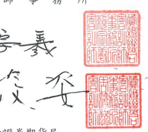

會計師核閱報告
(112)財審報字第 23002214 號 長榮海運股份有限公司 公鑒

## 前言

長榮海運股份有限公司及子公司(以下簡稱「合併公司」)民國 112年及 111年 9月 30 日之合併資產負債表,民國 112年及 111年7月1日至 9月 30 日、民國 112年及 111年1月1日至9月30日之合併綜合損益表,暨民國 112年及 111年 1月1日至9月30日之合併權益變動表、合併現金流量表,以及合併財務報表附 註(包括重大會計政策彙總),業經本會計師核閱竣事。依證券發行人財務報告編製 準則及經金融監督管理委員會認可並發布生效之國際會計準則第 34 號「期中財務 報導」編製允當表達之合併財務報表係管理階層之責任,本會計師之責任條依據核 閱結果對合併財務報表作成結論。

## 範圍

除保留結論之基礎段所並者外,本會計師像依照中華民國核閱準則2410號5財 務報表之核閱」執行核閱工作。核閱合併財務報表時所執行之程序包括查詢(主要 向負責財務與會計事務之人員查詢)、分析性程序及其他核聞程序。核閱工作之範 國明顯小於查核工作之範圍,因此本會計師可能無法察覺所有可藉由查核工作辨認 之重大事項,故無法表示查核意見。

## 保留結論之基礎

如合併財務報表附註四(三)所述,列入上開合併財務報表之非重要子公司-長 榮譽備保全股份有限公司,其財務報表所列之金額及合併財務報表附註十三所揭露 之相關資訊,係依據該公司同期間自編未經會計師核閱之財務報表所編製。該公司 民國 111 年 9 月 30 日之資產及負債總額分別為新台幣 809,791 仟元及新台幣 306,027 仟元,各占合併資產及負債總額之 0.09%及 0.10%;民國 111年7月1日 至 9 月 30 日暨民國 111 年 1 月 1 日至 9 月 30 日之綜合損益總額分別為新台幣
(4,007)任元及新台幣(5,985)仟元。

## ~4~

如合併財務報表附註六(八)所述,列入上開合併財務報表之部分採用權益法之 投資,其財務報表所列之金額及合併財務報表附註十三所揭露之相關資訊,係依據 各該公司同期間自編未經會計師核閱之財務報表所編製。該等公司民國 112 年及 111 年 9 月 30 日之採用權益法之投資金額分別為新台幣 3,759,448 仟元及新台幣 3,041,855 仟元,各占合併資產總額之 0.48%及 0.35%;民國 112年及 111 年 7月 1 日至 9月 30 日暨民國 112年及 111年1月1日至 9月 30 日之採用權益法認列之 綜合損益分別為新台幣 102,376 仟元、新台幣 100,053 仟元、新台幣 308,877 仟元 及新台幣290,139 仟元,各占合併綜合損益總額之 0.29%、0.08%、0. 58%及 0.08%。

## 保留結論

依本會計師核閱結果及其他會計師之核閱報告(請參閱其他事項段),除保留結 論之基礎段所述部分非重要子公司及採用權益法之投資其财務報表及合併財務報 表附註十三所揭露之相關資訊倘經會計師核閱,對合併財務報表可能有所調整之影 響外,並未發現上開合併財務報表在所有重大方面有未依照證券發行人財務報告編 製準則及經金融監督管理委員會認可並發布生效之國際會計準則第 34號「期中財 務報導,編製,致無法允當表達合併公司民國 112年及 111年9月30日之合併財 務狀況,民國112年及111年7月1日至9月30日暨民國112年及111年1月1 日至 9月 30 日之合併財務績效,暨民國 112 年及 111 年 1月 1 日至 9月 30 日之 合併現金流量之情事。

## 其他事項 - 採用其他會計師之核閱報告

列入合併公司合併財務報表之部分子公司及採用權益法之被投資公司,其財務 報表未經本會計師核閱,而係由其他會計師核閱。因此,本會計師對上開合併財務 報表所出具之核閱報告中,有關該等公司財務報表所列之金額及合併財務報表附註 十三所揭露之相關資訊,係依據其他會計師之核閱報告。該等公司民國 112年及 111 年 9月 30 日之資產(含採用權益法之投資)總額分別為新台幣 86,528,102 仟元 及新台幣 92,461,080 仟元,各占合併資產總額之 11.05%及 10.48%;民國 112 年及 111年7月1日至9月30日、民國112年及 111年1月1日至9月30日之營業收 入分別為新台幣 586,968 仟元、新台幣 611,911 仟元、新台幣 1,994,595 仟元及新 台幣 1,793,636 仟元,各占合併營業收入之 0.81%、0.36%、0.96%及 0.35%。民國

## ~5~

112年及 111 年 7 月 1 日 至 9 月 30 日 、民國 112 年及 111 年 1 月 1 日 至 9 月 30 日 之採用權益法認列之綜合損益分別為新台幣 682,904 仟元、新台幣 1,149,261 仟 元、新台幣 3,783,169 仟元及新台幣 5,967,995 仟元,各占合併綜合損益總額之 1.90%、0.93%、7.08%及 1.69%
資

$\frac{1}{2}$.  

所

* [16] A. A. K.  
$$\mathbb{B}\ \hat{\mathbb{B}}\mathbb{B}$$
* [15] M. C. Gonzalez-Garcia, M. C. Gonzalez-Garcia, M.  
前行政院金融監督管理委員會證券期貨局 核准簽證文號:金管證六字第 0960038033 號 前財政部證券管理委員會 核准簽證文號:(85)台財證(六)第 68700 號

$$\begin{array}{l}{{\Phi\quad\pm\quad R\quad\pm\quad1\quad1\quad2\quad\pm\quad1\quad1\quad\quad R\quad1\quad3}}\end{array}$$

日

## ~6~
