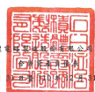
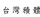
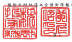

及子公司 民 图 111 年 3 月 日及 3 月 31 日

|                                            | 單位:新台幣仟元                                    |                 |                 |                 |                 |               |                 |      |                 |      |    |    |
|--------------------------------------------|----------------------------------------------------|-----------------|-----------------|-----------------|-----------------|---------------|-----------------|------|-----------------|------|----|----|
| 111 年3月31 日                             | 110 年 12 月 31 日                                 | 110年3月31日    |                 |                 |                 |               |                 |      |                 |      |    |    |
| (经核間)                                   | (經查ձ)                                            | 〔经核間〕      |                 |                 |                 |               |                 |      |                 |      |    |    |
| 代                                         | ધ્યું                                                 | _黄             | 産              | 金              | 高              | 96            | 金              | 高   | %               | 金   | 原 | જેર |
| 流動 資產                                  |                                                    |                 |                 |                 |                 |               |                 |      |                 |      |    |    |
| 1100                                       | 現金及约當現金(附誌六)                             | $ 1,151,589,646 | 29              | $ 1,064,990,192 | 29              | S             | 664,727,857     | 23   |                 |      |    |    |
| 這過損益按公允價值衡量之金融資產〔附該七〕 | 758,452                                            | 159,048         | 26,897          |                 |                 |               |                 |      |                 |      |    |    |
| 1110                                       | 选過其他綜合損益按公允價值衡量之金融資產(附註入)   | 120,995,765     | 119,519,251     | 3               | 125,208,307     |               |                 |      |                 |      |    |    |
| 1120                                       | 3                                                  | ﻀ               |                 |                 |                 |               |                 |      |                 |      |    |    |
| 1136                                       | 按繳鋪後成本街量之金融資產(附註九)                 | 8,425,386       | .               | 3,773,571       | .               | 6,694,422     | .               |      |                 |      |    |    |
| 1139                                       | 過險之金融資產(附註十)                             | 286,824         | 13,468          | 64,349          |                 |               |                 |      |                 |      |    |    |
| 應收票據及帳款净額(附仕十一)               | 212,846,891                                        | 5               | 197,586,109     | 5               | 167,143,336     | б             |                 |      |                 |      |    |    |
| 1170                                       |                                                    |                 |                 |                 |                 |               |                 |      |                 |      |    |    |
| 1180                                       | 應收關係人款項(附註三一)                           | 581,010         | .               | 715,324         | ·               | 335,572       | .               |      |                 |      |    |    |
| 1210                                       | 其他應收關係人數項(附註三一)                       | 58,165          | 61,531          | 52,591          |                 |               |                 |      |                 |      |    |    |
| 1310                                       | 存货(附註十二)                                     | 200,118,682     | 5               | 193,102,321     | 5               | 154,567,568   | 5               |      |                 |      |    |    |
| 1476                                       | 其他金融資産(附註三二)                             | 16,243,656      | 1               | 16,630,611      | 1               | 15,131,465    | 1               |      |                 |      |    |    |
| 1479                                       | 其他流動資產                                       | 10,333,155      | 10,521,481      | 5,834,459       |                 |               |                 |      |                 |      |    |    |
| 11XX                                       | 流動貨產合計                                       | 1,722,237,632   | 43              | 1,607,072,907   | 43              | 1,139,786,823 | 39              |      |                 |      |    |    |
| 邦流動質產                                 |                                                    |                 |                 |                 |                 |               |                 |      |                 |      |    |    |
| 1517                                       | 选過其他綜合損益按公允慣值街量之盒融資產(附註入〕  | 6,011,937       | .               | 5,887,892       | .               | 4,401,224     | .               |      |                 |      |    |    |
| .                                          | .                                                  | .               |                 |                 |                 |               |                 |      |                 |      |    |    |
| 1535                                       | 按接销後成本街量之金融资産(附註九)                 | 15,605,898      | 1,533,391       | 4,434,410       |                 |               |                 |      |                 |      |    |    |
| 1550                                       | 採用權益法之投資(附註十三)                         | 24,119,008      | 1               | 21,963,418      | 1               | 20.294.816    | 1               |      |                 |      |    |    |
| 1600                                       | 不動產 ·廠房及設備(附註十四)                       | 2,104,330,654   | 53              | 1,975,118,704   | રૂ3              | 1,658,551,290 | 57              |      |                 |      |    |    |
| 1755                                       | 使用權貨產(附註十五)                               | 32,922,146      | 1               | 32.734.537      | 1               | 32,282,312    | 1               |      |                 |      |    |    |
| 1780                                       | 無形質產(所註十六)                                 | 25,620,051      | 1               | 26,821,697      | 1               | 25,012,688    | 1               |      |                 |      |    |    |
| 1840                                       | 53,903,541                                         | 49,153,886      | 1               | 31,254,225      | 1               |               |                 |      |                 |      |    |    |
| 适延所得税货速(附往四)                     | 1                                                  |                 |                 |                 |                 |               |                 |      |                 |      |    |    |
| 1920                                       | 存出保证金                                         | 4.073.354       | .               | 2,624,854       | ﺍ               | 1,193,924     | :               |      |                 |      |    |    |
| 1990                                       | 其他非流動管產                                     | 3,852,446       | 2.592.169       | 1,919,749       |                 |               |                 |      |                 |      |    |    |
| 15XX                                       | 非流動質產合計                                     | 2,270,439,035   | 57              | 57              | 1,779,344,638   | 61            |                 |      |                 |      |    |    |
| 2,118,430,548                              |                                                    |                 |                 |                 |                 |               |                 |      |                 |      |    |    |
| 1XXX                                       | 黄                                                 | 產              | 场              | 14              | $ 3,992,676,667 | 100           | $ 3,725,503,455 | _100 | $ 2,919,131,461 | _100 |    |    |
| 身                                         | 价                                                 | 反              | 耀              | ম               |                 |               |                 |      |                 |      |    |    |
| 消费負債                                   |                                                    |                 |                 |                 |                 |               |                 |      |                 |      |    |    |
| 2100                                       | 短期借款(肘は十七及二九)                           | S               | 144,550,897     | 4               | S               | 114,921,333   | 3               | ક    | 137,123,748     | ה    |    |    |
| 2,203,138                                  | 1,958,208                                          |                 |                 |                 |                 |               |                 |      |                 |      |    |    |
| 2120                                       | 透過擬益按公允價值街量之金融負債(附註七)           | 681,914         |                 |                 |                 |               |                 |      |                 |      |    |    |
| 2126                                       | 避險之金融負債(附註十)                             | 9,642           |                 |                 |                 |               |                 |      |                 |      |    |    |
| 2170                                       | 應付帳款                                           | 48,653,183      | 1               | 47,285,603      | l               | 36,653,115    | l               |      |                 |      |    |    |
| 2180                                       | 應付開係人教項(附註三一)                           | 1,450,896       | 1,437,186       | 1,944,990       |                 |               |                 |      |                 |      |    |    |
| 1                                          | 1                                                  | 15,696,178      | 1               |                 |                 |               |                 |      |                 |      |    |    |
| 2201                                       | 應付薪資及獎金                                     | 21,077,111      | 23,802,100      |                 |                 |               |                 |      |                 |      |    |    |
| 2206                                       | 應付員工副發及董事副势(附註二八)                   | 48,766,534      | 1               | 36,524,741      | 1               | 44,149,585    | 1               |      |                 |      |    |    |
| 2213                                       | 應付工程及設備款                                   | 122,915,512     | 3               | 145,742,148     | 4               | 109,037,744   | 4               |      |                 |      |    |    |
| 2216                                       | 應付現金融利(附註二十)                             | 142.617.093     | 4               | 142.617.093     | 4               | 129.651.902   | 4               |      |                 |      |    |    |
| 2230                                       | 本期所得就負債(附註四)                             | 87.693.132      | 2               | 59,647,152      | 2               | 74,018,602    | ﺗﺮﺍ             |      |                 |      |    |    |
| 16,791,667                                 | .                                                  | 4,566,667       |                 |                 |                 |               |                 |      |                 |      |    |    |
| 2320                                       | 一年內对期長期負債〔附註十八、十九及二九〕         | .               |                 |                 |                 |               |                 |      |                 |      |    |    |
| 2399                                       | 應付費用及其他流動負債(附註十五、二一、二九及三一) | 186,148,544     | 5               | 162,267,779     | 4               | 111,414,540   | 4               |      |                 |      |    |    |
| 21XX                                       | 流動負債合計                                       | 822,867,707     | -21             | 739,503,358     | _20             | 661,648,612   | _23             |      |                 |      |    |    |
| 非液動員積                                 |                                                    |                 |                 |                 |                 |               |                 |      |                 |      |    |    |
| 2530                                       | 應付公司債〔附註十八及二九〕                       | 629,650,221     | 16              | 610,070,652     | 16              | 276,838,303   | 10              |      |                 |      |    |    |
| 2541                                       | 長期銀行借款(附註十九及二九)                       | 3,087,714       | -               | 3,309,131       | .               | 2,623,824     | .               |      |                 |      |    |    |
| 2573                                       | 遮廷所得我負債〔附註四〕                           | 1,899,315       | .               | 1,873,877       | 1,895,572       |               |                 |      |                 |      |    |    |
| 2580                                       | 組質負債(附註十五及二九)                           | 21,065,933      | .               | 20,764,214      | 1               | 21,074,764    | 1               |      |                 |      |    |    |
| 2640                                       | 淨確定福利負債 (附註四)                            | 8,533,290       | ﻭ               | 11,036,879      | 11,294,513      |               |                 |      |                 |      |    |    |
|                                            | .                                                  | .               |                 |                 |                 |               |                 |      |                 |      |    |    |
| 2645                                       | 存入保管金                                         | 706,708         | 686,762         | 349,500         | :               |               |                 |      |                 |      |    |    |
| 2670                                       | 其他非流動負債 (附該二一)                          | 183,397,025     | 5               | 167,525,377     | 2,409,411       |               |                 |      |                 |      |    |    |
| 25XX                                       | 非流動負債合計                                     | 848,340,206     | 21              | 815,266,892     | _22             | 316,485,887   | 11              |      |                 |      |    |    |
| 2XXX                                       | 負债合計                                           | 1,671,207,913   | 42              | 1,554,770,250   | 42              | 978,134,499   | 34              |      |                 |      |    |    |
| 郎届於母公司憲主之權益                     |                                                    |                 |                 |                 |                 |               |                 |      |                 |      |    |    |
| 3110                                       | 殷本〔附該四及二十〕                               |                 |                 |                 |                 |               |                 |      |                 |      |    |    |
| 普通股股本                                 | 259,317,675                                        | 259,303,805     | 7               | 259,303,805     | 9               |               |                 |      |                 |      |    |    |
| 貢本公積(附註四、二十及二七)               |                                                    |                 |                 |                 |                 |               |                 |      |                 |      |    |    |
| 3200                                       | 65,215,135                                         | _2              | 64,761,602      | __              | 64,753,607      | ___2          |                 |      |                 |      |    |    |
| 保留量徐(阴往四及二十)                     |                                                    |                 |                 |                 |                 |               |                 |      |                 |      |    |    |
| 3310                                       | 法定盈條公積                                       | 311,146,899     | 8               | 311,146,899     | 8               | 311,146,899   | 11              |      |                 |      |    |    |
| 3320                                       | 转对盈徐公積                                       | 62,608,515      | 1               | 59,304,212      | 2               | 54,679,873    | 2               |      |                 |      |    |    |
| 1.664.506.123                              | 1.536,378,550                                      |                 |                 |                 |                 |               |                 |      |                 |      |    |    |
| 3350                                       | 来分配量给                                         | 42              | 41              | 1,297,445,035   | 44              |               |                 |      |                 |      |    |    |
| 3300                                       | 保留盈修合計                                       | 2.038.261.537   | 51              | 1,906,829,661   | 51              | 1.663.271.807 | 57              |      |                 |      |    |    |
| 3400                                       | 47,492,685 )                                       | _1)             | 62,608,515 )    | _2)             | 48,392,823 )    | (_2)          |                 |      |                 |      |    |    |
| 其他權益(附註四・二十及二七 )
準誠股票(用社四及二十)                                            |                                                    |                 |                 |                 |                 |               |                 |      |                 |      |    |    |
| 3500                                       | 871,566 )                                          | 58              | 58              | ર્ણ્સ             |                 |               |                 |      |                 |      |    |    |
| 31XX                                       | 母公司第王德盟合计                                 | 2,314,430,096   | 2,168,286,553   | 1,938,936,396   |                 |               |                 |      |                 |      |    |    |
| 36XX                                       | 非控制模型                                         | 7,038,658       | 1.              | 2,446,652       | -               | 2,060,566     | 1               |      |                 |      |    |    |
| 3XXX                                       | 程益合时                                           | 2,321,468,754   | __ 58           | 2,170,733,205   | 58              | 1.940,996,962 | __(ﺉ            |      |                 |      |    |    |
| 角 值 及 檔 益 總 計                       | $ 3.992.676.667                                    | _100            | $ 3,725,503,455 | 100             | $ 2,919,131,461 | _100          |                 |      |                 |      |    |    |
| 一部分。                                   |                                                    |                 |                 |                 |                 |               |                 |      |                 |      |    |    |

豪来长:

级理人

會計主要

