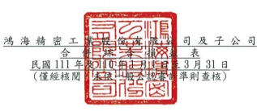
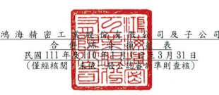
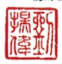
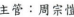

單位:新台幣仟元

|                  | (除每股盈餘為新台幣元外)          |                  |                 |             |              |               |     |    |    |    |
|------------------|-----------------------------------|------------------|-----------------|-------------|--------------|---------------|-----|----|----|----|
| 111 年           | 1                                 | 月               | 1               | 日          | 110          | 年            | 1   | 月 | 1  | 日 |
| 至               | 3                                 | 月               | 31              | 日          | 至           | 3             | 月  | 31 | 日 |    |
| 項目             | 附註                              | 金               | 多頁            | ಜ           | 金           | 额            | ಶಿಲ  |    |    |    |
| 4000             | 營業收入                          | 六(三十一)及七 $ | 1,407,553,167   | 100         | $            | 1,347,112,823 | 100 |    |    |    |
| 5000             | 營業成本                          | 六(八)(三十五)   | 1,268,980,278)( |             |              |               |     |    |    |    |
| (三十六)及七     | 1,322,787,489)(                   | 94) (            | 94)             |             |              |               |     |    |    |    |
| 5900             | 78,132,545                        |                  |                 |             |              |               |     |    |    |    |
| 苍葉毛利         | 84,765,678                        | 6                | б               |             |              |               |     |    |    |    |
| 苍紫贵用         | 六(三十五)                        |                  |                 |             |              |               |     |    |    |    |
| (三十六)         |                                   |                  |                 |             |              |               |     |    |    |    |
| 6100             | 推銷費用                          | (                | 6,688,243)      | - (         | 7,883,901)(  | 1)            |     |    |    |    |
| 6200             | 管理費用                          | (                | 16,993,517) (   | 1)(         | 18,820,414)( | 1)            |     |    |    |    |
| 6300             | 研究發展費用                      | (                | 24,414,614) (   | 2) (        | 23,858,634)( | 2)            |     |    |    |    |
| 6000             | 誉業費用合計                      | (                | 48,096,374) (   | 3) (        | 50,562,949)( | 4)            |     |    |    |    |
| 6900             | 營業利益                          | 36,669,304       | 3               | 27,569,596  | 2            |               |     |    |    |    |
| 營業外收入及支出 |                                   |                  |                 |             |              |               |     |    |    |    |
| 7100             | 利息收入                          | 六(三十二)       | 6,996,856       | -           | 8,403,342    | 1             |     |    |    |    |
| 7010             | 其他收入                          | 六(三十三)       | 1,424,640       | .           | 7,183,226    | 1             |     |    |    |    |
| 7020             | 其他利益及损失                    | 六(三十四)       | (               | 5,698,956)  | .            | 482,401       | 文  |    |    |    |
| 7050             | 財務成本                          | 4,863,582)       | 1)              |             |              |               |     |    |    |    |
| 六(三十七)       | (                                 | - (              | 6,747,233)(     |             |              |               |     |    |    |    |
| 7060             | 採用權益法認列之關聯企業及 六(九) |                  |                 |             |              |               |     |    |    |    |
| 合資損益之份額   | 2,399,073                         | 2,297,741        |                 |             |              |               |     |    |    |    |
|                  | 00                                | ﺗ                |                 |             |              |               |     |    |    |    |
| 7000             | 營業外收入及支出合計              | 258,031          | 11,619,477      | 1           |              |               |     |    |    |    |
|                  | 5                                 |                  |                 |             |              |               |     |    |    |    |
| 7900             | 稅前淨利                          | 36,927,335       | 3               | 39,189,073  | 3            |               |     |    |    |    |
| 7950             | 所得稅費用                        | 六(三十八)       | (               | 7,317,908)( | 1) (         | 8,209,821)(   | 1)  |    |    |    |
| 8200             | 本期淨利                          | ക്ക               | 29,609,427      | 30,979,252  |              |               |     |    |    |    |
|                  | 2                                 | છે                | 2               |             |              |               |     |    |    |    |
| (續次頁)         |                                   |                  |                 |             |              |               |     |    |    |    |

單位:新台幣仟元

|                                  | (除每股盈餘為新台幣元外)                  |              |            |            |            |            |    |    |    |
|----------------------------------|-------------------------------------------|--------------|------------|------------|------------|------------|----|----|----|
| 111 年                           | 1                                         | 月 1         | 日         | 110        | 年         | 1          | 月 | 1  | 日 |
| 3                                | 31                                        | 31           |            |            |            |            |    |    |    |
| 至                               | 月                                        | 日           | KAJ        | 3          | 月         | 日         |    |    |    |
| 項目                             | 円 註                                     | 额           | ିହ          | 金         | 領         | శ          |    |    |    |
| 其他综合損益(浮額)               |                                           |              |            |            |            |            |    |    |    |
| 不重分類至損益之項目             |                                           |              |            |            |            |            |    |    |    |
| 8316                             | 透過其他綜合損益按公允債值 六(三)(二十九) |              |            |            |            |            |    |    |    |
| 衡量之權益工具投資未實現評(三十) |                                           |              |            |            |            |            |    |    |    |
| 價損益                           | (8                                        | 8,141,762) ( | 1) $       | 7,203,475  | 1          |            |    |    |    |
| 8320                             | 採用權益法認列之關聯企業及 六(二十九)     |              |            |            |            |            |    |    |    |
| 合資之其他综合損益之份額-        |                                           |              |            |            |            |            |    |    |    |
| 不重分類至損益之項目             | (                                         | 2,585,398)   | .          | 5,296,271  | .          |            |    |    |    |
| 8349                             | 與不重分類之項目相關之所得 六(三十八)     |              |            |            |            |            |    |    |    |
| 稅                               | 1,039,998                                 | .            | .          |            |            |            |    |    |    |
| 8310                             | 不重分類至損益之項目總額                  | 9,687,162) ( | 1)         | 12,499,746 | 1          |            |    |    |    |
| 後續可能重分類至損益之項目       |                                           |              |            |            |            |            |    |    |    |
| 8361                             | 國外營運機構財務報表換算之 六(二十九)     |              |            |            |            |            |    |    |    |
| 兒換差額                         | (三十)                                    | 63,698,111   | 5 (        | 2,180,487) |            |            |    |    |    |
| 8368                             | 避險工具之損益                            | 六(五)       | (          | 144,313)   | .          | .          |    |    |    |
| 8370                             | 採用權益法認列之關聯企業及 六(二十九)     |              |            |            |            |            |    |    |    |
| 合資之其他綜合損益之份額—        |                                           |              |            |            |            |            |    |    |    |
| 可能重分類至損益之項目           | 95,293                                    | - (          | 4,002,504) | .          |            |            |    |    |    |
| 8399                             | 與可能重分類之項目相關之所 六(五)         |              |            |            |            |            |    |    |    |
| 得稅                             | 21,647                                    | 1.           | 10         |            |            |            |    |    |    |
| 8360                             | 後續可能重分類至損益之項目總              |              |            |            |            |            |    |    |    |
| 额                               | 63,670,738                                | 6,182,991)   |            |            |            |            |    |    |    |
|                                  | 5 (                                       | .            |            |            |            |            |    |    |    |
| 8300                             | 其他综合損益(淨額)                        | સ્ક           | 53,983,576 | 4          | ક          | 6,316,755  | 1  |    |    |
| 8500                             | 本期综合損益總額                          | ક            | 83,593,003 | 6          | ક          | 37,296,007 | 3  |    |    |
| 淨利歸屬於:                      |                                           |              |            |            |            |            |    |    |    |
| 8610                             | 母公司業主                                | ക            | 29,450,302 | 2          | ക          | 28,161,775 | 2  |    |    |
| 8620                             | 非控制權益                                | 159,125      | =          | 2,817,477  | .          |            |    |    |    |
| $                                | 29,609,427                                | 2            | ക          | 30,979,252 | 2          |            |    |    |    |
| 綜合損益總額歸屬於:              |                                           |              |            |            |            |            |    |    |    |
| 8710                             | 母公司業主                                | S            | 77.486,237 | S          | 34,211,928 | 3          |    |    |    |
|                                  | б                                         |              |            |            |            |            |    |    |    |
| 8720                             | 非控制權益                                | 6,106,766    | 3,084,079  |            |            |            |    |    |    |
|                                  | .                                         |              |            |            |            |            |    |    |    |
| 83,593,003                       | б                                         | ક            | 37,296,007 | 3          |            |            |    |    |    |
| ક                                |                                           |              |            |            |            |            |    |    |    |
| 每股盈餘                         | 六(三十九)                                |              |            |            |            |            |    |    |    |
| 9750                             | 基本每股盈餘                              | ક            | 2.12       | 49         | 2.03       |            |    |    |    |
| 9850                             | 稀釋每股盈餘                              | $            | 2.08       | ക          | 2.02       |            |    |    |    |

後附合併財務報表附註為本合併財務報告之一部分,請併同參閱。

董事長:劉揚偉 經理人:劉揚偉

會計主管:周宗愷

~9~

