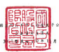

不会用
民网 111 年 9 月 月 31 日及 9月 30 日

|                                         | 单位:[新台器付元                                   |                    |             |                 |             |              |            |    |        |
|-----------------------------------------|----------------------------------------------------|--------------------|-------------|-----------------|-------------|--------------|------------|----|--------|
|                                         | 710年12月31日                                      | 110年9月30日       |             |                 |             |              |            |    |        |
| 111年9月30日                            |                                                    |                    |             |                 |             |              |            |    |        |
| (经检局)                                | (童婦護屈經查組)                                   | 《查编捷虽舰被困》 |             |                 |             |              |            |    |        |
| 盘                                      |                                                    | જ                  | গ্র          | 以              | જ           | �            | n          | ત્ર |        |
| 代 马                                   | 全                                                 |                    |             |                 |             |              |            |    |        |
| 研
酒费食                                         |                                                    |                    |             |                 |             |              |            |    |        |
| 1100                                    | $ 37,066,515                                       | 13                 | s           | 39,126,405      | 16          | s            | 36.909.800 | 15 |        |
|                                         | 4,218,459                                          |                    |             |                 |             |              |            |    |        |
| 1110                                    | 發貨及
 現金及め雪观全(所在火)
  達塔頓直接公允情설聞受之会融資産一流動(肘部七)
  班領織並成本則達之会融資産一流動(別部元)                                                    | 6.250.701          | 2           | 4,208,551       | 2           | ﺪ،           |            |    |        |
| 13,749,710                              | 5                                                  | 10,764,884         | 4           | 10.158,853      | 4           |              |            |    |        |
| 1136                                    | 96,704                                             | -                  |             |                 |             |              |            |    |        |
| 1139                                    | 报镇局设成本向全一名单位
超依之会赴賞五一道的《原住十》
唐武君被浮報(府拉十一)                                                    | 107,948            | 195.177     | 215,628         |             |              |            |    |        |
| 1150                                    | ﻭ                                                  | ﻭ                  |             |                 |             |              |            |    |        |
| 1170                                    | 成收錄於淨鋼(耐禁十一,三明及三五)                  | 24,104,955         | 22,105,150  | 25,453,107      | 11          |              |            |    |        |
| 1200                                    | 其代理收款(图德三四)                               | 1.344.507          | 1           | 1,072,785       | 1           | 961,692      |            |    |        |
| 28,774,410                              | 10                                                 | 25,197,902         | 10          | 23 250.322      | 10          |              |            |    |        |
| 130X                                    | 序寅(附边十二及三五)                               | 2,093,046          | l           | 1,292,243       | l           | 1,451,097    | 1          |    |        |
| 1410                                    | 分具
预计器手流動資產(附班十五)                                                    | .                  | 85,869      |                 |             |              |            |    |        |
| 1460                                    | 865,559                                            | 425 192            |             |                 |             |              |            |    |        |
| 1470                                    | 其他流動發展                                       | 549,249            | 47          | .104.828.656    | ৰহ          | 103.168.019  | 43         |    |        |
| 11XX                                    | 流動情產地时                                       | 114,137,745        |             |                 |             |              |            |    |        |
| 非波斯官方                              |                                                    |                    |             |                 |             |              |            |    |        |
| 1510                                    | 1.397,984                                          | 1                  | 672,258     | .               | 682,240     |              |            |    |        |
| (系質。
 這過演並按公允價值到重之全融資產一本流的(附加七)
 這過男比較合損益投公允價值衝要之全融資產一本流動(附註入)                                         | 691,440                                            | 100.772            |             |                 |             |              |            |    |        |
| 1517                                    | 833,714                                            | 4 .                |             |                 |             |              |            |    |        |
|                                         | 7                                                  | 9,143,579          | 9,071,841   | 4               |             |              |            |    |        |
| 1535                                    | 19.179.749                                         |                    |             |                 |             |              |            |    |        |
| 経理部長点水準を発生。
共理島後或木関量之全融資産一律派動(附近大)
過程と全融資産一部流動(所は十)                                         | 1,283,234                                          | 1                  | 507,195     | 382,721         |             |              |            |    |        |
| 1538                                    | ﺍ                                                  | 1,604,436          | 】          |                 |             |              |            |    |        |
| 1550                                    | 禁用假总法文投资(所在十五)                         | 3,312,555          |             | 51,169,838      | 신          |              |            |    |        |
| 1600                                    | 不動產、販鳥及政領〔附註十六及三五〕               | 56,805,933         | 20          | 21              |             |              |            |    |        |
|                                         | 1.647.319                                          | 一                 | 1,654,706   | 1               |             |              |            |    |        |
| 1755                                    | 使用程管理                                         | 1,190,164          |             |                 |             |              |            |    |        |
| 校要性不動産(別註四 · 十七、三国及三五) | 38,615                                             | 135,632            | 136,304     |                 |             |              |            |    |        |
| 1760                                    |                                                    |                    |             |                 |             |              |            |    |        |
| 1805                                    | 49.013.971                                         | 18                 | 44,131,198  | 18              | 44,393,469  | 19           |            |    |        |
| 程 安佐中 网盘()
商易(附註十八)
其北昌形資產净額(图8十九)                                         |                                                    |                    |             |                 |             |              |            |    |        |
| 1821                                    | 25,016,503                                         | 9                  | 22,428,461  | ﺻ               |             |              |            |    |        |
|                                         | ﻭ 1                                                | 22,303,362
   5,493,060                    | 2           | 4,466,932       | N           |              |            |    |        |
| 1840                                    | 通越所得就實産(財証四)                             | 3,822,728          |             |                 |             |              |            |    |        |
| 225 212                                 | 197,878                                            | 180,226            |             |                 |             |              |            |    |        |
| 1920                                    | 存台深圳金                                         |                    |             |                 |             |              |            |    |        |
| 1990                                    | 实记非法处管理                                     | 1,479,594          | 938,310     | 952,250         |             |              |            |    |        |
| 15XX                                    | 非淡始背產總計                                     | 163.599,956        | 59          | 138,074,027     | _57         | 187,224,196  | _52        |    |        |
| $_27.737.701                            | 10                                                 | $ 242,902,683      | -100        | $ . 200.392.215 | 102         |              |            |    |        |
| 1XXX                                    | মা                                                  | 点                 | 바          | 바              |             |              |            |    |        |
| 代                                      | 19                                                 | 及                 | 세          | ﺔ               |             |              |            |    |        |
| 版给身情                                | 22,797,140                                         | ડ                  | 26,005,204  | 11              | ડ           | 31,757,197   | 13         |    |        |
| 2100                                    | 員 後
 組組營战(附註二十月三五)
 應付妹期景春(新社二十)                                                    | રુ                  | 8           |                 |             |              |            |    |        |
| 20,073,687                              | 20,078,123                                         | 8                  | 20,171,384  | ે છ              |             |              |            |    |        |
| 2110                                    | 554,507                                            | 44,192             | 160,523     |                 |             |              |            |    |        |
| 2118
2136                                         | 进纷镇互拍公允情值周贤之会融角情一演剧《附註七》   | .                  |             |                 |             |              |            |    |        |
| 總股之会越良價一流動(開採十)            | 8,326                                              | .                  | 8,211       | .               |             |              |            |    |        |
|                                         | 4.722                                              | 2,157              |             |                 |             |              |            |    |        |
| 2150                                    | 尼什么技                                           | 1,171              |             |                 |             |              |            |    |        |
| 17,919,507                              | 7                                                  | 18.626.978         | 8           | 19.436.386      | 3           |              |            |    |        |
| ט7נ                                     | 鹰纱线歌(附班元四)                                 |                    |             |                 |             |              |            |    |        |
| 其他患什版《附註二二及三四》            | 7                                                  | 35,126,324         | 6           | 14,079,227      | ው           |              |            |    |        |
| 2200                                    | 18,836,605
  5,464,369                                                    | 2                  |             |                 |             |              |            |    |        |
| 2230                                    | 本期所接稅负債(例故四)                             | 2                  | 4,295,120   | 2               | 3,498,397   |              |            |    |        |
|                                         | 368,951                                            |                    |             |                 |             |              |            |    |        |
| 2280                                    | 班便负债一流到                                     | 337,356            | 441,465     | .               | .           |              |            |    |        |
|                                         | ﺩ                                                  | 830,506            | .           | 779,517         | .           |              |            |    |        |
| 2320                                    | 车内到鹅之長期借款及應付公司價〔附註二十及二十八   | 8.652.019          |             |                 |             |              |            |    |        |
| 2399                                    | 810,247                                            | 708.902            | 477,238     |                 |             |              |            |    |        |
| 其他调動角播                            | | শ                                                | | শ                |             |                 |             |              |            |    |        |
| 21XX                                    | 选购角墙绝计                                       | 95,446,605         | ୍ର 34        | 86.169.871      | 90.739.728  |              |            |    |        |
| 非温的负值                              |                                                    |                    |             |                 |             |              |            |    |        |
| 2500                                    | 这语演出报公允像值频童之全融负债一系演纷(用语七)   | 18                 |             |                 |             |              |            |    |        |
| 2511                                    | 理陆之会服务线—非通到《附拉十)                     | 621.252            | 511,886     | ,               |             |              |            |    |        |
| 1,604,400
15,032,292                                         | 1                                                  | 15,961,017         | 7           | 15,963,216      |             |              |            |    |        |
| 應付公司儀(所註二一)                    |                                                    |                    |             |                 |             |              |            |    |        |
| | 案 |                                  | 30.012.123                                         | 21                 | 27,888,787  | 12              | 24,244,052  | 10           |            |    |        |
| 長期借款(图往二十及三五)                | 6,365,779                                          | . 2                | 4,723,754   | N               | 4.756.069   | 2            |            |    |        |
| 2570                                    | 遮越所得就負債(附註四)                             |                    |             |                 |             |              |            |    |        |
| 但質負債一非浪動                        | 758,067                                            | 982,249            |             |                 |             |              |            |    |        |
|                                         | i                                                  | .. .               |             | 1               |             |              |            |    |        |
| 净碳定插利角價【附近四反二三)           | 2,506,570                                          | 2,547,605          |             |                 |             |              |            |    |        |
| 290,643                                 | 276,976                                            | 206.419            |             |                 |             |              |            |    |        |
| 2645                                    | 存入外理会                                         | 5,934,212          | ৰ ২৪ হ'ল ব  | 3,028,031       |             |              |            |    |        |
| 2670                                    | 民化存道動員優                                     | 62,304,086         | _23         | . 57,306,963    | ন           | 52,526,822   | -22        |    |        |
| 25XX                                    | __5Z                                               | 143.476.531        | __52        | 143,266,550     | -----       |              |            |    |        |
| 2XXX                                    | 负绩炮吐                                           | 157,730,694        | .           |                 |             |              |            |    |        |
| 的履於本公司實主之權益                  |                                                    |                    |             |                 |             |              |            |    |        |
| R                                       | 本
香 |直 |                                                    | _4.212.608         | _           | 4.959.182       | --          | 4.959.182    | r 1        |    |        |
| 3110                                    | 蛋本会持                                           |                    |             |                 |             |              |            |    |        |
| 3211                                    | 登 行汕 演                                         | 41,163,603         | 15          | 20,221,583      | 8           | 20, 221, 583 | 8          |    |        |
| 3260                                    | 按用增益法認列之間聯全需及合育股極净值之發動數     | 155,351            | 1.574.490   | 1               | 1,575,189   |              |            |    |        |
|                                         | 252.844                                            | ਸੀ ਲੱਜ               |             |                 |             |              |            |    |        |
| 3272                                    | 可辨换公司像認列模互相成都份                       | 283 ला              | -           |                 |             |              |            |    |        |
| 41 60 338                               | ાર                                                  | 22,048,917         | 11          | 22,049,616      | الما        |              |            |    |        |
| 3200                                    | 晋三公告院计                                       |                    |             |                 |             |              |            |    |        |
| 师自立综                                | 8,621,566                                          |                    |             |                 |             |              |            |    |        |
| 10,694,034                              | 8,621,366                                          | ﻪ ډﻩ               |             |                 |             |              |            |    |        |
| 5910
3530                                         | 法定显得公报
# 别量母公报                                                    | 9.911,736          | سا          | 4,594,931       | 2           | 4,594,931    |            |    |        |
| 52.221.667                              | 19                                                 | 50.545.451         | 45,692,225  | 19              |             |              |            |    |        |
| 3350                                    | 未分配品给                                         |                    |             |                 |             |              |            |    |        |
| 保留盈栋绝对                            | 72,827,437                                         | 26                 | 63,761,748  | z               | 58,906,522  | 25           |            |    |        |
| 3300                                    | 其记姓互                                           | 9,287,852 )        | (           | 4 )             |             |              |            |    |        |
| 3410                                    | 圈外登速機場时替超長換耳之兒挑裝圖                 | 2,561,238          | t           | (               | 9,753,973 ) | {            | 4 }        | (  | 78,840 |
| 3420                                    | 透過其他除合攝品按公光價值開賣之全融資產未實現損益 | 10,069             | .           | 81,021          |             |              |            |    |        |
| 601 513                                 | 198,811                                            | 111,967            |             |                 |             |              |            |    |        |
| 3450                                    | 避险工具服装                                       |                    |             |                 |             |              |            |    |        |
| 3400                                    | 其他假出鸡计                                       | 3,172,840          | 9,474,145   | ৭০৪৫ তৰাই        | | T         |              |            |    |        |
|                                         | ו יו                                               |                    |             |                 |             |              |            |    |        |
| 3500                                    | 年藏版票                                           | 2,033,720 1        | 1,879,155 ) | 1 --            | 1,879,155 ) | 11           |            |    |        |
|                                         | T1                                                 | 79,416,558         | 33          | 74,941,127      | ---         |              |            |    |        |
| 31XX                                    | 本公司富至之權亞總計                               | 118783554          | -           | -               | -           |              |            |    |        |
| 35XX                                    | 共同控制下的手候互                                 | 223,991            | 192,382     |                 |             |              |            |    |        |
|                                         | 19,715.301                                         | _1                 | 21,992,151  | ﻣ               |             |              |            |    |        |
| 36XX                                    | 非控制相当                                         | 203.443            | 1           |                 |             |              |            |    |        |
| 50000                                   | 按丝绝对                                           | _119.957.002       | __          | 99,425,850      | ---         | 97,125,665   | --         |    |        |
| $ 277-737-701                           | 100                                                | $ 242.902.683      | _102        | 240.392.215     | _102        |              |            |    |        |
| 員 日 與 盤 起 給 計                    | 被附之附近像本合併时得 报告之                      | 一郎分 ·           |             |                 |             |              |            |    |        |
| 11月 10日抗周颜色)                      |                                                    |                    |             |                 |             |              |            |    |        |
| 《接參閱動需累信聯合會对即車裝          |                                                    |                    |             |                 |             |              |            |    |        |

资率長:原品站 0 :3:0 短理人:王滨如 育计生管:弱文期
- 5 -

