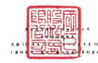

|  음악                                           | 이보                                                |                           |                                          |                                                 |                                                |                      |               |              |              |                     |               |              |                   |                 |              |              |                  |              |
|-------------------------------------------------|-----------------------------------------------------|---------------------------|------------------------------------------|-------------------------------------------------|------------------------------------------------|----------------------|---------------|--------------|--------------|---------------------|---------------|--------------|-------------------|-----------------|--------------|--------------|------------------|--------------|
|                                                 | 进进其他对合                                        |                           |                                          |                                                 |                                                |                      |               |              |              |                     |               |              |                   |                 |              |              |                  |              |
|                                                 | 及互按 公 元                                        |                           |                                          |                                                 |                                                |                      |               |              |              |                     |               |              |                   |                 |              |              |                  |              |
|                                                 | 国外管理失得 生 注 别 看 之                         |                           |                                          |                                                 |                                                |                      |               |              |              |                     |               |              |                   |                 |              |              |                  |              |
|                                                 | 时在线点换车 全 时 官 五                            | ル同在科下 本 江 州 型 互 |                                          |                                                 |                                                |                      |               |              |              |                     |               |              |                   |                 |              |              |                  |              |
| 第十六章                                        |                                                     |                           |                                          |                                                 |                                                |                      |               |              |              |                     |               |              |                   |                 |              |              |                  |              |
| Bt                                              |                                                     | 1                         | ଉ                                        | 【NB二四,正文直载全被 特别监控公园 本文 昭义 的 | 工艺服系 项 主页 电 品 适 超 险 工 具 级 生 用 | 有 > - 点 (障虫△白 · |               |              |              |                     |               |              |                   |                 |              |              |                  |              |
| ﺑ                                               | ( 时 11 人 四 )                                     | ( M B 二 R )              | 《 的 旺 二 四 ]                         | ( M I 二 = )                                    | 다                                             | ( 前 江 二 田 )      | スナ反ニー >  |              |              |                     |               |              |                   |                 |              |              |                  |              |
| ৰ হৈ                                             | No 10 1 10 1 10 1                                   |                           | 二八月三十) 《 開出二百〕 《 則里 5 份》 | - $ 47,000,413                                  | 星 ( 图 品 二 元 ( 元 ( 元 (                   | 投 上一篇 电         |               |              |              |                     |               |              |                   |                 |              |              |                  |              |
| 110年1月1日给眼                                 | 4,500,411                                           | 4,969,841                 | 5 23,099,157                             | $ 7.331.956                                     | 5 2945827                                      | $ 36,22 189          | ($ 4,605,523) | ২            | 71,291       | ২                   | 250,340       | 0            | <                 | 26,474          | $ 68,117,400 |              |                  |              |
| A4                                              | 道师调整样同做到下组织安知                          | 97.241                    | ... NASLIER                              | --- 20,9,5,225                                  |                                                |                      |               |              |              |                     |               |              |                   |                 |              |              |                  |              |
| 7.331.336                                       | --- 37 002 432                                      | ( _ + 145,522 )           | _万测                                    | 190 100                                         | ( __ 2,577,552)                                | 08.405.203           | 21,870,759    | 09.573.912   |              |                     |               |              |                   |                 |              |              |                  |              |
| મર                                              | 130年1月1日宣播版歌剧                               | 189992                    | - 11/2                                   | ---                                             | 23.098.122                                     | 2,945,802            | - № 725,188   | 28,243       |              |                     |               |              |                   |                 |              |              |                  |              |
| 109年度最短组组及公配                           |                                                     |                           |                                          |                                                 |                                                |                      |               |              |              |                     |               |              |                   |                 |              |              |                  |              |
| 81                                              | 法又监会公园                                        |                           | 1,200,070                                | 1,299,570 }                                     | .                                              |                      |               |              |              |                     |               |              |                   |                 |              |              |                  |              |
| IKA                                             | 展列特别盆雕公园                                    | '                         | 1.649.104                                | 16-19 104 1                                     | 167                                            | 3,967,354 )          |               |              |              |                     |               |              |                   |                 |              |              |                  |              |
| 195                                             | 永公司假求调公服新                                  | '                         | -                                        | 8 967,351 1                                     | 3,547,354 )                                    | 1                    | 3,967,351 |   |              |              |                     |               |              |                   |                 |              |              |                  |              |
|                                                 | .                                                   | 23,45 ) (                 | 474617 |                                 | 1                                               | 158,122 )                                      |                      |               |              |              |                     |               |              |                   |                 |              |              |                  |              |
| ા                                                | 于公司股东现金银利                                  |                           |                                          |                                                 |                                                |                      |               |              |              |                     |               |              |                   |                 |              |              |                  |              |
| (7                                              | |9.明祖反法培训工程却全国灵会官之星郎歌             | .                         | :                                        | 3 1                                             | 3,590 }                                        | -                    | ..            | 1            | 10,316 ) 【  | ( 910,156           | ....          | ..           | ..                | 【              | 14,000 )     | 13,135       | 753,5-31         | ​ ​            |
| C15                                             | 资本公债配资理金版制                                | r                         | :                                        | 1                                               | 991,838 1                                      | -                    | .             | ra           | .            | 9784 )              | :             | 1            | 中九 835 >        |                 |              |              |                  |              |
| Na                                              | 股份基础知识 员工团股报                             | 19,406                    | <                                        | 408 }                                           | 18.669                                         | 54,905               | 곳            | .            | 0 12 4       | .                   | 트            | 75,969       | 工                | .               | 71,983       |              |                  |              |
| 1月166,082                                      | 15,166,082                                          | 5.8,566.062               | 446.6                                    | 1,000,005                                       | 19.222.117                                     |                      |               |              |              |                     |               |              |                   |                 |              |              |                  |              |
| Di                                              | 110年1月1日至少月30日净利                           | 5                         | .                                        | .                                               | 15                                             | .                    |               |              |              |                     |               |              |                   |                 |              |              |                  |              |
| Di                                              | 110 年 1 月 1 和 里 6 月 30 由 投 提 用 M 8 1 4 011 | :4                        |                                          | 4.622,329 )                                     | 20.513                                         | 236.340 )            | . . .         | 4.830.156 ]  | 18436 )      | 303,324 ) {         | 5,201,8% )    |              |                   |                 |              |              |                  |              |
| Li                                              | 臨入與最近                                          | :                         |                                          |                                                 |                                                | Ch                   | .             | .            | la           | ั                    | 1,079,355 | ( | 1,570,155 ]  |                   | (               | 1,579,155- ] |              |                  |              |
| 13                                              | 早点线比d                                           | 29,458 )                  | ·                                        | (                                               | 29,650 ]                                       | 1                    | 106,433 )     | 12           | 1            | (                   | 2,285,469 ) { | 2,285,469 ]  | .                 | 2,420,552       |              |              |                  |              |
|                                                 | .                                                   | .                         | (                                        | 136.822                                         |                                                |                      |               |              |              |                     |               |              |                   |                 |              |              |                  |              |
| දි                                               | 界在列班日                                          | 2.285 |                   | 2.285 J                                  | 139,007                                         |                                                |                      |               |              |              |                     |               |              |                   |                 |              |              |                  |              |
| -2.86                                           | 7,254                                               | (                         | -3.55 >                                  |                                                 |                                                |                      |               |              |              |                     |               |              |                   |                 |              |              |                  |              |
| ए।                                              | 高分道冯某比较合福运省公允健信助费之程提三具        |                           |                                          |                                                 |                                                |                      |               |              |              |                     |               |              |                   |                 |              |              |                  |              |
| 21                                              | 110年9月30日於國                                    | 3 .. . 1.559.189          | 5                                        | 5 1.929.122                                     | 5_22018625                                     | S ... 8 621-36       | $ 1524971     | 2 13,022,222 | 5 86.853.522 | ( 5 ... 9.287.852 ) | -23.840       | 111.967      | 1 5 = 1.879.155 ) | $ 24.945.27.    | 5 - 192.387  | 5 21.992.154 | 5 ... 97.125.665 |              |
| B                                               |                                                     |                           |                                          |                                                 |                                                |                      |               |              |              |                     |               |              |                   |                 |              |              |                  |              |
| Al                                              | 111年2月5日组织                                     | $ = 4,559,889             | 1                                        | 5 4.959.889                                     | $ 22,048,937                                   | $ 5,021,366          | 5 4,594,932   | 5 50,545,453 | 5 63,761,748 | ( 5 9.753.903 )     | ર             | 81,621       | $ 198,811         | ( $ 1,879,155 ) | $ 79,436,558 | 5            | 5 354.174        | 8 79.774.895 |
| H                                               | 蓝海国经济网在时下的质量加                          | 223,921                   | -1940.16                                 | 18453 332                                       |                                                |                      |               |              |              |                     |               |              |                   |                 |              |              |                  |              |
| 111 本 3 月 日 日 日 皇 编 级 经 维 场 编       | 4,059,199                                           | 22,046,917                | 6.621.366                                | 4,594,931                                       | __                                             | --                   | 9.2.53.877. ) | ស្រី ប្រ        | 198811       | 1,870,155 )         | 79,474,554    | ... _        | 19,785,200        | 99,425,630      |              |              |                  |              |
| A5                                              | 4,999,590                                           |                           |                                          |                                                 |                                                |                      |               |              |              |                     |               |              |                   |                 |              |              |                  |              |
| 120 不发监控组组及分配                          |                                                     |                           |                                          |                                                 |                                                |                      |               |              |              |                     |               |              |                   |                 |              |              |                  |              |
|                                                 | 承定量保公园                                        | ్రా                         | 2002008                                  | ー                                              | 2672668 }                                      |                      |               |              |              |                     |               |              |                   |                 |              |              |                  |              |
|                                                 | 挺列特别虽假公确                                    | 5                         | 5,326,805                                | .                                               |                                                |                      |               |              |              |                     |               |              |                   |                 |              |              |                  |              |
| 5, 519, ATS |
5,400, 560 ]                                                 | 5,400,5ed }                                         | -                         | 5, 410,560 )                             | 5,400,560 )                                     |                                                |                      |               |              |              |                     |               |              |                   |                 |              |              |                  |              |
| 145                                             | 车会司配表现金服利                                  | .                         |                                          | .                                               |                                                |                      |               |              |              |                     |               |              |                   |                 |              |              |                  |              |
| ા                                                | 于公司股集现金胜利                                  | 11                        | ...                                      | .                                               | -                                              | :                    | 64,632 ] {    | (4672 )      |              |                     |               |              |                   |                 |              |              |                  |              |
| एक                                              | 除用强互冰的利之周期安备贸易公园受即软              | に                        | ਾ                                         |                                                 | 1,660                                          | .                    | .             |              | -3           |                     | 1,660         |              | 1,260             |                 |              |              |                  |              |
| fra                                             | 111 4 1 月 1 日 6 9 月 30 日 9 8 1 1 1              | ్ర                         | .                                        | ( = )                                           | 18.546.994                                     | 18,564,094           | ಪ             | 18,566,952   | 1,245        | 55,538              | 18,600,578    |              |                   |                 |              |              |                  |              |
| 112 年2月1日至9月 30日就最高处原会福建          | .                                                   | 1 1,257,556               | ן געגענד                                 | 400,702                                         | 13,597,285                                     | 9,079                | 15.66%, 354   |              |              |                     |               |              |                   |                 |              |              |                  |              |
| មើ                                               | .                                                   | .                         |                                          |                                                 |                                                |                      |               |              |              |                     |               |              |                   |                 |              |              |                  |              |
| ಿ                                                | .                                                   | 1,080,112 }               | 6 - C                                    | = 1                                             | 345,145 } (                                    | 365,145 )            | .             |              | .            | 385.545             | 1             | 1,059,712 )  | :                 | 1               | 1,059,722 )  |              |                  |              |
| 现会风景                                        | ( 1,080,412 )                                       |                           |                                          |                                                 |                                                |                      |               |              |              |                     |               |              |                   |                 |              |              |                  |              |
| મપ                                              | 照明星图                                            | 477.793                   | 477.293                                  | 20.691.277                                      | (                                              | 1 2,675 ]            | 1,993         | :            | (            | 537.110 ]           | 29,681,273    | 225,236 } 【 | 19,456,042 )      |                 |              |              |                  |              |
| 11                                              | 对群体会可理核进力量经理                            | 3,578                     | 600                                      | 3,578                                           | 151,30%                                        | .                    | .             | た           | 154,949      | 154.949             |               |              |                   |                 |              |              |                  |              |
|                                                 | 6.172.415 )                                         | נ 272415                  |                                          |                                                 |                                                |                      |               |              |              |                     |               |              |                   |                 |              |              |                  |              |
| 5.8                                             | 明人年成股                                          | .                         | ﻲ                                        |                                                 | 2 1                                            | 【                   | 5.872.415 1   |              |              |                     |               |              |                   |                 |              |              |                  |              |
| 年前段立研                                      | 147,880 )                                           | 147,880 )                 | ( 3.738.222 ) (                          | 3,735,222 1                                     | 以                                             | i                    | 2,172,415     |              |              |                     |               |              |                   |                 |              |              |                  |              |
| 1.3                                             | <                                                   | .                         | 【                                       | 1,200,313 }                                     |                                                |                      |               |              |              |                     |               |              |                   |                 |              |              |                  |              |
| м                                               | 成分子公司                                          | .                         | .                                        | .                                               | .                                              | ·                    | -             | -            | "            | 1                   | 99,159 ) (    | タ),159 ]    |                   |                 |              |              |                  |              |
| N1                                              | 股份基礎知付一員三双版權                            | ລວ                        | 7 = 1                                    | 45                                              | 508                                            | -                    | 6-16          | કાઠ           |              |                     |               |              |                   |                 |              |              |                  |              |
| ા                                                | # # 이 #                                            | .                         | 0-1                                      | <                                               | 3,621 1                                        | .                    | .             | 网 (         | 3,321 |      | .                   | 4,783 ) (     | 11,006 }     |                   |                 |              |              |                  |              |
| .                                               |                                                     |                           |                                          |                                                 |                                                |                      |               |              |              |                     |               |              |                   |                 |              |              |                  |              |
| ્ર                                               | 属分通通系他班合报品相公允值值购费之星直工具        | 1                         | ( ..                                     | -- 228 )                                        | |                                              | 网                   |               |              |              |                     |               |              |                   |                 |              |              |                  |              |
| ZI                                              | 311 年9月20日照销                                   | 5-4212600                 | ર                                        | 2-121268                                        | 2-10169.222                                    | 2 12624.05           | 2-0.911.234   | 2_22.221.142 | 2 72817,40   | 5 - 2.561,235       | -11.000       | 211,513      | 15 - 2010222 )    | 5 112783,564    | 5 ..         | ... 21534    | 5.112.957.000    |              |
| 之則止德本合併財發展者之一部分。                |                                                     |                           |                                          |                                                 |                                                |                      |               |              |              |                     |               |              |                   |                 |              |              |                  |              |
| 那合会计师学院所民国 111 年 11月 10日被超级金 > |                                                     |                           |                                          |                                                 |                                                |                      |               |              |              |                     |               |              |                   |                 |              |              |                  |              |
| 成假人 | 又没如                                 | 會計工會: 廣文社                                    |                           |                                          |                                                 |                                                |                      |               |              |              |                     |               |              |                   |                 |              |              |                  |              |
| - 7 -                                           |                                                     |                           |                                          |                                                 |                                                |                      |               |              |              |                     |               |              |                   |                 |              |              |                  |              |
