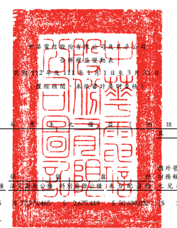
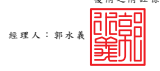
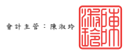

單位:新台警仟元

| 降                                             |  局                                            |  於                                  | ...          | ـــ                 |  +                        | 及二二八                                           |                     |              |              |              |    |       |              |              |              |
|------------------------------------------------|------------------------------------------------|--------------------------------------|--------------|---------------------|---------------------------|----------------------------------------------------|---------------------|--------------|--------------|--------------|----|-------|--------------|--------------|--------------|
|                                                | 优                                             | 报                                   | ৱ            |                     |                           |                                                    |                     |              |              |              |    |       |              |              |              |
|                                                | 透過其他綜合                                   |                                      |              |                     |                           |                                                    |                     |              |              |              |    |       |              |              |              |
|                                                | 损益按公允                                     |                                      |              |                     |                           |                                                    |                     |              |              |              |    |       |              |              |              |
|                                                | 假值街量之                                     |                                      |              |                     |                           |                                                    |                     |              |              |              |    |       |              |              |              |
|                                                | 外管運機構 金 融 買 產                         | 非 控制 程 益                        |              |                     |                           |                                                    |                     |              |              |              |    |       |              |              |              |
|                                                | 榜级表换算 来                                  | 常                                   | (附註十三    |                     |                           |                                                    |                     |              |              |              |    |       |              |              |              |
| 服本一尝通服 買 本 公 積                       | 計 及 二 八 ) 權 益 總 額                      |                                      |              |                     |                           |                                                    |                     |              |              |              |    |       |              |              |              |
| 代码                                           | 盛龄公益                                       | 兒换差額 評 價 損 益 透險工具損益 總 |              |                     |                           |                                                    |                     |              |              |              |    |       |              |              |              |
| A1                                             | $ 77,574,465                                   | $171,279,625                         | 392,276) ($  | 8,286) $379,334,846 | $ 11,927,604 $391,262,450 |                                                    |                     |              |              |              |    |       |              |              |              |
| 111 年 1 月 1 日 徐 領                         | 7,588) (S                                      |                                      |              |                     |                           |                                                    |                     |              |              |              |    |       |              |              |              |
| 01                                             | 子公司股東現金股利                             | -                                    | '            | (                   | 370,957) (                | 370,957)                                           |                     |              |              |              |    |       |              |              |              |
| C7                                             | 採用權益法認列關聯企業及合買之賃本公積變動數   | · (                                  | 1,159)       | .                   | · (                       | 1,159) (                                           | 51) (               | 1,210)       |              |              |    |       |              |              |              |
| D1                                             | 111 年 1 月 1 日至 3 月 31 日净利              | -                                    | 9,059,580    | -                   | 9,059,580                 | 331,397                                            | 9,390,977           |              |              |              |    |       |              |              |              |
| D3                                             | 50,161                                         |                                      |              |                     |                           |                                                    |                     |              |              |              |    |       |              |              |              |
| 111 年 1 月 1 日至 3 月 31 日 其他綜合損益淨額 | 1,524                                          | 66,473                               | 37,495)      | 16,341              | 46,843                    | 3,318                                              |                     |              |              |              |    |       |              |              |              |
| D5                                             | 111 年1月1日至3月 31 日綜合損益總額            | 9,061,104                            | 66,473       | 37,495)             | 16,341                    | 9,106,423                                          | 334,715             | 9,441,138    |              |              |    |       |              |              |              |
| 01                                             | 子公司股份基礎給付交易                         | 13,147                               | 13,147       | 38,269              | 51,416                    |                                                    |                     |              |              |              |    |       |              |              |              |
| Z1                                             | 111 年 3 月 31 日会额                          | $ 77.574.465                         | $171.291.613 | $ 77.574.465        | $ 2.675.419               | $ 59.700.126                                       | (5                  | 325,803)     | (S           | 45,083)      | 5  | 8.055 | $388,453,257 | $ 11.929.580 | $400,382,837 |
| A1                                             | 112 年 1 月 1 日 徐 镇                         | $ 77,574,465                         | $171,300,898 | $ 77,574,465        | $ 3,083,569               | $ 51,868,574 ($ 111,213) ($ 111,213) ($ 124,762) S | 12,891              | $381,178,887 | $ 12,599,541 | $393,778,428 |    |       |              |              |              |
| 01                                             | 子公司股東現金股利                             | -                                    | · (          | 676,862) (          | 676,862)                  |                                                    |                     |              |              |              |    |       |              |              |              |
| D1                                             | 112 年 1 月 1 日至 3 月 31 日净利              | 9,643,255                            | -            | 9,643,255           | 229,791                   | 9,873,046                                          |                     |              |              |              |    |       |              |              |              |
| D3                                             | 112 年 1 月 1 日至 3 月 31 日 其他綜合損益淨額 | 44,875)                              | 546,476 (    | 11,695)             | 500,019                   | 812)                                               | 499,207             |              |              |              |    |       |              |              |              |
| 10,113                                         |                                                |                                      |              |                     |                           |                                                    |                     |              |              |              |    |       |              |              |              |
| D5                                             | 112 年1月1日至3月 31 日綜合損益總額            | 9,653,368                            | 44,875)      | 546,476             | (                         | 11,695)                                            | 10,143,274          | 228,979      | 10,372,253   |              |    |       |              |              |              |
| 01                                             | 子公司股份基礎给付交易                         | 8,900                                | 8,900        | (                   | 6,428)                    | 2,472                                              |                     |              |              |              |    |       |              |              |              |
| 01                                             | 非控制權益净增加                               | 15,173                               | 15,173       |                     |                           |                                                    |                     |              |              |              |    |       |              |              |              |
| Z1                                             | 112 年 3 月 31 日会额                          | $ 77.574.465                         | $171.309.798 | $ 77.574.465        | $ 3.083.569               | $ 61,521,942 (8 156,088)                           | S 421,714 S S 1,196 | $391,331,061 | $ 12,160,403 | $403,491,464 |    |       |              |              |              |

後附之附註條本合併财務報告之一部分。

- 8 -