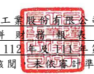
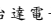

台達電子 工業股 份有限 公司及 子公司

合 併 財 務 報 表 附 註 民國 112 年及 111 年第 一季
(僅經核閱 ,未依 審計準 則查核 )
單位:新 台幣仟 元 (除特別註 明者外 )

## 一、 公司沿革

台達電子 工業股 份有限 公司 (以 下簡稱「 本公司 」)於 中華民 國設立,本 公司及 子 公司(以下 統稱「 本集團 」 ), 為全球 電 源管理與 散 熱 解 決 方 案 的 領 導 廠 商 , 主 要營業項 目包括:電源 供應系 統、無刷直 流風扇、散熱 系統、微型化 關鍵零 組件、 工業自動 化、視訊 顯示、資 訊、網路 通 訊、消費性 電子、節 能照明、可再生 能 源 應用、電動車充電設備 、 能 源 技 術 服 務 及智慧樓宇管理與控制解決方案 等之研 發、設計、製造 與行銷 業務。面對日 益 嚴重的氣 候變遷,本集 團長期 關注環 境 議 題,秉持「環保 節 能 愛 地 球 」 的 經 營使 命 , 持 續 開 發 創 新 節能 產 品 及 解 決 方 案、不 斷提升 產品的 能源轉 換效率,以 減 輕全球暖 化對人 類生存 的衝擊。近 年來, 本集團已 逐步從 關鍵零 組件製 造商邁 入 整體節能 解決方 案提供 者,深 耕「 電源及 零組件」、「自動 化」與 「基礎 設施」 三 大業務範 疇。

## 二、 通過財務 報表 之 日期及 程序

本合併財 務報表 已於民國 112 年 4 月 27 日經董事 會通過 後發布 。

三、 新發布及 修訂準 則及解 釋之適 用
(一)已採用 金 融 監 督 管 理 委 員 會 (以 下 簡 稱 「 金 管 會 」 )認 可 並 發 布 生 效 之 新 發 布、修正 後國際 財務報 導準則 之影響 下表彙列 金管會 認可並 發布生 效之民 國 112 年 適用之 國際財 務報導準 則之 新發布、 修正 及 修訂之 準則及 解釋:

|                          | 國際會計準則理事會         |                 |                 |
|--------------------------|----------------------------|-----------------|-----------------|
|                          | 新發布/修正/修訂準則及解釋 | 發布之生效日    |                 |
| 國際會計準則第1號之修正  | 「會計政策之揭露」         |                 | 民國112年1月1日 |
| 國際會計準則第8號之修正  | 「會計估計之定義」         |                 | 民國112年1月1日 |
| 國際會計準則第12號之修正 | 「與單一交易所產生之資產及 | 民國112年1月1日 |                 |
| 負債有關之遞延所得稅」   |                            |                 |                 |

本 集 團 經 評 估 上 述 準 則 及 解 釋 對 本 集 團 財 務 狀 況 與 財 務 績 效 並 無 重 大 影 響。

(二)尚未採用 金管會 認可之 新發布 、修正 後 國際財務 報導準 則之影 響 無。