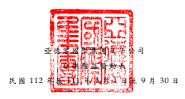
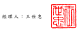
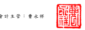

單位: 新 台幣仟元

| 歸                     | 屬                                         | 於                                                                       | 本                     | 公                                     | 司     | 業        | 主           | 之              | 權        | 益    |              |              |       |              |              |
|------------------------|--------------------------------------------|--------------------------------------------------------------------------|------------------------|----------------------------------------|--------|-----------|--------------|-----------------|-----------|-------|--------------|--------------|-------|--------------|--------------|
|                        | 其                                         | 他                                                                       | 權                     | 益                                     | 項     | 目        |              |                 |           |       |              |              |       |              |              |
|                        | 國 外 營 運 機 構                          |                                                                          |                        |                                        |        |           |              |                 |           |       |              |              |       |              |              |
| 股                     | 本 資本公積 保                             | 留                                                                       | 盈                     | 餘 財 務 報 表 換 算 確 定 福 利 計 畫 |        |           |              |                 |           |       |              |              |       |              |              |
| 代 碼                  | 股 數 ( 仟 股) 股                        | 本 ( 附 註 二 十 ) 特 別 盈 餘 公 積 未分配盈餘 之兌換差額 再衡量數 總 | 計 非控制權益 權益總額 |                                        |        |           |              |                 |           |       |              |              |       |              |              |
| A1                     | 111 年 1 月 1 日餘額                       | 200,000                                                                  | $ 2,000,000            | $ 14,846,145                           | $      | -         | $ 19,529,933 | ( $ 1,238,417 ) | $         | 6,262 | $ 35,143,923 | $            | 7,748 | $ 35,151,671 |              |
| 110 年度盈餘指撥及分配 |                                            |                                                                          |                        |                                        |        |           |              |                 |           |       |              |              |       |              |              |
| B5                     | 本公司股東現金股利                         | -                                                                        | -                      | -                                      | -      | (         | 2,675,892 )  | -               | -         | (     | 2,675,892 )  | -            | (     | 2,675,892 )  |              |
| D1                     | 111 年 1 月 1 日至 9 月 30 日淨利          | -                                                                        | -                      | -                                      | -      | 4,671,193 | -            | -               | 4,671,193 | (     | 362 )        | 4,670,831    |       |              |              |
| D3                     | 111 年 1 月 1 日至 9 月 30 日其他綜合 損益 | -                                                                        | -                      | -                                      | -      | -         | 879,469      | -               | 879,469   | (     | 31 )         | 879,438      |       |              |              |
| D5                     | 111 年 1 月 1 日至 9 月 30 日綜合損益 總額 | -                                                                        | -                      | -                                      | -      | 4,671,193 | 879,469      | -               | 5,550,662 | (     | 393 )        | 5,550,269    |       |              |              |
| Z1                     | 111 年 9 月 30 日餘額                      | 200,000                                                                  | $ 2,000,000            | $ 14,846,145                           | $      | -         | $ 21,525,234 | ( $             | 358,948 ) | $     | 6,262        | $ 38,018,693 | $     | 7,355        | $ 38,026,048 |
| A1                     | 112 年 1 月 1 日餘額                       | 200,000                                                                  | $ 2,000,000            | $ 14,846,145                           | $      | -         | $ 22,867,172 | ( $             | 793,750 ) | $     | 6,262        | $ 38,925,829 | $     | 7,261        | $ 38,933,090 |
| 111 年度盈餘指撥及分配 |                                            |                                                                          |                        |                                        |        |           |              |                 |           |       |              |              |       |              |              |
| B3                     | 提列特別盈餘公積                           | -                                                                        | -                      | -                                      | 32,712 | (         | 32,712 )     | -               | -         | -     | -            | -            |       |              |              |
| B5                     | 本公司股東現金股利                         | -                                                                        | -                      | -                                      | -      | (         | 2,690,710 )  | -               | -         | (     | 2,690,710 )  | -            | (     | 2,690,710 )  |              |
| D1                     | 112 年 1 月 1 日至 9 月 30 日淨利          | -                                                                        | -                      | -                                      | -      | 5,266,445 | -            | -               | 5,266,445 | (     | 295 )        | 5,266,150    |       |              |              |
| D3                     | 112 年 1 月 1 日至 9 月 30 日其他綜合 損益 | -                                                                        | -                      | -                                      | -      | -         | 82,933       | -               | 82,933    | (     | 3 )          | 82,930       |       |              |              |
| D5                     | 112 年 1 月 1 日至 9 月 30 日綜合損益 總額 | -                                                                        | -                      | -                                      | -      | 5,266,445 | 82,933       | -               | 5,349,378 | (     | 298 )        | 5,349,080    |       |              |              |
| Z1                     | 112 年 9 月 30 日餘額                      | 200,000                                                                  | $ 2,000,000            | $ 14,846,145                           | $      | 32,712    | $ 25,410,195 | ( $             | 710,817 ) | $     | 6,262        | $ 41,584,497 | $     | 6,963        | $ 41,591,460 |

後附之附註係本 合併 財務 報告 之 一 部 分 。

董事長: 王世忠 經理人: 王世忠 會計主管: 曹永祥

