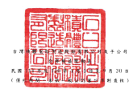
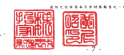

|                                                                      | 早也:新台學伴元                                                                              |                                                |                                                                                     |                                   |                  |                          |                |                |                        |             |                |                 |           |    |
|----------------------------------------------------------------------|----------------------------------------------------------------------------------------------|------------------------------------------------|-------------------------------------------------------------------------------------|-----------------------------------|------------------|--------------------------|----------------|----------------|------------------------|-------------|----------------|-----------------|-----------|----|
| મ                                                                    |                                                                                              |                                                |                                                                                     |                                   |                  |                          |                |                |                        |             |                |                 |           |    |
| 请通其处理合                                                         |                                                                                              |                                                |                                                                                     |                                   |                  |                          |                |                |                        |             |                |                 |           |    |
| 翻显转公光假值                                                       |                                                                                              |                                                |                                                                                     |                                   |                  |                          |                |                |                        |             |                |                 |           |    |
| 纸 國外各逐横福时路 浏览之全融资產                                   | 母公司 第 3                                                                                  |                                                |                                                                                     |                                   |                  |                          |                |                |                        |             |                |                 |           |    |
| 服製(件敷)                                                           | 法文虽晚会榜 得到虽然公想 本文 8. 发给 怀留意的合計 银洲第二KMER 永育观培演播放 通验工具导演 | 月工未赚得到资 买他推动合计 来 被              | 机 总 合 于 在 打 机 品                                                             | 《 总 合 》                       |                  |                          |                |                |                        |             |                |                 |           |    |
| 120年1月1日的領                                                      | 25,930,380                                                                                   | 56,347,243                                     | $ 311,146,899 5 42,259,146 $1,235,200,106 51,235,200,627) 5 57,000,627) 5 2,222,254 | ર                                 | (S 54,679,873)   | $1,849,657,256           | 964.743        | $1,850,621,994 |                        |             |                |                 |           |    |
| 股长分配                                                             |                                                                                              |                                                |                                                                                     |                                   |                  |                          |                |                |                        |             |                |                 |           |    |
| 料到最终公程                                                         | 16,334,897                                                                                   | ( 16,334,897)                                  |                                                                                     |                                   |                  |                          |                |                |                        |             |                |                 |           |    |
| 现会股时                                                             | (_207,443,043) (_207,443,043)                                                                | 210,443,0421                                   | ( 200443.043)                                                                       |                                   |                  |                          |                |                |                        |             |                |                 |           |    |
| 服務合配合計                                                         | 16,334,897                                                                                   | ( 223,377,940)                                 | 2017,443,0431                                                                       | 200,443,0431                      | 300 AVERTIE      |                          |                |                |                        |             |                |                 |           |    |
| 310年1月1日至9月30日净利                                             | 430,307,722                                                                                  | 430,200,722                                    | 420,307,722                                                                         | 291,897                           | 430.699.619      |                          |                |                |                        |             |                |                 |           |    |
| 110 8 1 月 1 8 买 9 月 70 日 配 没 异 他 9 回 包 链 3 元 1 年 1 月 1 | 1.737.424) ( ( _ 1.161.954)                                                                  | 4522)                                          | 4.942.910)                                                                          | 4.842.2101                        | ness             | ( 4,941,852)             |                |                |                        |             |                |                 |           |    |
| 110 年 1月1日至少月 30日综合播总地镜                                 | 430,307,722                                                                                  | -430,307,722                                   | 3.737.424) (_                                                                       | । स्वक्तः                            | 4523)            | 4.942.910)               | 425,364,812    | 392.955        | 425,257,767            |             |                |                 |           |    |
| 成分速透器也综合翻箱按全无限值购量之候点工具被资                     | . .                                                                                          | 277,155) (                                     | 277,155)                                                                            | 277,155                           | .                | 277,155                  |                |                |                        |             |                |                 |           |    |
| 避险工具捐资基礎调整                                                 | 41,416                                                                                       | 41,416                                         | 41,416                                                                              | 41,416                            |                  |                          |                |                |                        |             |                |                 |           |    |
| 标准模益法23列元棋哪全套股银冲返之坚始机                             | 317                                                                                          | .                                              | .                                                                                   | 317                               | 317              |                          |                |                |                        |             |                |                 |           |    |
| 實歷臺分子公司股權借助縣新領區是鎮                                   | 8,406,282                                                                                    | .                                              | 讯,406,242                                                                          | 1,045,516                         | אול, 1451, 1     |                          |                |                |                        |             |                |                 |           |    |
| 27]列手会荷朗高辅權益智動數                                          | -                                                                                            | × (                                            | 6,978)                                                                              | -                                 | -                | .                        | - 【           | 6,978)         | 6,978                  |             |                |                 |           |    |
| 昨日制服互运少                                                       | = (                                                                                          | 110,099) I                                     | 110,059)                                                                            |                                   |                  |                          |                |                |                        |             |                |                 |           |    |
| .                                                                    |                                                                                              |                                                |                                                                                     |                                   |                  |                          |                |                |                        |             |                |                 |           |    |
| 取得于公司到零股                                                     | ારર                                                                                           | ાકડ                                             |                                                                                     |                                   |                  |                          |                |                |                        |             |                |                 |           |    |
| 110 年9月 30 日休職                                                  | 5 2 / 178 320 310                                                                            |                                                |                                                                                     |                                   |                  |                          |                |                |                        |             |                |                 |           |    |
| 25.931.380                                                           | $ 259,303,805                                                                                | S_ F4,746,864                                  | 8 7114684                                                                           | 2 58.94103                        | 21,41,532,63     | 5181122346               | (S_(1)239.051) | 5 1,437,945    | (2                     | 3.105)      | ($ 59,304,212) | $ 2,076,020,062 | 2.200.245 |    |
| 111 年】月】日休飯                                                   | 25,900,300 5 259,303,805 5 64,761,600 5 311,146,899 5 5 5311,146,899 5 5 59,304,212          | $1,506,378,550 51,906,829,661 (S 63,308,361) 5 | 574,310                                                                             | 彩                                | · 120,536 · 8    | · [8 62,618,515] 5       | -              | 5 2,446,652    | $ 2,170,733,205        |             |                |                 |           |    |
| 展的分配                                                             |                                                                                              |                                                |                                                                                     |                                   |                  |                          |                |                |                        |             |                |                 |           |    |
| 特别强低公绩                                                         | · 《 24,239,549)                                                                             | 24,239,549                                     |                                                                                     |                                   |                  |                          |                |                |                        |             |                |                 |           |    |
| 现金服利                                                             | (_217.925.636)                                                                               | ( _ 213.925.636)                               | 213.925.638)                                                                        | 1                                 | (__ 212,925,636) |                          |                |                |                        |             |                |                 |           |    |
| 监融会配合计                                                         | 24,239,549)                                                                                  | 189 (885 (199)                                 | ( 213,925,638)                                                                      | 212,925,634)                      | 1                | ( 213,925,638)           |                |                |                        |             |                |                 |           |    |
| 111年1月1日至9月30日通时                                             | 720,626,072                                                                                  | 720,626,102                                    | 720,626,072                                                                         | 365,561                           | 721,022,033      |                          |                |                |                        |             |                |                 |           |    |
| 111年1月1日至9月30日或演其他综合副监                                 | 69,259,158                                                                                   | ( 11,200 118)                                  | 1.40.361                                                                            | 59,595,441                        | 59,595,441       | (ucc'ory                 | 58,917,121     |                |                        |             |                |                 |           |    |
| 【【年】月】日至9月 20日除合韻版的額                                 | 720,626,072                                                                                  | 220,626,102                                    | 69,359,198 [ __ 11,2(7,118)                                                         | 1,443,361                         | 59.595.441       | 515,122,187              | 287,352)       | 279.934.154    |                        |             |                |                 |           |    |
| 股份高硬险计交易                                                     | 1,387                                                                                        | 13,870                                         | 438,029                                                                             | . 1                               | 265,177)         | 265,177)                 | 186,722        | '              | 186,722                |             |                |                 |           |    |
| 應最販売買回                                                         | .                                                                                            | -                                              | .                                                                                   | -                                 | · (              | 871,566) {               | 871,566]       | . . .          | 871,566)               |             |                |                 |           |    |
| 局藏股票注册                                                         | 【                                                                                           | 1,267) (                                       | 32,870) 4                                                                           | ( 2,999 )                         | .                | · · (                    | 1 (Dic PIO) 1  | 554,707        | '                      | .           | .              | 171,566         | -         | .  |
| 高分过通其他综合播道按全无偶然则爱之强迫工具检查                     | .                                                                                            | .                                              | .                                                                                   | .                                 | 98,209           | 98,209}                  | .              | > 1            | 56,200)                | -           | .              | .               |           |    |
| 98,209                                                               | . .                                                                                          |                                                |                                                                                     |                                   |                  |                          |                |                |                        |             |                |                 |           |    |
| 通政工具制造基礎网 您                                                | 43,007]                                                                                      | ·                                              | 43,007)                                                                             | · · (                             | 43,027)          | · (                      | 43,007)        |                |                        |             |                |                 |           |    |
| .                                                                    | .                                                                                            | -                                              | · (                                                                                 | 2,542                             | .                | 2,582                    |                |                |                        |             |                |                 |           |    |
| 採用液送法23例之間既全套股权并固之空赔累                             | .                                                                                            | 2,582                                          | -                                                                                   | .                                 | 4.117,167        | 12,348,992               | 16,466,159     |                |                        |             |                |                 |           |    |
| 175列平公司所有强组当更新额                                          | 4,117,167                                                                                    |                                                |                                                                                     |                                   |                  |                          |                |                |                        |             |                |                 |           |    |
| 庭故例据互成少                                                       | 166,4321                                                                                     | . 166,432)                                     |                                                                                     |                                   |                  |                          |                |                |                        |             |                |                 |           |    |
| 111 年 9 月 30 日除 4                                                | 25.920.381                                                                                   | S 231,219,815                                  | $ 69,216,291                                                                        | 2011/10000 2 2017 2017 22/04/2010 | 22412.22222      | 2 6165.632 15 10.231.01Z | 5 1520.80      | (S.            | 265.177) (S_2.419.417) | 52539924334 | 5 -- 14241853  | $2.252.316.153  |           |    |

应理人

